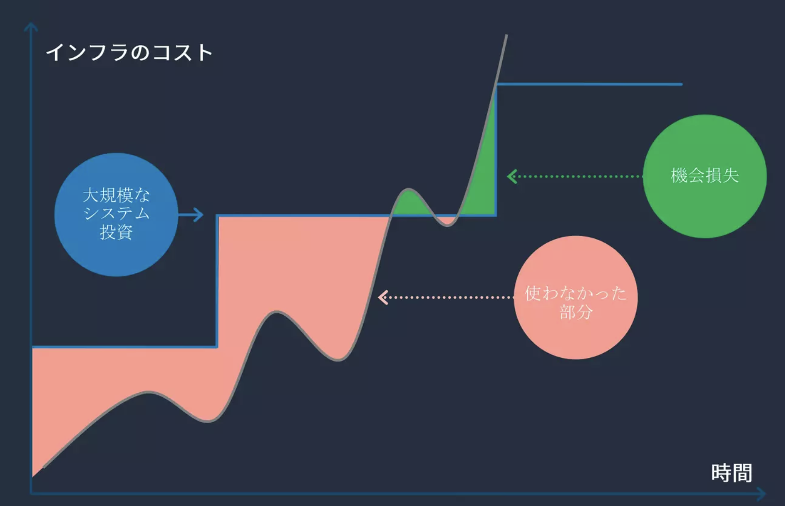

# AutoScaling
リソースの拡張を行うスケーリングの目的は、リソース不足による機会損失を防ぎつつ、リソース過剰によるコストの増大を防ぐことである。


[BlackBelt](https://www.slideshare.net/slideshow/20191002-aws-black-belt-online-seminar-amazon-ec2-auto-scaling-and-aws-auto-scaling-178995835/178995835#10)

AWSにはEC2を対象としたEC2 Auto Scalingと、ECSやLambdaなどを対象としたApplication Auto Scalingがある。

## Application AutoScaling
### AutoScalingの種類
大きく、3つのスケーリングの方法が提供されている。

|スケーリングタイプ|説明|特徴|
|:----|:----|:----|
|ターゲット追跡スケーリング|特定の CloudWatch メトリクスのターゲット値に基づいてリソースをスケーリングします。|ユーザーが設定したターゲット値を維持するために、リソースを自動的にスケール。多くのユースケースで利用される。|
|ステップスケーリング|超過アラームのサイズによって異なる一連のスケーリング調整値に基づいてリソースをスケーリングします。|条件に応じて段階的にリソースをスケール。突発的な需要や急激な変化に対応しやすい。|
|スケジュールに基づくスケーリング|1 回のみ、または定期的なスケジュールでリソースをスケールします。|特定の時間やイベントに合わせて、あらかじめ決めたスケジュールに従ってスケーリングを実施。リソースの効率的な利用が可能。|

#### ターゲット追跡スケーリング
指定したメトリクスを指定した値に保つためにコンテナ数をコントロールするスケーリング。

設定を行う際は以下の2つを定義する
- メトリクス: 追跡する CloudWatch メトリクス
- 目標値: メトリックのターゲット値

利用するメトリクスについては、Metric Mathなどを利用することで複数メトリクスを組み合わせたメトリクスを利用することができる。

#### ステップポリシースケーリング
特定のCloudWatchアラームのアラームに応じて、リソースをスケーリングする。
CloudWatchアラームに即したスケーリング実行ができるため、利用するメトリクスやしきい値、評価期間の数を設定することが可能。

発砲されたアラームに対してスケーリングポリシーを設定することができる。
- ChangeInCapacity: スケーラブルターゲットの現在の容量に対して指定された値だけ増減する（addやremove）
- ExactCapacity: スケーラブルターゲットの現在の容量を指定された値に変更(set to)

ChangeInCapacityでは、アラート評価のたびに増減が適用される点に注意。
[AutoScalingに関する記事](https://qiita.com/AWS11077/items/3f7861591b4ae1aa00d9)で以下のような挙動をしている。
```
SQSのメッセージ数が100~200の時に10台追加するルールが設定されていたとする。
メッセージが200台投入されると、ルールに従って、10台のコンテナが追加される。
1分後にアラートが評価され、その時点でメッセージが190件残っている場合、ルールに従って、さらに10台のコンテナが追加される。(合計20台)
1分後にアラートが評価され、その時点でメッセージが110件残っている場合、ルールに従って、さらに10台のコンテナが追加される。(合計30台)
```

この問題を発生させないためには、クールダウン時間の設定が必要。
クールダウン時間を設定することで、過度なスケールアウトを防ぐ働きがある。具体的には、クールダウン時間が設定されていると、より大きなスケールアウトの命令がトリガーされるか、クールダウン時間を超過しないと必要な容量を再び増加しない。さらに、クールダウン中に依頼されたさらに大きな命令に対する追加処理に、追加済みの数を含めて計算する。例えば２台のコンテナを追加した後、クールダウン時間中に３台のスケールアウト命令が来ると既に追加された２台分も計算に含めて１台しか追加でコンテナを加えない。


## EC2 AutoScaling
