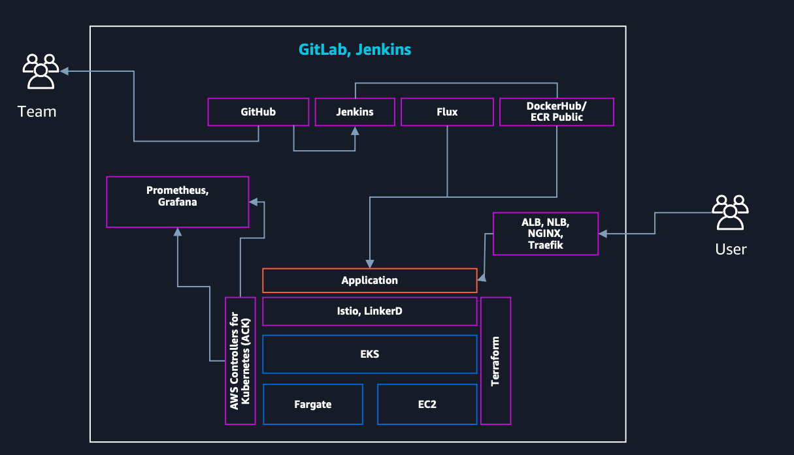

# EKS
## EKSのメリット
EKSの最大の特徴は、Kubernetesというオープンソースの特徴を活かして、周辺の行為範囲なコミュニティの再利用性。
さらに、ACK(AWS Contreollers for Kubernetes)を利用するとK8sとAWSの連携もシームレスになる。

[なぜ今コンテナなのか](https://pages.awscloud.com/rs/112-TZM-766/images/AWS-Black-Belt_2024_Why-Container-Now_0630_v1.pdf)

