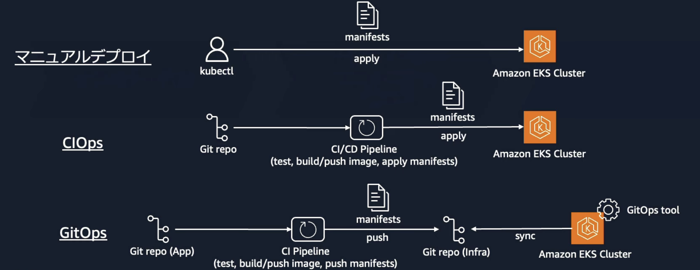

# EKS
EKSは、AWSが提供するKubernetesに基づいたコンテナのオーケストレーションサービス。
オーケストレーションサービスを利用することで簡単に、以下のオーケストレーション操作を行うことができる
- コンテナのデプロイ
- ポート管理
- スケーリング
- ヘルスチェックや自動復旧

[Amazon Elastic Kubernetes Service(Amazon EKS) 入門【AWS Black Belt】](https://www.youtube.com/watch?v=E5TEqZhS0D0)

EKSとECSの最も大きな違いはKubernetesを実行するためのマネージドサービスである点

## Kubernetesについて
Kubernetesとは、コンテナを複数のホストにまたがって管理するオープンソースのコンテナオーケストレーションサービス。
ECS同様にオーケストレーションの機能を有しているが、オープンソースであるという特徴からさまざまなエコシステムとの連携を行うことができる。

### Kubernetesの課題
Kubernetesは、分散システムであり、コントロールプレーン・データプレーンでさまざまなコンポーネントが動作しており、運用管理が煩雑になりがちである。

## EKSの価値
Kubernetesの課題である、運用の煩雑性について抑制しながらにKubernetesを利用することができるのがEKSのメリットである。

EKSを利用することでKubernetesのコントロールプレーンやデータプレーンの管理を容易にすることができる。
- コントロールプレーンをマネージドサービスとしてAWSが管理・提供
- データプレーンの提供（EC2/Fargate）
- アドオンによりエコシステムの連携
- AWSサービスとの連携（ネットワーク・セキュリティ・ストレージ

## EKSの仕組み
### EKSのアーキテクチャ
コントロールプレーンは、AWSが管理するアカウント上に存在する。データプレーンはユーザーのAWSアカウント上に存在する。

[Amazon Elastic Kubernetes Service(Amazon EKS) 入門【AWS Black Belt】](https://www.youtube.com/watch?v=E5TEqZhS0D0)

### コントロールプレーン
AWS管理のアカウントにKubernetesに必要なコンポーネントが作成され、KubernetesのAPIはエンドポイントを介して公開される。

APIエンドポイントへの通信は、パブリック、プライベート、パブリックとプライベートの混同の方法がある。
- パブリック：インターネット経由でAPI問い合わせを行うCIDRでIP制御可能
- プライベート：ENI経由のAWSネットワーク経由で通信

### データプレーン
ユーザーの管理アカウントにデータプレーンが作成されるが、いくつかのオプションから選択が可能
- マネージド型ノードグループ
- セルフマネージド型ノード
- Karpenter
- Fargate

|項目|管理の容易さ|カスタマイズ性|コスト効率|スケーリング速度|適用ワークロード|
|:----|:----|:----|:----|:----|:----|
|マネージド型ノードグループ|AWSがノード管理を自動化（例: パッチ適用、スケール設定）するため運用負担が低い。|標準的な設定はAWSにより管理されるが、AMIや設定の変更には制約がある。 高度なチューニングは難しい場合がある。|一般的なユースケースでは適切なコスト効率を実現可能。 スポットインスタンスを活用することでさらに最適化できる。|Auto Scaling Groupを基盤とするため、スケーリング速度は中程度。 安定したパフォーマンスを提供するが、突発的な負荷への即応性はやや劣る。|継続的に動作する安定したWebアプリケーションやマイクロサービス。運用負荷を最小化しつつ、ある程度の柔軟性が必要な環境。|
|セルフマネージド型ノード|ノードの全てを手動で管理する必要があり、運用負荷が高い。 ただし、自由度は高い。|インスタンスの設定やネットワーク、セキュリティを含めた完全なカスタマイズが可能。 HPCなど特化したワークロードに最適。|自身でコスト管理が可能。 スポットインスタンスや予約インスタンスを柔軟に利用可能で、費用削減の余地が大きい。|手動管理のため、スケーリングはオペレーターの対応次第。 高負荷環境では適切なスケーリング計画が必須。|特殊なセキュリティ要件やカスタム構成が求められるバッチ処理やHPC（高性能コンピューティング）。|
|Karpenter|自動でインスタンスをプロビジョニングするが、初期設定と運用管理には一定の学習コストが必要。|Kubernetesポッドのリソース要件に応じて自動プロビジョン。 カスタマイズは中程度だが、柔軟なインスタンス選択が可能。|必要なインスタンスのみを自動プロビジョニングするため、リソースの過剰割り当てが少ない。 スポットインスタンスの活用で大幅なコスト削減も可能。|瞬時に必要なリソースをプロビジョニングできるため、高いスケーリング性能を持つ。 負荷の増減が激しいワークロードに適している。|スポットインスタンスを活用し、コスト効率を重視する動的なスケーリングが必要なマイクロサービスや不定期バッチ処理。|
|Fargate|完全マネージド型のため、インスタンス管理が不要。 非常に簡単だが、柔軟性に欠ける。|カスタマイズの余地がほとんどなく、基本的なワークロード向け。 特定のポッドごとの設定は難しい。|完全マネージド型ゆえにコストが高め。 長時間動作するワークロードでは非効率になりがち。|スケーリングは完全自動化されており、即時にスケールイン・アウト可能。 ただし、プロセス数が多い場合にコストが急増する可能性がある。|一時的な小規模アプリケーションや実験的なワークロード。 サーバーレスアーキテクチャを採用する環境。|

## EKSによるアプリ構築の流れ
EKSでアプリを構築する際は以下の流れに従う

[Amazon Elastic Kubernetes Service(Amazon EKS) 入門【AWS Black Belt】](https://www.youtube.com/watch?v=E5TEqZhS0D0)

### クラスター作成
クラスター構築はコンソールやCFnはもちろん、コミュニティ主催のEKS Blueprintやeksctlが提供されている。
EKS Blueprintはコントロールプレーン、データプレーン、アドオンなどまとめて作成することができるIaCテンプレートになっている。

上記を利用して、コントロールプレーンやデータプレーンを作成し、クラスターを構成する。

### エコシステムやEKSアドオンのデプロイ
Kubernetesを利用するメリットとして、エコシステムが充実していることが挙げられる。監視、セキュリティ、CICDなどについて、エコシステムとして公開されている。
さまざまなエコシステムを利用することで、開発や運用の効率化を図ることができるが、エコシステム自体のバージョンアップ対応の運用が増える点は注意。

エコシステムの開発状況は[CNCF landscape](https://landscape.cncf.io/)などで確認できる。

EKSでは、厳選されたエコシステムのソフトウェアをアドオンとして管理することが可能。

### EKSのデプロイ
アプリケーションをEKSにデプロイする方法としては、いくつかの選択肢が提供されている。

[Amazon Elastic Kubernetes Service(Amazon EKS) 入門【AWS Black Belt】](https://www.youtube.com/watch?v=E5TEqZhS0D0)

