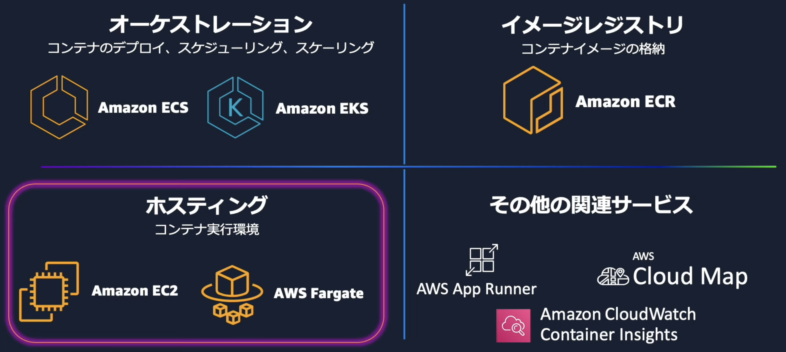
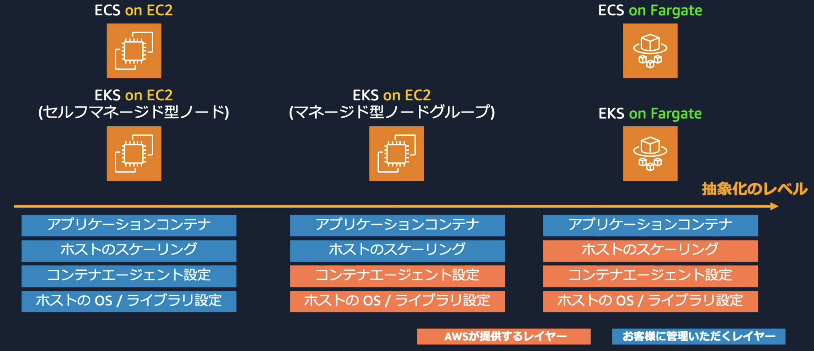
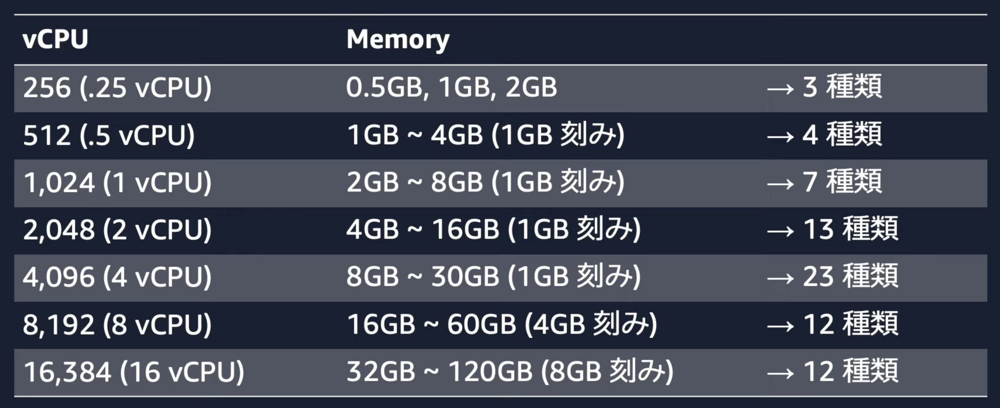
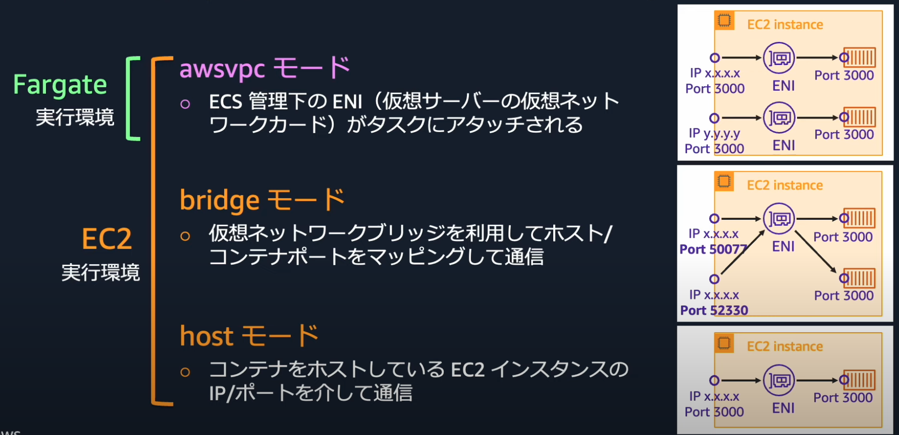
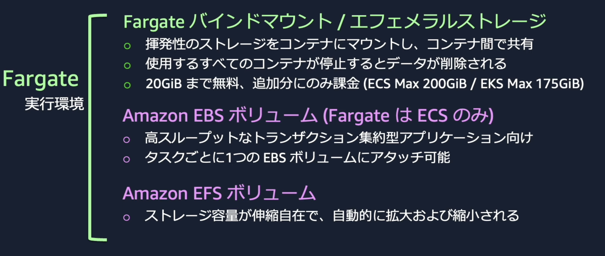

# Fargate
Fargateは、AWSのコンテナサービスにおけるホスティングサービスの一種。

[AWS Fargate 入門【AWS Black Belt】](https://www.youtube.com/watch?v=JT9aV27FixI&t=4s)

- コントロールプレーン（コンテナオーケストレーター）:ECSやEKSを提供
- データプレーン（コンテナの実行環境）:EC2とFargateを提供

Fargateの特徴としては、サーバーレスでありユーザーによるホストマシンの保守作業が抑えられることが挙げられる。

## Fargateのメリット
Fargateを利用するメリットには以下が挙げられる。
- ホストのOS/コンテナエンジン/エージェントのアップグレートやパッチの適用が不要
- クラスターのキャパシティ管理が不要
- 分離とセキュリティの担保
- 料金の従量課金性

具体的にECS/EKSにおいてEC2を利用する場合とFargateを利用する場合の手間暇を比較する。
下図のようにEC2では、エージェントの導入などの手間暇をかける必要があるが、Fargateを利用することで、ユーザー（開発者）はアプリの開発に集中することができる。

[AWS Fargate 入門【AWS Black Belt】](https://www.youtube.com/watch?v=JT9aV27FixI&t=4s)

### アプリケーションに必要なエージェント（サービス）について
EC2においては、必要なエージェントやサービスに関してはEC2のOS上でインストールを行う。

一方でFargateではAWSサービス系についてはAWS管理のOS上でインストールされているものがある。特別なエージェントが必要な場合に関してはDockerFileでインストールを記述してコンテナ上でインストールを行う必要がある。  
[AWS Fargate + System Manager で構成するサーバーレスな Bastion を導入したのでその仕組みと運用を解説](https://note.com/num_8/n/ndad6c7464d88?utm_source=chatgpt.com)

## EC2 vs Fargate
5つの観点で比較する
- vCPUとメモリ
- ホスト
- ネットワークモード
- データボリューム
- セキュリティ

### vCPUとメモリ
EC2では、ホストのリソースをコンテナ間で共有することになるが、Fargateの場合ECSTaskごとにに割り当てるvCPUとメモリに関して事前に定義する。

[AWS Fargate 入門【AWS Black Belt】](https://www.youtube.com/watch?v=JT9aV27FixI&t=4s)

### ホスト
Fargateではコンテナイメージのキャッシュ機能もないため、軌道について時間がかかる傾向がある。
加えて、Fargateの制約条件として、GPUを適用することができない問題がある。

また、EC2上に構築した一つのコンテナが同じホスト上のコンテナに対して処理を実行するデーモンスケジュール戦略を適用することができない。
Fargateでは上記の対応をすることができないのでFargateのTaskでサイドカーを構築する必要がある。

[AWS Fargate 入門【AWS Black Belt】](https://www.youtube.com/watch?v=JT9aV27FixI&t=4s)

### ネットワークモード
awsvpcモードのみがサポートされている。
このモードでは、taskごとにENIがアタッチされる。

[AWS Fargate 入門【AWS Black Belt】](https://www.youtube.com/watch?v=JT9aV27FixI&t=4s)

### データボリューム
Fargateのエフェメラルストレージとしてコンテナ間で20Gまでストレージを共有することができる。
共有できるコンテナは同じTask内。また揮発性のため参照しているコンテナが全て停止してしまうと、データは削除されてしまう。

[AWS Fargate 入門【AWS Black Belt】](https://www.youtube.com/watch?v=JT9aV27FixI&t=4s)

### セキュリティ
上記のFargateの特徴を踏まえてセキュリティ的なメリットを整理すると以下
- OS/パッチなどがAWSによって常に最新化される
- taskごとに実行環境が独立している
- awsvpcのためENIやSGも独立している
- sshなどによるホストへのアクセスが不可  
    コンテナにログインしたい場合は、ecs-execを利用することでログイン可能

## Fargateの費用削減
### Fargate Spot
EC2のSpotインスタンス同様、AWSの空きリソースを利用して起動されるため、費用の削減を受けることができる。
中断に強いワークロードに対しては適用価値がある。

### AWS Graviton
ARMのプロセッサを利用することで費用削減の効果を受けることができる。