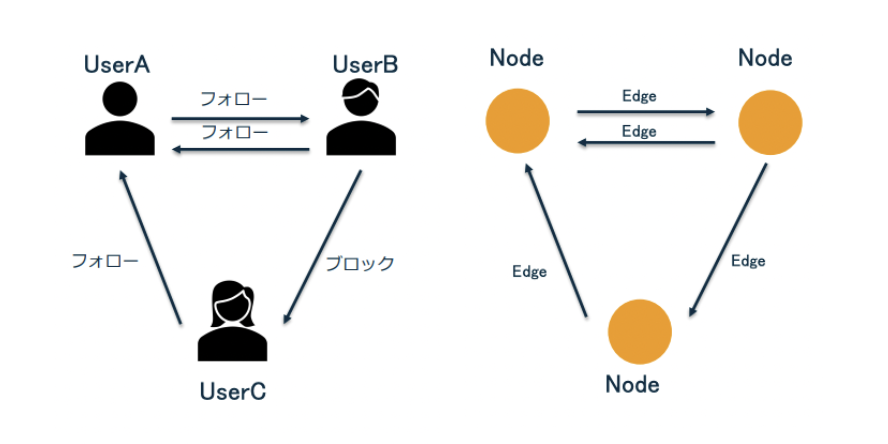
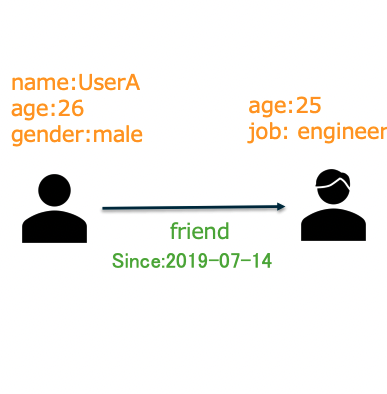
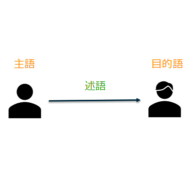
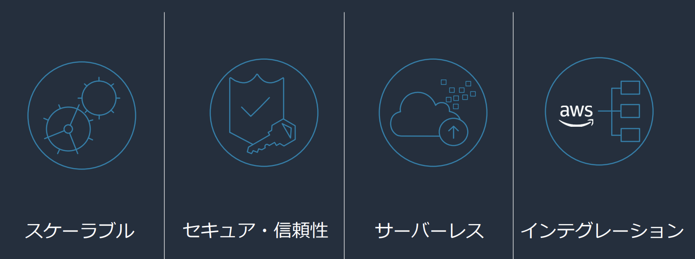
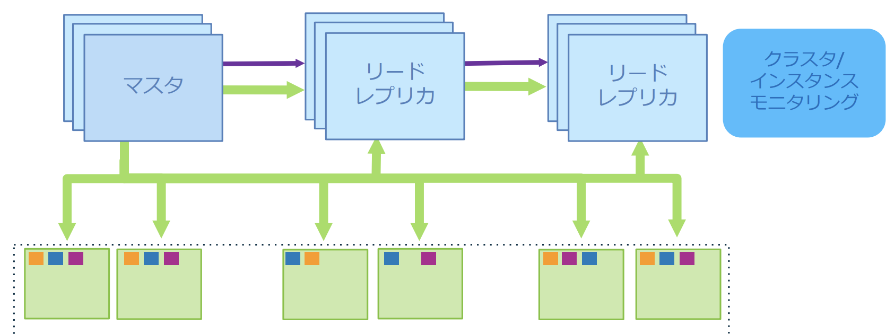
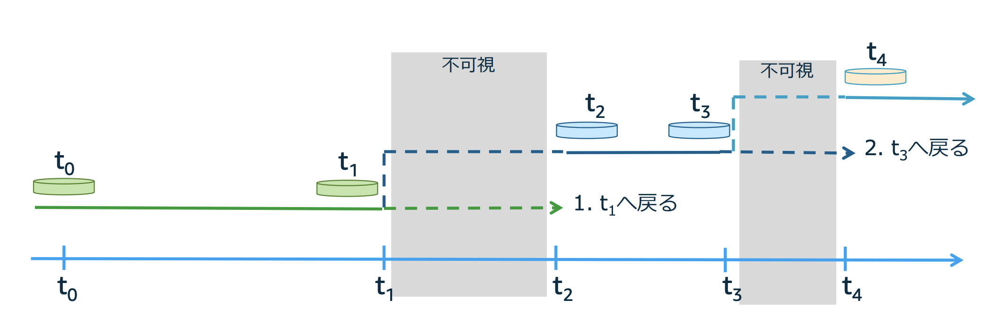
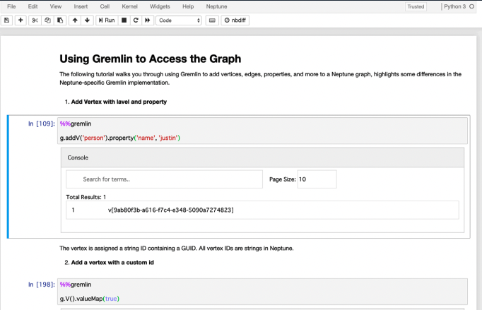

# Neptune
## Graphとは
以下の例のようにノード（Vertex）とエッジ（Edge）で構成され、それぞれのノードの関係をエッジにより記述する際に用いられるのが、グラフ。

Gprah構造はSNSやレコメンドなど高度に接続されたデータドメインや接続された構造の探索などのユースケースで用いられる。


[AWS Black Belt Online Seminar](https://pages.awscloud.com/rs/112-TZM-766/images/20200714_AWS_BlackBelt_AmazonNeptune.pdf)


## グラフモデルとフレームワーク
GraphDBはグラフモデルを効率的に格納し、検索するためのDB。  
GraphDBには大きく２種類のモデルが存在する。それが`プロパティグラフ`と`RDF（Resource Description Framework）`。

### プロパティグラフ
プロパティグラフの特徴は、NodeとEdgeそれぞれに`プロパティ`を自由に持たせることができる点。
以下の例のように、Nodeに対して"name"や"age"といった属性やEdgeに対して"friend"や"Sincce"などの属性を持たせることができる。

  
[AWS Black Belt Online Seminar](https://pages.awscloud.com/rs/112-TZM-766/images/20200714_AWS_BlackBelt_AmazonNeptune.pdf)

#### Nodeの設定項目
Nodeには`id`、`label`が必須で設定する必要があり、それ以外に`propety`を自由に設定することができる。

|項目|役割・意味|特徴|
|:----|:----|:----|
|id|ノードの一意な識別子|グラフDB内でノードを一意に特定するために使う（変更不可のことが多い）|
|label|ノードのカテゴリやタイプを表す名称|例 "User"、"Company"、"Product" など|
|property|ノードに付与する任意の属性情報（キーと値のペア）|例: name: "Alice", age: 30, location: "Tokyo" など|


#### Edgeの設定項目
Edgeには、`id`、`ラベル`、そしてEdgeが結ぶNodeとの関係である`FROM`と`TO`が必須で設定する必要があり、それ以外に`プロパティ`が設定することができる。

|項目|役割・意味|特徴・例|
|:----|:----|:----|
|id|エッジの一意な識別子|- 自動生成されることが多く、クエリではあまり明示的に使わない <br> - 内部的な参照に使われる|
|label|エッジの種類・関係の内容|- 例: friend, works_for, purchased <br> - クエリのフィルタ条件として使える|
|from|エッジの始点（出発ノード）|- 方向性を示す始点ノード|
|to|エッジの終点（到達ノード）|- 方向性を示す終点ノード|
|property|関係に付随する属性情報（キーと値のペア）|- 任意に設定可能な追加情報 <br> - 例: since: "2021-01-01", role: "Manager"|


### RDF(Resource Description Framework)
RDFの特徴は、NodeとEdge間をトリプルと呼ばれる`主語、述語、目的語`の関係で結ぶこと。  
特徴として、W3Cで標準化されているため、外部データ（DBPedia）などとの外部連携をしやすくなっている特徴がある。

  
[AWS Black Belt Online Seminar](https://pages.awscloud.com/rs/112-TZM-766/images/20200714_AWS_BlackBelt_AmazonNeptune.pdf)


## Neptuneの特徴
NeptuneはAWSが提供する信頼性の高いフルマネージドなGraphDBである。


[Amazon Neptuneではじめる グラフデータベース入門](https://pages.awscloud.com/rs/112-TZM-766/images/AWS-Black-Belt_2023_Amazon%20Neptune_0730_v1.pdf)

### スケーラブル・サーバーレス
Neptuneは、以下のようなスケーラブルな特徴がある。
- ノードやエッジの持つプロパティについて、制約がない
- 高性能
    - 数十億の関係をmsecのレイテンシー参照可能
    - 毎秒100,000件のクエリをサポート(自動で拡張)
    - キャパシティ管理も不要
    - 最大15個のリードレプリカ 
    - インデックスについてもNeptune側で管理
- 128TiBまでスケール可能なストレージ

### セキュア・信頼性
DBに保管されるデータに関してのセキュリティや信頼性についてもマネージドに高い補償をしている
- セキュア
    - 転送時の暗号化(TLS)
    - KMSによる保管時の暗号化
    - セキュリティグループやIAMによるセキュリティ制御
    - 監査ログのCloudWatchへの発行
- 高可用性
    - データが3つのAZにまたがって、6つのレプリカにコピーされる
    - リードレプリカを最大15作成可能し、負荷分散
    - プライマリインスタンスに障害が発生した際に自動でリードレプリカが昇格
    - 10sec以内の自動フェイルオーバー
- 耐障害性
    - 継続的にS3にバックアップを作成
    - 複数のコピーから破損したとしても自動修復可能
    - ポイントインタイムリカバリにより、任意の点にリカバリ可能


#### リードレプリカ
最大15のリードレプリカを作成することができる。特徴は以下。
- 読み取り専用のコピーでありデータなどを共有
- 障害時に自動でフェイルオーバーして復旧
- エンドポイントは共通なのでアプリ側は複数のリードレプリカを意識なくて良い
- 自動で拡張されるわけではないので、読み込みの性能からリードレプリカの台数を決める
- 費用に関しても従量課金で通常のインスタンス同様の値段がかかる


[AWS Black Belt Online Seminar](https://pages.awscloud.com/rs/112-TZM-766/images/20200714_AWS_BlackBelt_AmazonNeptune.pdf)

#### ポイントインタイムリカバリ
ストレージ内に直近のステータスのポイントを補完しているので、ポイントを指定すれば任意のポイントにデータを戻すことができる。これは、S3に自動で配置されるバックアップとは異なり、内部のログとストレージに保管されている。
S3へのバックアップを利用していないため、高速ではあるがその分、戻せるポイントに限りがある点に注意。どちらかというとオペミスの復旧などのイメージ。

[AWS Black Belt Online Seminar](https://pages.awscloud.com/rs/112-TZM-766/images/20200714_AWS_BlackBelt_AmazonNeptune.pdf)

### インテグレーション
AWSサービス各種との連携が可能
- モニタリング
    - CloudWatch/CloudTrailと連携
- イベントドリブン
    - Lambdaと連携しイベント契機でのアクションが可能
- 検索
    - Amazon ElasticSearchなどとの連携

#### 全文検索
Elastic Searchなどにデータを連携し、そのデータに対する検索などをサポートしている。

Neptuneからストリームデータを配信し、ElasticSearchにデータを登録しておき、検索時にはNeptuneからクエリを投げることで、ElasticSearchを利用した検索が可能になる。


[AWS Black Belt Online Seminar](https://pages.awscloud.com/rs/112-TZM-766/images/20200714_AWS_BlackBelt_AmazonNeptune.pdf)

ElasticSearchを利用することで、Neptuneで苦手な全文検索、部分一致検索や曖昧検索が可能となる。

### 検証のしやすさ（Neptune Workbench）
NeptuneにはNeptune WorkBenchと呼ばれるJupyter環境が準備されている。
インスタンスを指定した上で、簡単に使用することができ、Jupyterのセルの中で`%%glemlin`などと指定することでクラスターに対して簡単にクエリを発行することができる。

  
[AWS Black Belt Online Seminar](https://pages.awscloud.com/rs/112-TZM-766/images/20200714_AWS_BlackBelt_AmazonNeptune.pdf)


## GraphDBのクエリ
### Glemlin
プロパティグラフにおいては`Glemlin`と呼ばれるクエリを用いる。
例えば以下の例におけるGlemlinのクエリの例や結果を挙げると以下。

  
[AWS Black Belt Online Seminar](https://pages.awscloud.com/rs/112-TZM-766/images/20200714_AWS_BlackBelt_AmazonNeptune.pdf)

Nodeの取得
```
g.V()
---
['UserA','UserB','UserC']
```

プロパティによるフィルタ
```
g.V().has('name', 'UserA')
---
['UserA']
```

Nodeと関係のあるNodeの探索
```
g.V().has('name', 'UserA').out('friend')
---
['UserB']
```

関係性の連鎖
```
g.V().has('name', 'UserA').out('friend').out('friend')
---
['UserC']
```
