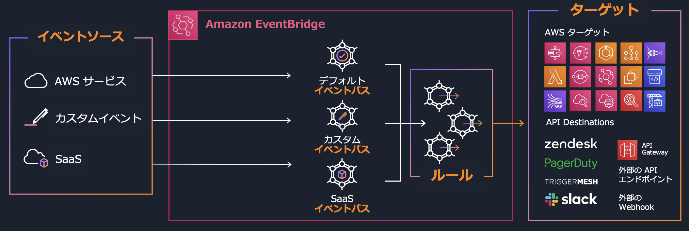
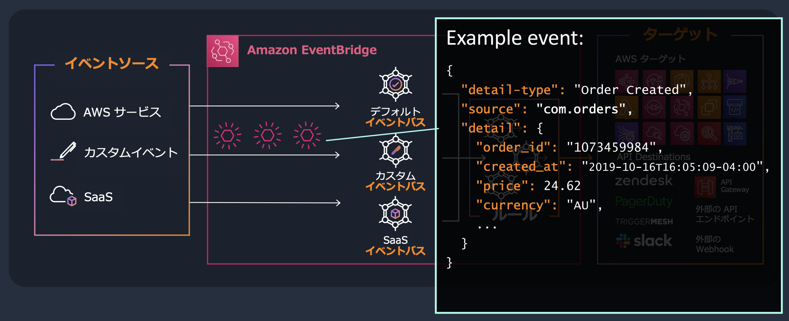
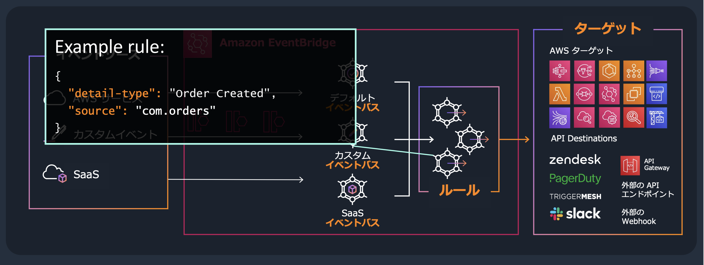
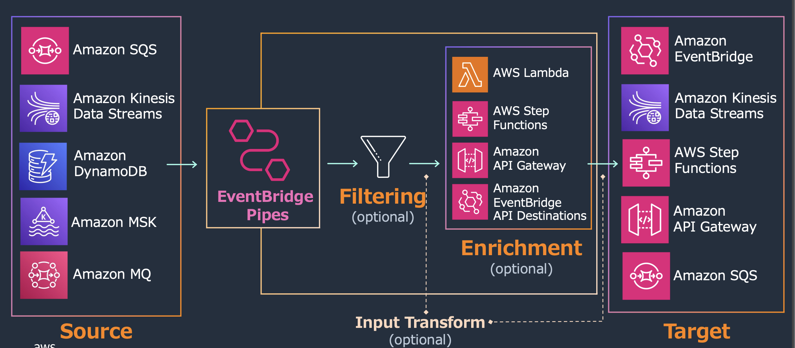
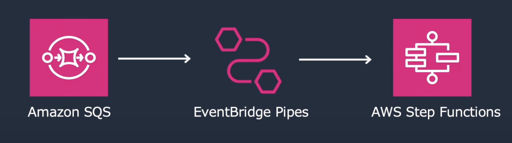

# EventBridge
EventBridgeとは、AWSが提供するサーバーレスなEventBusである。
主な登場人物としては、イベントバス・ルール・ターゲットが挙げられる。

[BlackBelt](https://pages.awscloud.com/rs/112-TZM-766/images/AWS-Black-Belt_2024_Amazon-EventBridge-Pipes_0227_v1.pdf)

## EventBridge詳細
### EventBus
EventBusとは、イベントを受信するルーターであるといえる。
EventソースからのEventを一度受信する。
また、EventBusにおいてルールを設定し、ターゲットへとルーティングを行う。

[BlackBelt](https://pages.awscloud.com/rs/112-TZM-766/images/AWS-Black-Belt_2024_Amazon-EventBridge-Pipes_0227_v1.pdf)

### EventRule
Busが受信したEventに対して、ルールに一致しているか確認を行い、一致していれば場合にルーティングを行う設定が可能。コードなどを書かないローコードな連携が可能。

 
[BlackBelt](https://pages.awscloud.com/rs/112-TZM-766/images/AWS-Black-Belt_2024_Amazon-EventBridge-Pipes_0227_v1.pdf)

## EventBridgePipes
EventBridgePipesの特徴として、EventBusが登場しないことがある。
使い分けとしては、EventBridgePipesはProducerとConsumerが1対1の場合に利用する。
そして、サービス間の連携についてノーコードで記述することができることがポイントになる。

[BlackBelt](https://pages.awscloud.com/rs/112-TZM-766/images/AWS-Black-Belt_2024_Amazon-EventBridge-Pipes_0227_v1.pdf)

例えばユースケースとしては、SQSからStepFunctionへの連携はLambdaなどのコーディングが必要であったが、Pipesを利用すればノーコードでの連携が可能になる。

さらにPipesの特徴は、Enrichimentであり、APIなどを経由してEventの情報を拡張することができる。
