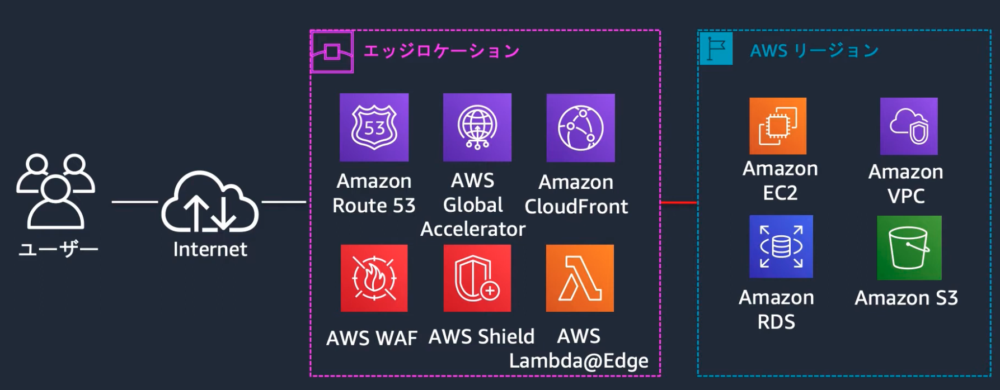
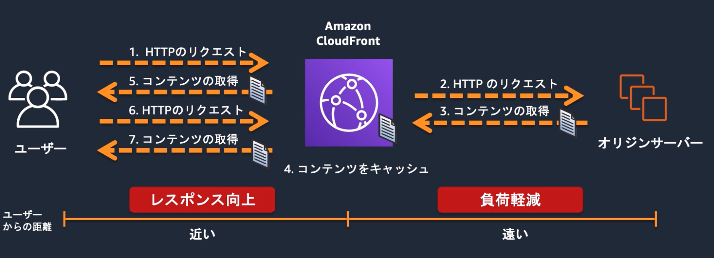

# CloudFront

## note
- [blackbelt](https://pages.awscloud.com/rs/112-TZM-766/images/20190730_AWS-BlackBelt_Amazon_CloudFront.pdf)
- [HandsOn](https://pages.awscloud.com/JAPAN-event-OE-Hands-on-for-Beginners-CF_WAF-2022-confirmation_129.html)

```
CloudFrontはCDN（Contents Delivery Netwoerk）の機能を持つマネージドサービスであり、クライアントへのコンテンツ配信について、エッジサービスのメリットを享受し、ユーザーエクスペリエンスを向上させる。

CloudFrontではオリジンとビヘイビアを定義して、ディストリビューションと呼ばれる配信設定を作成する。
```


## エッジサービスについて
AWSでは33のリージョンと105のAZが利用可能であるが、これらとは別に225箇所のエッジロケーションが配置されている。
エッジロケーションはCDNやDNSといったユーザーから近い場所から提供されることが望ましいサービスに利用される。

エッジロケーションを利用することで、以下のようなメリットが得られる
- 地理的距離による遅延の削減
- 大量アクセス（DDos）への対応


[HandsOn](https://pages.awscloud.com/JAPAN-event-OE-Hands-on-for-Beginners-CF_WAF-2022-confirmation_129.html)より引用


## CloudFrontについて
CloudFrontはCDN（Contents Delivery Netwoerk）の機能を持つマネージドサービスであり、クライアントへのコンテンツ配信について、エッジサービスのメリットを享受し、ユーザーエクスペリエンスを向上させる。

また、AWSのマネージドサービスであり他のAWSサービスとの緊密な統合が特徴となる。S3やELBと統合することで、効率的なコンテンツ配信が可能となります。CloudWatchと連携することでリアルタイムで使用状況を確認できます。WAFと連携することでDDos攻撃から保護することが可能となる。


## CDNについて
CDN（Contents Delivery Netwoerk）とは、各地に配置されたエッジサーバーにコンテンツをキャッシュすることによって、コンテンツ配信の高速化や負荷分散する処理を指す。

CDNの構成は、コンテンツを所持し配信する`オリジンサーバー`(S3,API GW etc..)と、一時的にコンテンツをキャッシュする`エッジサーバー`（CloufFront etc..）で構成されている


[HandsOn](https://pages.awscloud.com/JAPAN-event-OE-Hands-on-for-Beginners-CF_WAF-2022-confirmation_129.html)より引用


### 配信対象について
ウェブアプリケーションについては、動的コンテンツと静的コンテンツが存在する。
- 動的コンテンツ：ユーザーのリクエストによって変わるコンテンツ
- 静的コンテンツ：ユーザーのリクエストによって変わらないコンテンツ

CDNは、静的コンテンツを対象としてキャッシュをすることに向いている。 動的コンテンツと静的コンテンツを見極めて設計することが重要となる。

以下の例では、cloud frontで、拡張子に応じてパスを変更するとともに、キャッシュするか否かを指定している。


[HandsOn](https://pages.awscloud.com/JAPAN-event-OE-Hands-on-for-Beginners-CF_WAF-2022-confirmation_129.html)より引用


## CloudFrontの構成要素
CloudFrontを設定する際には3つのリソースの設定を行う
|リソース|役割|
|:----|:----|
|ディストリビューション|CloudFrontの設定が集まった配信設定。コンテンツ取得元のオリジンやキャッシュ設定、セキュリティ設定を行う。|
|ビヘイビア|リクエストに対する振る舞いの定義。パスパターンやキャッシュの動作、転送方法などを設定する|
|オリジン|コンテンツを取得する場所の定義。S3やEC2、独自サーバーなどを設定する|


### ビヘイビア
パスごとにキャッシュの振る舞いを定義する。
#### キャッシュポリシー
オリジンに対するキャッシュの振る舞いを`ビヘイビア`において設定する。
カスタマイズすることも可能だが、一般的な設定についてはマネージドポリシーが準備されている。

|設定項目|設定値|
|:----|:----|
|TTL Setting|キャッシュ時間のコントロール設定。最小TTLと最大TTLを設定する|
|Cache key contents|何をキーとしてキャッシュを適用するか。キーごとにキャッシュを保持する|


#### オリジンリクエストポリシー: 動的コンテンツの配信時の注意
ユーザーからのリクエストは、まずCloudFrontによって受け取られ、その後オリジンへ配信される。
この過程で、ヘッダー、Cookie、クエリストリングはCloudFrontによってフィルタリングされることがある。

したがって、動的コンテンツ配信などで理代衰退ヘッダー、Cookie、およびクエリストリングに関しては、CloudFront側でのホワイトリスト設定が必要となる。この設定を`オリジンリクエストポリシー`と呼ぶ。


## オリジンへのアクセス制御
オリジンへの負荷を低減するためにCloudFrontを利用するため、オリジンへの直接アクセスは制御する必要がある。
### OAC(Origin Access Control)
S3がオリジンの場合に設定することができる。

CloudFront側でOICを作成し、S3側のバケットポリシーでOICからのアクセスを許可する。 バケットポリシーだけの制限も可能であるものの、シンプルかつ一貫性のあるルール設定ができるため推奨。

### カスタムヘッダー
ALBがオリジンの場合に利用すると有効。  
ディストリビューションのオリジン設定に任意のキーと値をカスタムヘッダーに追加する。 リクエストヘッダーにこの値があることを確認しあって通信を許可する。

### IP制限
オリジン側のセキュリティグループにおいてCloudFrontからのアクセスを許可する方法。
ただし、マネージドプレフィックスリストを使用する形になり、SGの制限すう60のうち55を利用してしまう。

### 署名付きURLとの組み合わせ
上記の3つとは異なり、ログイン後のユーザーだけが特定のリソースにアクセスできるようにするようなユースケースで利用する。 例えばS3へのアクセスをログインユーザーに絞る場合は、CloufFrontのビヘイビアの設定で署名付きURLだけの許可に絞り、インスタンスでログイン処理をした後に、署名付きURLを発行する。


[CloudFront の署名付きURL を使ったコンテンツの配信方法](https://www.aws-room.com/entry/presigned-cloudfront)より引用


## エッジ関数
### CloudFront Functions
Lambda@Edgeと比較して、軽い処理の際にはCloudFront Functionsを利用する

### Lambda@Edge
CloudFrontのエッジで動作するLambda関数を設定する機能で、クライアントに近い場所でコード実行できるので、レスポンスタイムの向上に寄与する。


ビューワー側のリクエストとレスポンス、オリジン側のリクエストとレスポンスに対して処理を定義することが可能。
(API GWのメソッド側と統合側とイメージは同じ)


[AWSブログ](https://aws.amazon.com/jp/blogs/news/lambdaedge-design-best-practices/)から引用

|処理タイミング|代表的な利用方法|詳細|
|:----|:----|:----|
|ビューワーリクエスト|URLリライトやリダイレクト|ユーザーのリクエストに応じて、URLを動的に書き換えたり、特定の条件に基づいて他のページへリダイレクトしたりします。例えば、モバイルユーザーをモバイル専用ページにリダイレクトする、言語設定に基づいて異なるコンテンツを表示する、などの処理が可能です。|
|オリジンリクエスト|アクセス制御と認証|ユーザーのリクエストがオリジンに送信される前に、アクセス制御や認証を行います。例えば、特定のユーザーにのみコンテンツを表示する、APIキーの検証を行う、などの処理が可能です。これにより、不正なアクセスを防ぎ、セキュリティを強化できます。|
|オリジンレスポインス|ヘッダーのカスタマイズとセキュリティ強化|オリジンからのレスポンスを受け取った後、セキュリティヘッダーを追加したり、キャッシュ制御ヘッダーを設定したりします。例えば、Content Security Policy (CSP) ヘッダーを追加してXSS攻撃を防ぐ、Cache-Controlヘッダーを設定してキャッシュの挙動を最適化する、などの処理が可能です。|
|ビューワーレスポンス|カスタムヘッダーの挿入|ユーザーに送信されるレスポンスにカスタムヘッダーを追加します。例えば、セキュリティを向上させるためのStrict-Transport-SecurityやX-Content-Type-Optionsヘッダーを追加する、パフォーマンス追跡のためのカスタムヘッダーを挿入する、などの処理が可能です。|


