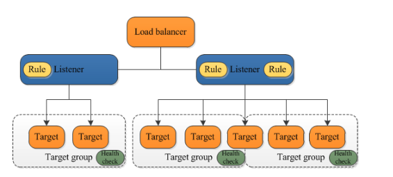

# ELB
ロードバランサーのサービスであり、受信したトラフィックを複数のAZのターゲットに分散させることができる。

## ALB(Application Load Balancer)
HTTP/HTTPSプロトコルを利用するアプリケーションの負荷分散をサポート
URLによるパスルーティングやCognitoとの連携など、多機能なロードバランサー

ALBでは、リスナーやルール、ターゲットグループといった設定を行うことでルーティングが可能となる。

### リスナー
通信先のプロトコル（HTTP/HTTPS）とポート（80/443）を設定することができる。
クライアントは、ALBに対して、リスナーで設定したプロトコルとポートを宛先としてリクエストを行う。

### ルール
リスナーに対して複数のルールを設定することができる。例えばリクエストのパスに対してルールを設定することができる。ルールは優先順位を持って設定され、条件が満たされるかが判断される。

ルールのパターン

|ルールの条件|特徴|
|:----|:----|
|ホストヘッダー|ALBには複数のドメインを紐づけることが可能。（"example-A.com"と"example-B.com"）このホストごとにルーティング先を定義することができる|
|パスパターン|リクエストのパスに応じてルーティング先を定義することができる|
|HTTPヘッダー|リクエストのHTTPヘッダーの文字列にルーティング先を定義することが可能|
|HTTPメソッド|GETやPOSTのメソッドごとにルーティング先を定義することが可能|
|クエリ文字列|クエリのキー/値のペアごとにルーティング先を定義することが可能|
|送信元IP|1つ以上のCIDRブロックごとにルーティング先を定義することが可能|

アクションパターン

|アクション|特徴|
|:----|:----|
|フォワード|登録されているターゲットグループにルーティングする|
|認証|認証アクションを設定して認証を行う（Cognito認証、OIDCが可能）|
|固定レスポンス|ALBのみで固定のSorryページなどを表示可能|
|リダイレクト|HTTPのリクエストをHTTPSにリダイレクト可能|

### ターゲットグループ
フォワード先としてm指定するロードバランシングの対象。

## NLB(Network Load Balanber)
TCP/UDPリスナーおよびTLSアプリケーションの負荷分散をサポート。
名前の通り、ネットワーク層での負荷分散を行うため、ソースIPアドレスやポートによるルーティングを行う。
秒間に数万リクエストを処理できる特徴がある。

IPの扱いについて、特徴がある。
第一に、NLBに対して固定のIP（EIPも可能）を付与させることができる。
第二に、クライアントとルーティング間のIPの扱いを制御することができる。具体的にはクライアントのIPをヘッダーに保持することができる。ALBはクライアントから受けたリクエストについて負荷分散する際、ルーティング先にはALBのIPとしてリクエストすることになるが、NLBでは、クライアントのIPを使うこともNLBに紐づいたIPを使うこともできる。

NLBは数万のリクエストを裁くことができるが、シンプルな構成となっており、ALBのように複雑なルーティングや認証などを行うことはできず、IPとポートに応じたフォワードのみをサポートしている。

## CLB(Classical Load Balanber)
古い世代のLoad Balancerのため利用は非推奨
