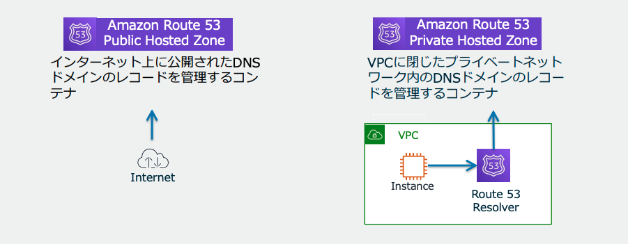
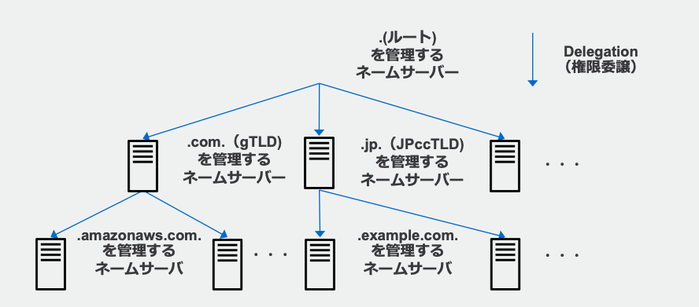

# Route53
DNSを管理するサービスである、可用性と拡張に優れているマネージドサービスである。
DNSサーバーのポートが53で動作することに由来して、命名されている。

「xxx.co.jp」というドメイン名には、IPアドレス192.168.0.1が対応しているという情報を保持して提供するシステムがDNSである、アプリケーションの住所録にあたる。

## Route53の役割
大きく4つの役割がある
- ドメイン登録（ドメイン名・ホストゾーン管理）
- ヘルスチェック
- DNSルーティング
- リソルバー


## ドメイン登録とホストゾーン管理
### ドメイン登録
Route53では、"xxx.com"のようなドメインを購入して登録することが可能。

取得したドメインに対して、Aレコード、CNAME、MXレコードなどのDNSレコードを設定することが可能。

|レコード名|役割|利用方法|例|その他重要情報|
|:----|:----|:----|:----|:----|
|A (Address) レコード|ドメイン名をIPv4アドレスにマッピング|ドメイン名が指定されたIPv4アドレスに解決される|example.com -> 192.0.2.1|WebサイトのIPアドレスを指定するのに使用|
|AAAA (Quad A) レコード|ドメイン名をIPv6アドレスにマッピング|ドメイン名が指定されたIPv6アドレスに解決される|example.com -> 2001:0db8:85a3:0000:0000:8a2e:0370:7334|IPv6対応サイトのIPアドレスを指定するのに使用|
|CNAME (Canonical Name) レコード|ドメイン名を別のドメイン名にマッピング|エイリアス名が本来のドメイン名に解決される|www.example.com -> d123456abcdef8.cloudfront.net|同じリソースに複数の名前を持たせる場合に使用|
|MX (Mail Exchange) レコード|メールサーバーの指定|ドメイン名に対するメールサーバーを指定|example.com -> mail.example.com|メールの配送先を指定|
|TXT (Text) レコード|テキスト情報の保存|ドメイン名に関連するテキスト情報を保存|example.com -> "v=spf1 include:_spf.example.com ~all"|SPFレコードやドメインの検証に使用|
|ALIAS レコード|エイリアスを提供（AWS Route 53特有）|エイリアス名が本来のドメイン名に解決される|example.com -> example.net|AWSリソースに対してエイリアスを作成する場合に使用|

### ホストゾーン管理(権威DNSサービス)
HostezZoneは特定のドメイン"example.com"に関するDNSの情報を管理するための領域。
そのドメインに関するDNSレコードを管理する役割を持つ。

AWSでは3つのHostedZoneがある。
- パブリックホストゾーン: インターネットに公開されたレコードを管理
- プライベートホストゾーン: VPCに閉じたレコードを管理
- VPC and Hybrid DNS: オンプレとVPCの両方のハイブリッド環境で名前解決




## ヘルスチェック
Route53では、登録されたレコードのリソースの死活監視を行うことが可能。
Route53が死活監視をおこなった上でルーティングを行うことで正常な宛先へのルーティングが可能となる。

特徴としては、実行間隔の調整や何回連続で失敗したら死んでいると判断するかの閾値設定が可能といった特徴がある。


## DNSルーティング
Route53では登録されたレコードについて、以下のポリシーを適用して適切な名前解決を行うことができる。

|ルーティングポリシー名|特徴|
|:----|:----|
|シンプルルーティング (Simple Routing)|単一のリソースに対してトラフィックをルーティングします。シンプルなDNSレコード設定に適しています。|
|加重ルーティング (Weighted Routing)|複数のリソースにトラフィックを分散させることができます。各リソースに対して加重を設定し、その加重に基づいてトラフィックが分散されます。|
|レイテンシールーティング (Latency Routing)|ユーザーとリソース間のレイテンシーを最小化するために、最も低いレイテンシーのエンドポイントにトラフィックをルーティングします。|
|フェイルオーバールーティング (Failover Routing)|プライマリリソースが利用できない場合に、セカンダリリソースにトラフィックをルーティングします。高可用性を確保するために使用されます。|
|地理位置情報ルーティング (Geolocation Routing)|ユーザーの地理的位置に基づいてトラフィックをルーティングします。特定の地域のユーザーに対して異なるリソースを提供する場合に使用されます。|
|地理的近接ルーティング (Geoproximity Routing)|ユーザーとリソースの物理的な距離に基づいてトラフィックをルーティングします。必要に応じてバイアスを適用して、特定のリソースにトラフィックを誘導できます。|
|マルチバリュールーティング (Multivalue Answer Routing)|複数の健康なエンドポイントのリストを返し、クライアント側での負荷分散をサポートします。健康チェックと組み合わせて使用されます。|

### CloudFrontとRoute53の連携
Route53は登録レコードの中でルーティングを行い、CloudFrontはルーティングされた後にエッジロケーションによりレイテンシーの最適化を行う。

|ケース|DNS解決|ルーティングポリシー|エッジロケーション選択|
|:----|:----|:----|:----|
| CloudFront単独|CloudFrontのDNS解決|なし|CloudFrontが自動的に選択|
| Route 53単独|Route 53がDNS解決|Route 53のルーティングポリシー|なし（ルーティングポリシーに基づきIPを選択）|
| Route 53とCloudFrontの組み合わせ|Route 53がDNS解決し、複数のCNAMEから適切なものに解決|Route 53のルーティングポリシーに基づきCNAMEを解決|CloudFrontが自動的に選択|
### CloudFront
CloudFrontはエッジロケーションを利用してレイテンシーが小さくなるようにリクエストに対してレスポンスを返す。その際に、どのエッジロケーションを利用するかはCloudFrontのネットワークインフラが自動的に選択を行う。
### Route53
Route53はレコードに設定されているAレコードやCNAMEの中からTraficPoliciesに基づいて適切な値を返却する。
レコードにCloudFrontが指定されており、CloudFrontに名前解決された後に、CDNとしてレイテンシーが小さくなるようなエッジロケーションが選択される。

## リゾルバー
リゾルバートは、クライアントからの名前解決のリクエストを受け付け、最終的なIPを返すまでのプロセスを管理します。
問い合わせを受けた理ゾルバーはルートDNSへの問い合わせから順次階層的に問い合わせを行い、権威DNS（Route53ではホストゾーン）まで問い合わせを行うことで名前解決を達成する。
```
クライアント -> リゾルバー -> ルートDNS -> TLD DNS (.comなど) -> Route 53 (権威DNS)
       ↑                                                               ↓
       └────────────────── IPアドレスを返す ───────────────────┘
```




