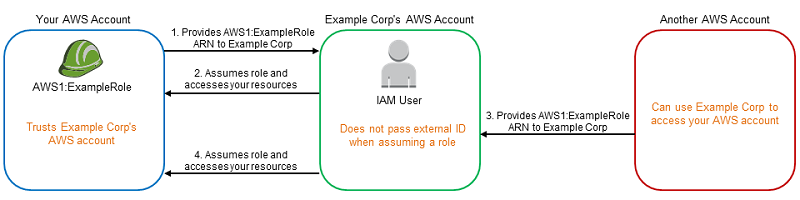

# クロスアカウント
別AWSアカウントのリソースの操作をすることをクロスアカウントと呼ぶ。
公式ドキュメントの[IAM でのクロスアカウントのリソースへのアクセス](https://docs.aws.amazon.com/ja_jp/IAM/latest/UserGuide/access_policies-cross-account-resource-access.html)参考。

クロスアカウントには、以下の2つの方法がある
- リソースベースポリシーを利用して、別アカウントのIAMプリンシパルに権限を追加してあげる方法
- Roleを利用して、別アカウントのRoleが自アカウントのRoleにスイッチできるようにしてあげる方法

## 基本的な考え方
基本的にクロスアカウントでは、どちらの方法を利用するにしても、以下の2つを準備すればよい。  
アカウントAがリソースを公開する側、アカウントBが外部からリソースにアクセスする側とする。
- アカウントAのPolicyのPrincipalにアカウントBのIAMプリンシパルの情報を記述
- アカウントAのPolicyのActionに許可したいアクションのみを記述
- アカウントBのPolicyにアカウントAのリソースに対するアクションを記述


## リソースベースポリシーを利用したクロスアカウント
リソースベースポリシーを利用したクロスアカウントの設定イメージと設定方法について見ていく。

注意点としては自アカウント内で許可する際は、リソースベースポリシーか許可ポリシーどちらかに許可が記載されていれば十分だったが、クロスアカウントではリソースベースと許可ポリシー両方で記述が必要である。
また、認可に対してもリソースベースと許可ポリシーの共通部分だけが許可される動きとなる。


### 設定イメージ
クロスアカウントの基本的な考え方に沿って、以下を実施
- アカウントAのリソースベースポリシーのPrincipalにアカウントBのIAMプリンシパルを記述
- アカウントAのリソースベースポリシーのActionに許可したいアクションのみを記述
- アカウントBのIAMプリンシパルの許可ポリシーにアカウントAのリソースに対する操作権限を記述


### 設定方法
#### アカウントAのリソースベースポリシーのPrincipal/Action設定
以下のようにアカウントAでは、PrincipalとしてアカウントBを指定して、操作してよい対象と操作してよいAction両方を記述する
```json
{
    "Version": "2012-10-17",
    "Statement": [
        {
            "Sid": "",
            "Effect": "Allow",
            "Principal": {"AWS": "arn:aws:iam::AccountB:[Role名など]"},
            "Action": "[許可したいアクション]",
            "Resource": "[許可したい対象リソース(リソース自身)]"
            }
        ]
}
```


#### アカウントBの許可ポリシーにAction設定
以下のようにアカウントBでは操作したいリソースとアクションを記述する。
```json
{
     "Version": "2012-10-17",
     "Statement": [
         {
             "Sid": "",
             "Effect": "Allow",
             "Action": "[実行したいアクション]",
             "Resource": [
                 "arn:aws:iam::AccountA:[操作したい対象リソース]"
             ]
         }
     ]
 }
```


## Roleを利用したクロスアカウント（スイッチロール）
スイッチロールを利用したクロスアカウントの設定イメージと設定方法について見ていく。

注意点はスイッチロールの方法を採用すると、別アカウントが元々利用していたRoleは捨てて、自アカウントのRoleに完全に切り替わっている点。


### 設定イメージ
クロスアカウントの基本的な考え方に沿って、以下を実施
- アカウントAのRoleの信頼ポリシーにアカウントBのIAMプリンシパルを記述
- アカウントAのRoleの許可ポリシーに許可したいアクションのみを記述
- アカウントBのIAMプリンシパルの許可ポリシーにアカウントAのRoleへのAssumeRoleを記述


### 設定方法
#### アカウントAのRoleの信頼ポリシー設定
以下のようにアカウントAではスイッチロールを許可するために、信頼ポリシーにrole-BBBをprincipalに記述する。

```json
{
    "Version": "2012-10-17",
    "Statement": [
        {
            "Effect": "Allow",
            "Principal": {
                "AWS": [
                    "arn:aws:iam::AccountB:role/role-BBB"
                ]
            },
            "Action": "sts:AssumeRole"
        }
    ]
}
```
#### アカウントAのRoleの許可ポリシー設定
以下のようにアカウントAではスイッチロール後に操作してよいリソースやアクションを記述する。
```json
{
     "Version": "2012-10-17",
     "Statement": [
         {
             "Sid": "",
             "Effect": "Allow",
             "Action": "[別アカウントに許可したいアクション]",
             "Resource": [
                 "[別アカウントに許可したいリソース]"
             ]
         }
     ]
 }
```

#### アカウントBのIAMプリンシパルの許可ポリシー設定
以下のようにアカウントBではスイッチロール先のRole-AAAに対してのassumeRoleの許可ポリシーを記述する。
```json
{
     "Version": "2012-10-17",
     "Statement": [
         {
             "Sid": "",
             "Effect": "Allow",
             "Action": "sts:AssumeRole",
             "Resource": [
                 "arn:aws:iam::AccountA:role/role-AAA"
             ]
         }
     ]
 }
```

## 混乱した代理問題
サードパーティサービスのAWSから、自分のアカウントのAWSリソースへの操作をすることを考える時に混乱した代理問題という問題に気をつける必要がある。

混乱した代理問題とは、サードパーティからのアクセスを許可するためにIAM Roleベースのスイッチロールを利用すると、サードパーティを利用しようとする別の第三者が、自分のIAM RoleのARNを予測することで、自分のIAM Role権限を利用してしまうという問題である。


公式ドキュメント[混乱する代理問題](https://docs.aws.amazon.com/ja_jp/IAM/latest/UserGuide/confused-deputy.html)

### 正規利用
自分のAWSアカウントAとサードパーティのAWSアカウントXとすると、スイッチロールのために以下の設定を行う
1. アカウントAでRoleAを作成する
2. RoleAの信頼ポリシーでアカウントXを信頼する旨を記載
3. サードパーティサービスで、RoleAのARNを登録
    - 内部ではアカウントXでRoleAにassumeRoleする旨を記載

これによりサードパーティを利用してアカウントRoleAの持つ権限を利用したサービスを享受することができる。

### 不正利用
ここで悪い人Zは、サードパーティサービスを利用したさいにRoleAのARNを予測して登録してしまうと、Aさんの情報を見れてしまうというのが混乱した代理問題のポイント。

### 対策
External IDとよばれるランダム文字列をサードパーティの登録時に発行する。
アカウントAの信頼ポリシーでアカウントXを信頼する手順２において、ExternalIDをAWSの信頼ポリシーの中のConditionにその文字列を追加することによって、対応する。
