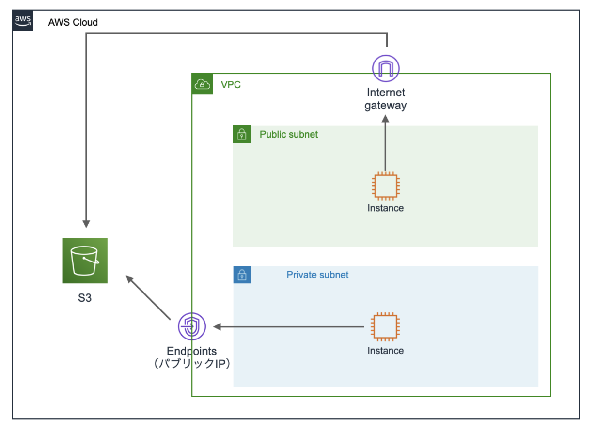
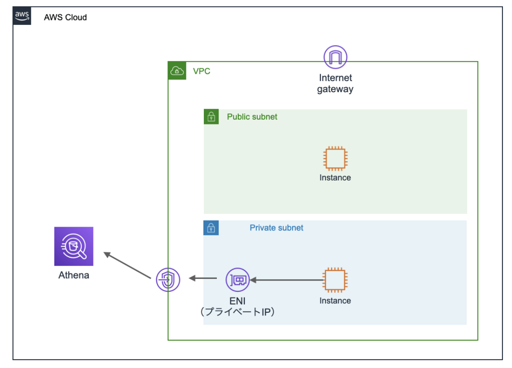

# VPC Endpoint
VPC Endpointを利用する事でインターネットを経由せずに、VPC外のAWSサービスにアクセする事が可能となる。

VPCエンドポイントにはゲートウェイ型とインターフェース型が存在する

## Gateway型
GW型のVPCエンドポイントは、S3とDynamoDBのみが対応している。
GW型のためVPCに設置され、各サブネットで設定するルートテーブルにおいてルーティング設定を行う事で、通信経路が確立される。

[2つのVPCエンドポイントの違いを知る](https://dev.classmethod.jp/articles/vpc-endpoint-gateway-type/)

### VPCエンドポイントポリシー
GW型のVPCエンドポイントにはVPCエンドポイントポリシーを付与する。
IAMのPolicyと同様に記載し、エンドポイントからサービスへのアクセス制御をする事ができる。

例えば、VPC-Endpoint-AにはBacket-Aへのアクセス権限をエンドポイントポリシーに定義し、VPC-Endpoint-BにはBucket全てへのアクセス権限をエンドポリシーに定義する。
バケットポリシー側でVPC-Endpoint-A経由のみのアクセスを許可するように記載する事で、Bucket-AはVPC-Endpoint-Aからのみ通信を許可し、さらに他のバケットへのコピーを防ぐ事ができる。
一方で、VPC-Endpoint-Bを経由する事でBucket-A以外のバケットには通信が可能となる。

## Interface型
IF型のVPCエンドポイントは、実態としてはENIを経由した通信が構成される。
サブネット内にENIが作成され、ENIに紐づいたプライベートIPアドレスで接続が行われる。
通信としては、VPC内部のローカルの通信を行なっている者と同一となる。

 
[2つのVPCエンドポイントの違いを知る](https://dev.classmethod.jp/articles/vpc-endpoint-gateway-type/)

## GW型とIF型の違い
### 費用
GW型は費用がかからない。一方でIF型は時間と利用通信量に応じて費用がかかる点に注意

### 外部からの通信
GW型は、サブネット外部への通信として扱われる。そのためVPCピアリングなどのVPC外部からGW型のエンドポイントを利用しようとすると通信は失敗する。

一方でエンドポイント型の場合、サブネット内部のENI経由の通信となるためVPC外部から出会っても適切にネットワーク設計されていれば通信を行う事ができる。