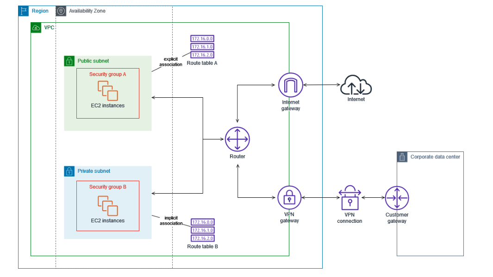

# ルートテーブル
## VPC内の通信
VPC内の通信経路はサブネットごとに紐づけられたルートテーブルにより制御される。

## ルートテーブル
ルートテーブルでは、`送信先(IP範囲)`とそれに対する`ターゲット`を定義する。
VPC内の通信は、ルートテーブルに問い合わせを行い、定義されたルートに従って通信を誘導する。

### localの通信
デフォルトのルートテーブルでは、VPC内でのルーティングを有効にするローカルルートが定義されている。
例えば、VPCのCIDRが(10.0.0.0/16)の場合、以下のような定義がされている。
以下の定義により、VPC内の通信経路が確立される（きちんと通信するためにはセキュリティ設定も必要）

|送信先IP|ターゲット|
|:----|:----|
|10.0.0.0/16|local|

### ターゲットの例
ターゲットの例としては以下が挙げられる

|利用例|送信先IP|ターゲット|備考|
|:----|:----|:----|:----|
|インターネットへの通信|0.0.0.0/0|igw-xxxxxx|パブリックサブネットで指定|
|NATGW経由の通信|0.0.0.0/0|nat-xxxxxx|プライベートサブネットで指定|
|VPCエンドポイント設定|pl-xxxxxx|vpce-xxxxx|plとはprefix Listを意味し、特定のAWSサービスに関連するIPプレフィックスを集約したもの。実態はCIDRの集合|
|仮想GW経由のオンプレへのVPN接続|192.168.1.0/24|vgw-xxxxx|仮想GWを経由して、オンプレへ通信する|
|他のVPCへのピア接続|10.1.0.0/16|pcx-xxxxx|VPCのピア接続を経由して、別のVPCのlocalへ通信する|

### ロンゲストマッチ
ルートテーブルには、複数のルールを設定する事ができるが、ルールが重複している場合より詳細なルールを設定しているルールが適用される。
例えば、以下の例で10.0.1.4への通信を行うと３番の経路で通信が行われる。

|No.|送信先IP|宛先|
|:----|:----|:----|
|1|10.0.0.0/16|local|
|2|0.0.0.0/0|igw|
|3|10.0.1.0/24|pcx|

### メインルートテーブルとカスタムルートテーブル
VPC作成時に、自動的にメインルートテーブルが作成され、
メインルートテーブルは明示的にルートテーブルの紐付けが行われないサブネットに対して付与され、ローカルルートのみが定義されている。

サブネットごとにルートを設定する場合は、通信経路を設定した新たなルートテーブルを作成し、サブネットに紐づける。明示的に作成され、紐付けが行われたルートテーブルをカスタムルートテーブルと呼ぶ。
