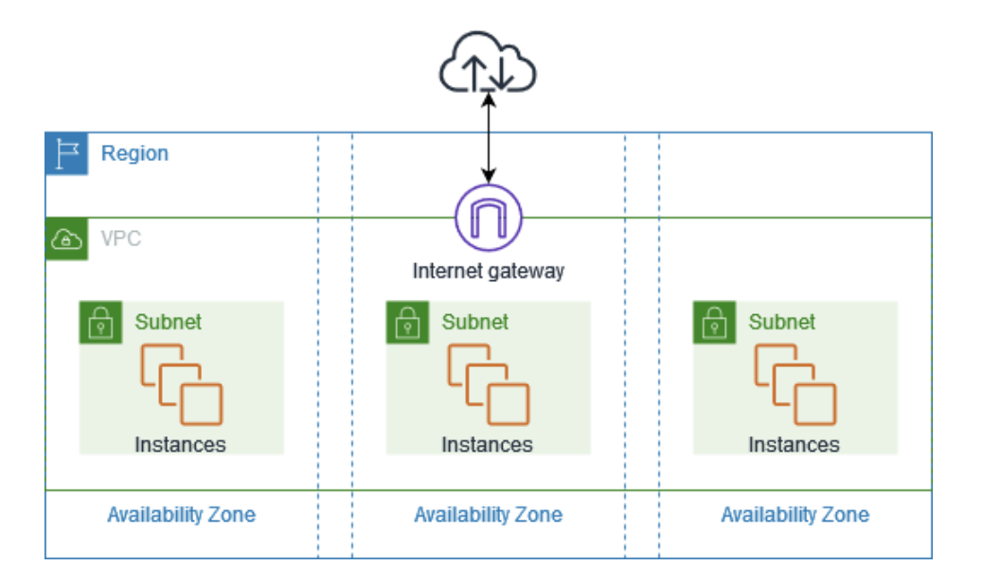

# VPC(Virtual Private Cloud)
AWSのネットワークサービスはVPCが基本となる。
VPCを作成することでユーザーごとのプライベートなネットワーク環境を構築する事ができる。

VPCを作成する事で、リージョン内部全てのAZに展開される。
VPCの内部にサブネットを作成する事ができ、その中にリソースを作成する。

## VPCのCIDR
VPCを作成するときにはIPv4のネットワークアドレスの範囲を指定する。
IPアドレスの設定範囲としての制限が設けられている

| |範囲|IPの数|
|:----|:----|:----|
|最大|/16|65536|
|最小|/28|16|

RFC1918で定められたプライベートIPアドレス範囲から指定することを推奨している。

|クラス|CIDR|IP数|
|:----|:----|:----|
|クラスA|10.0.0.0/8|	 16,777,216|
|クラスB|172.16.0.0/12|	 1,048,576|
|クラスC|192.168.0.0/16| 65,536|

また、設定できるIPにも制限があり、通常のネットワークアドレスとブロードキャスト以外にもAWSとして予約されたIPがあり、合計5つのIPを利用する事ができない点に注意する。
例えばVPCのCIDRとして10.0.0.0/16を選択した場合、

|名称|対象のIPアドレス|例|概要|
|:----|:----|:----|:----|
|ネットワークアドレス|最初のIPアドレス|10.0.0.0|サブネット全体を識別するためのアドレス。|
|VPCルーター|2番目のIPアドレス|10.0.0.1|サブネット内のデフォルトゲートウェイとして使用されるアドレス。|
|DNSサーバー|3番目のIPアドレス|10.0.0.2|AWSが提供するDNSサーバーのアドレス。|
|予約済みアドレス|4番目のIPアドレス|10.0.0.3|将来の使用のために予約されているアドレス。|
|ブロードキャストアドレス|最後のIPアドレス|10.0.255.255|ブロードキャストトラフィックに使用されるアドレス。|

上記で設定されたIPはプライベートIPとして設定されており、直接インターネットと通信する事ができない点に注意。

### IPv6
VPCに対しては必ずIPv4のCIDRを割り当てる必要がある。IPv4の設定を行った後にIPv6のCIDRを追加で割り当てる事ができる。
IPv6についてはVPCおよびサブネットのCIDRブロックサイズは固定されており、さらにIPv4同様5つのIPはAWSによって予約されており利用できない。

## サブネット
VPCで作成したCIDRの範囲の中から、ネットワーク範囲を区切ってサブネットに割り当てる事ができます。
サブネットは特定のAZに割り当てられる。

### パブリックサブネット
IGWを通じてインターネットへアクセスする事ができるサブネットの通称
### プライベートサブネット
インターネットから直接アクセスできないサブネットの通称

## DHCP(Dynamic Host Configuration Protocol)
VPCにはDHCPの機能を有しており、コンピューターがネットワークに接続して通信する際に必要な設定情報を自動で割り当ててくれる。

具体的にはDHCPにより、サブネット内のENI（Elastic Network Interface）に対してIPアドレスを自動で割り振る。
VPC内に作成されるリソースは、ENIをアタッチすることでサブネット内で通信することができる。

### DHCPオプション
DHCPではIPの割り振るだけでなく、「DHCPオプションセット」として設定された以下の情報を配布することができる。
AWSでは、VPCごとにDHCPオプションを作成、適用する事ができる。

|オプション名|設定内容|
|:----|:----|
|DNSサーバーのIPアドレス|規定ではVPCが提供するRoute53Resolver(Amazon Provided NDS)が指定される|
|カスタムドメイン名|EC2インスタンスに付与されるDNSドメイン名|
|NTPサーバーのIPアドレス|時刻同期用のNTPサーバーへのIPが設定可能。規定では設定されない|
|NetBIOSネームサーバーのIPアドレス|レガシーな通信用。規定では設定されない|
|NetVIOSノードタイプ|レガシーな通信用。規定では設定されない|

### DNS
VPCでは、DNSサーバーとしてはRoute53 Resolver(Amazon Provided DNS)が自動で提供されており、そのエンドポイントのアドレスは2つある
- 169.254.169.253
- 2番目のIPアドレス(Ex:10.0.0.2)

DHCPオプションとしてもAmazon Provided DNSが設定されており、このDNSサーバーによりサブネット場のリソースはVPC内やインターネット上の名前解決を行う事ができる。

## ENI

## IGW

## NAT

## ルートテーブル

## ファイヤーウォール
### セキュリティグループ
### ネットワークACL