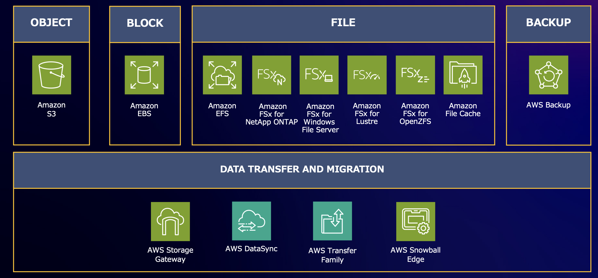
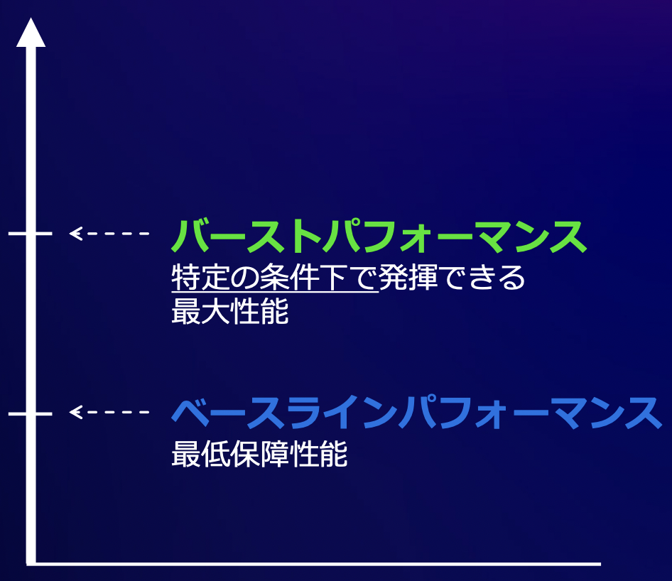
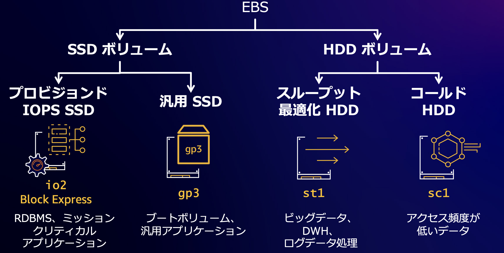
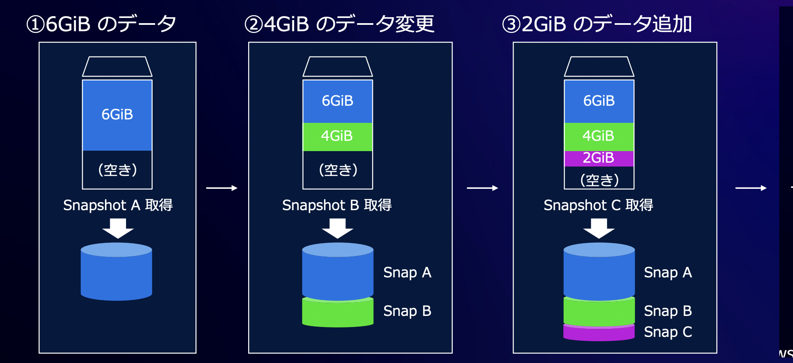
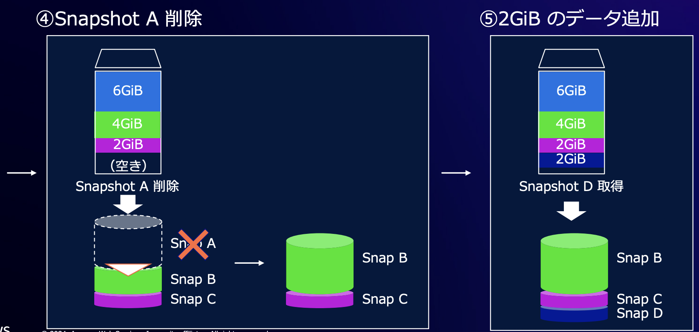

# EBS
EBSはAWSが提供する複数のストレージサービスのうち、Blockストレージにあたる。
EC2向けの永続的なストレージサービス。

[Amazon Elastic Block Store(Amazon EBS) 基礎編【AWS Black Belt】](https://pages.awscloud.com/rs/112-TZM-766/images/AWS-Black-Belt_2024_Amazon-Elastic-Block-Store-Basic_1209_v1.pdf)

Blockタイプのストレージは、Blockと呼ばれる固定朝の単位でデータを扱う。
ブロックのため階層構造を持たず、低レイテンシーを実現可能であり、低レイテンシーが要求されるワークロードに適している。  
また、低レイテンシーのために、AZ内で独立しているアーキテクチャとなっている。
よく利用されるプロトコルはNVMe。

[Amazon Elastic Block Store(Amazon EBS) 基礎編【AWS Black Belt】](https://pages.awscloud.com/rs/112-TZM-766/images/AWS-Black-Belt_2024_Amazon-Elastic-Block-Store-Basic_1209_v1.pdf)

## クラウドストレージのメリット
オンプレミスと比較して、ストレージに関する専門性があまりなくても高い機能性と非機能性を有するストレージを扱うことができる。

|項目|EBS (Elastic Block Store)|オンプレミスストレージ|
|:----|:----|:----|
|設計の簡単さ|AWSが管理するため設計がシンプル。要件に応じてサイズやタイプを選択するだけで利用可能。|ハードウェア、ネットワーク、バックアップの要件をすべて自分で設計する必要があるため、設計が複雑化しやすい。|
|オペレーションの簡単さ|管理コンソールやCLIでプロビジョニング、スナップショット、リサイズが簡単にできる。|ハードウェアの管理、RAID設定、ファームウェアのアップデートなどの手動操作が多い。|
|スケーラビリティ|容量の増減が柔軟で、必要に応じてすぐにスケールアップまたはダウンが可能。|ストレージ容量を増やすにはハードウェアの購入や設置が必要で、柔軟性が低い。|
|可用性|AWSが複数のアベイラビリティゾーンにわたる冗長性を提供。高い可用性が確保されている。|冗長性を確保するには自前でRAIDや複数拠点にデータを複製する必要があり、コストと手間がかかる。|
|コスト|初期投資が不要で、使用量に応じた課金モデル。特定の要件に応じてコスト最適化が可能。|初期投資が高く、ハードウェア、電力、保守費用が継続的に発生する。|
|セキュリティ|デフォルトで暗号化がサポートされ、アクセス制御もAWS IAMで一元管理可能。|暗号化やアクセス制御は独自に実装・管理する必要がある。|
|パフォーマンス|IOPSやスループットを選択できるため、要件に応じて調整可能。|パフォーマンスを向上させるにはハードウェアやネットワークの構成を変更する必要がある。|

## EBSの基本
EC2に対して、永続的なblockストレージを提供するサービス。
EBSは、AZごとに独立しているため、EC2にアタッチする際に、同一のAZ内のEC2からのみアクセスが可能。

## ボリュームタイプ
### Blockストレージの種類
EC2におけるBlockストレージは2種類
- Amazon EBS
- EC2 インスタンスストア

インスタントストアは、非永続的なディスク領域でEC2に元から付属しているキャッシュ領域のようなもの。

[Amazon Elastic Block Store(Amazon EBS) 基礎編【AWS Black Belt】](https://pages.awscloud.com/rs/112-TZM-766/images/AWS-Black-Belt_2024_Amazon-Elastic-Block-Store-Basic_1209_v1.pdf)

### EBSの性能
EBSではベースラインとバーストモードが提供されている。
クレジットを消費することでバーストモードとして高い性能を提供できるが、クレジットを使い切ってしまうとベースラインの性能しか出ないことに注意。

[Amazon Elastic Block Store(Amazon EBS) 基礎編【AWS Black Belt】](https://pages.awscloud.com/rs/112-TZM-766/images/AWS-Black-Belt_2024_Amazon-Elastic-Block-Store-Basic_1209_v1.pdf)

EBSでは、HDDタイプがクレジットに基づいて性能が変化し、SSDタイプは一貫した性能を担保する。

### EBSの種類
EBSでは、大きく4つのタイプが提供されている。
これらの変更はコンソールやAPIを利用して実行することが可能。ただし、サイズの縮小はできない点に注意。

[Amazon Elastic Block Store(Amazon EBS) 基礎編【AWS Black Belt】](https://pages.awscloud.com/rs/112-TZM-766/images/AWS-Black-Belt_2024_Amazon-Elastic-Block-Store-Basic_1209_v1.pdf)

#### スループットとIOPS
EBSの指標となるIOPSとスループットについて簡単に述べておく。
スループットは、転送できるファイルサイズ、IOPSは処理できるデータの回数を示す。

|項目|定義|単位|特徴|適用タイプ|
|:----|:----|:----|:----|:----|
|スループット|ストレージが1秒間に転送できるデータ量|MB/s|大きなデータ転送のスピードを重視|シーケンシャルアクセス（HDDに強い）|
|IOPS|ストレージが1秒間に処理できるデータの読み書き操作（入出力操作）の回数|回/秒（4KBブロック単位）|小さなデータを頻繁に読み書きする速度|ランダムアクセス（SSDに強い）|

EBSで提供されている各タイプのIOPSおよびスループット以下。gp3にはgp2という旧世代もあるがパフォーマンス及び費用でgp3にメリットがあるため割愛。

|ボリュームタイプ|主なユースケース|耐久性|ボリュームサイズ|ボリューム毎の最大IOPS|インスタンス毎の最大IOPS (複数ボリューム)|ボリューム毎の最大スループット|インスタンス毎の最大スループット (複数ボリューム)|マルチアタッチ|月額料金 (東京リージョン)|
|:----|:----|:----|:----|:----|:----|:----|:----|:----|:----|
|io2 Block Express|ミッションクリティカルアプリケーション|100.00%|4GiB - 64TiB|256000|420000|4,000 MiB/sec|12,500 MiB/sec|○|$0.142/GB + $0.074/設定IOPS値 (#32000まで) + $0.052/(設定IOPS値 - 32000) (#64000まで) + $0.036/(設定IOPS値 - 64000)|
|汎用SSD (gp3)|ブートボリューム、アプリケーション|99.8% - 99.9%|1GiB - 16TiB|16000|260000|1,000 MiB/sec|12,500 MiB/sec|-|$0.096/GB + $0.006/(設定IOPS値 - 3000) + $0.048/(設定スループット値 - 125)|
|スループット最適化HDD (st1)|ビッグデータ、DWH、ログデータ処理|99.8% - 99.9%|125GiB - 16TiB|500|500|500 MiB/sec|12,500 MiB/sec|-|$0.045/GB|
|コールドHDD (sc1)|アクセス頻度が低いデータ|99.8% - 99.9%|125GiB - 16TiB|250|250|250 MiB/sec|7,500 MiB/sec|-|$0.018/GB|
[Amazon EBS ボリュームタイプ](https://docs.aws.amazon.com/ja_jp/ebs/latest/userguide/ebs-volume-types.html?utm_source=chatgpt.com)

性能的にはプロビジョンドSSDが最も性能が高い。一方でHDD系は費用が安い。
また、上記で述べたとおりEBSでは、HDDタイプがクレジットに基づいて性能が変化し、SSDタイプは一貫した性能を担保する点にも注意。

## スナップショットとリストア
EBSのスナップショット機能を利用すると、S3にスナップショットを配信することができる。
スナップショットは増分アップデートであり、自動で世代管理まで対応してくれる。

[Amazon Elastic Block Store(Amazon EBS) 基礎編【AWS Black Belt】](https://pages.awscloud.com/rs/112-TZM-766/images/AWS-Black-Belt_2024_Amazon-Elastic-Block-Store-Basic_1209_v1.pdf)

リストアする際の手順は以下
1. スナップショットからEBSを新規作成
2. 新しいEBSをEC2にアタッチ
3. 古いEBSをEC2からデタッチ
4. 古いEBSを削除

## EBSのセキュリティ
EBSでは、暗号化の設定を有効化にするだけで、KMSのキーを利用したEBSの暗号化が行われるとともに、復号化に関してはEC2で透過的に行われるため、サーバー側やアプリ側で意識する必要性がない。

暗号化はEBSを作成するときにのみ実行することができる点に注意。
