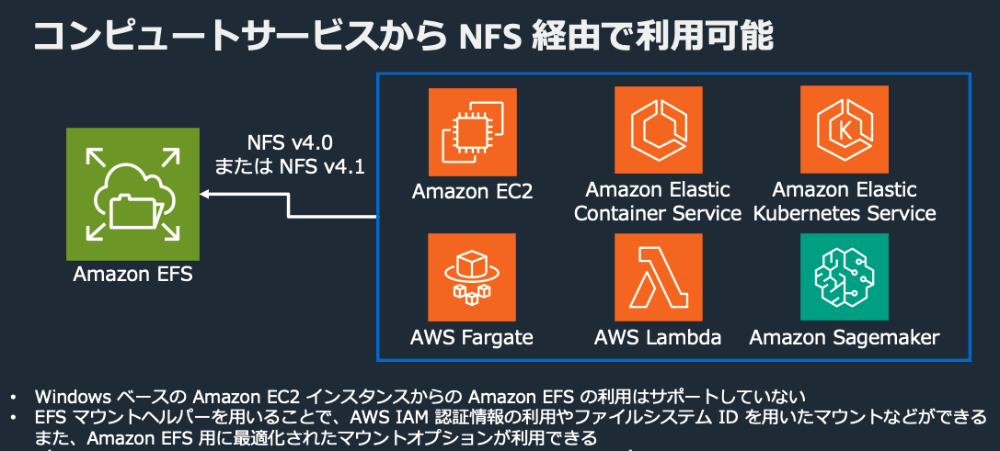
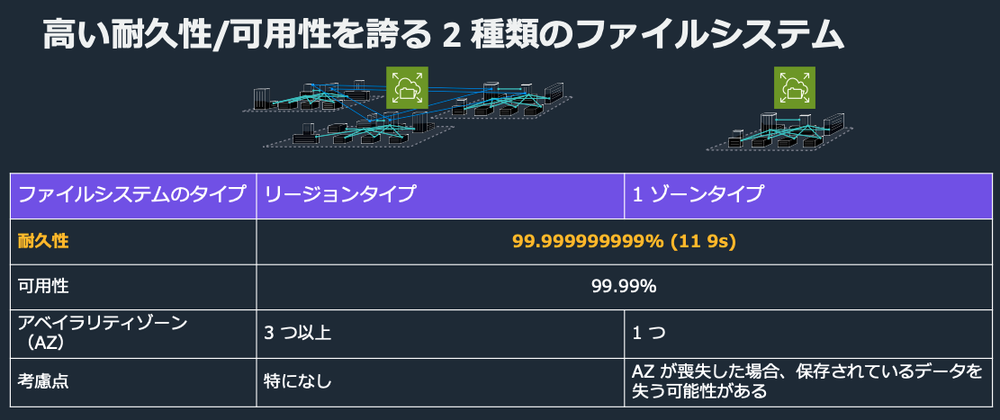

# EFS
## メリット
クラウドネイティブなワークロードに適した分散ファイルシステムのフルマネージドサービス。
特徴としては以下
- フルマネージド
- 保存容量に応じた自動拡張
- 高い耐久性と可能性
- セキュリティ

### フルマネージド
EFSをマウントすると8エクサバイトの容量がマウントされるが、課金は使用容量による重量課金

### 利用しやすさ
さまざまなコンピューティングサービスから利用が可能。

[BlackBelt](https://pages.awscloud.com/rs/112-TZM-766/images/AWS-Black-Belt_2024_Amazon-ElasticFileSystem_0229_v1.pdf)

### 耐久性
リージョンタイプと1ゾーンタイプが利用可能で、耐久性や可用性はどちらでも非常に高い。
リージョンタイプは3つのAZに分散される。1AZはデータの損失の可能性がある点に注意。

[BlackBelt](https://pages.awscloud.com/rs/112-TZM-766/images/AWS-Black-Belt_2024_Amazon-ElasticFileSystem_0229_v1.pdf)

### セキュリティ
EFS自体への操作を制御したり、監視することができる。
また、アプリケーションがEFSに操作する場合も、アイデンティティベース・リソースベース・ネットワークベースでの制御が可能となる。
EFSに保管されるファイルへの暗号化も適用が簡単にできる。

## 接続方法
### マウントターゲット
EFSファイルシステムにアクセスするためのエンドポイントはマウントターゲットと呼ばれる。
マウントターゲットはAZごとに作成され、各種コンピューティングサービスはこのマウントターゲット経由でEFSに接続するため、VPC-Endpointのような動きをする。

[マウントターゲットの管理](https://docs.aws.amazon.com/ja_jp/efs/latest/ug/accessing-fs.html)

### アクセスポイント
マウントする際にEFSのルートディレクトリではなくて、別のディレクトリをルートディレクトリとして設定することができる機能。また、権限についてもアクセスポイントで制御することができる。
この機能を利用するためにはEFSのマウントヘルパーが必要な点に注意。

### EFSとNFS
EFSはNFSv4およびNFSv4.1プロトコルを使用している。NFSによりEC2やオンプレがEFSにアクセスすることができる。

### NFS(Network File System)
NFSはネットワークを介して、リモートのファイルシステムを共有するためのプロトコルである。
NFSを使用することで、クライアントマシンがリモートサーバーのファイルシステムをローカルのディレクトリとしてマウントする。

### EFSマウントヘルパー
EFSマウントヘルパー(amazon-efs-utils)とは、EFSファイルシステムをEC2インスタンスで簡単にマウントするためのツール。
標準的なNFSクライアントよりもシンプルなCLI操作により、EFSとの接続が可能となる。

## 便利機能
### レプリケーション
EFSを別のリージョンへとレプリケーションが可能。ただし、レプリケーション先のシステムは読み取り専用となる。
15分以内のレプリケーションが行われることが多い。
レプリケーションに土絵は暗号化や自動バックアップやレプリケーション方式にはオプションがある。

### ストレージの階層化
ファイルへのアクセスパターンに応じて、低頻度アクセスクラスやアーカイブクラスなどに移行することができる。
これによって費用を削減へ寄与する。

### バックアップ
AWS Backupと連携して、自動でのバックアップ設定を行うことができる。

## 費用
ストレージとデータアクセスについて費用がかかる

[BlackBelt](https://pages.awscloud.com/rs/112-TZM-766/images/AWS-Black-Belt_2024_Amazon-ElasticFileSystem_0229_v1.pdf)
