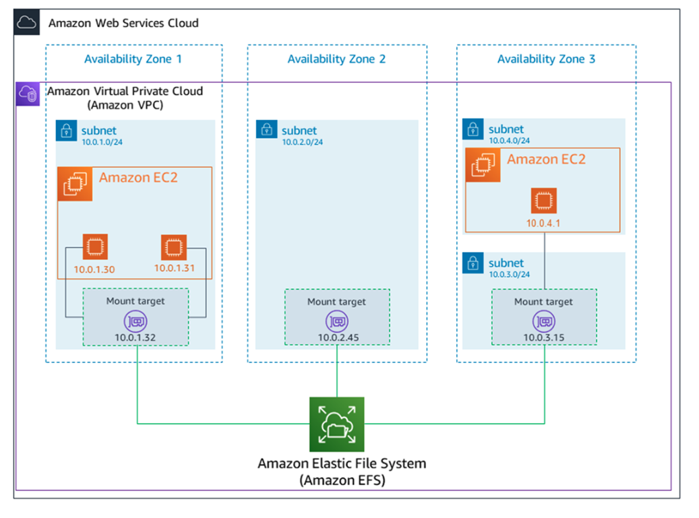
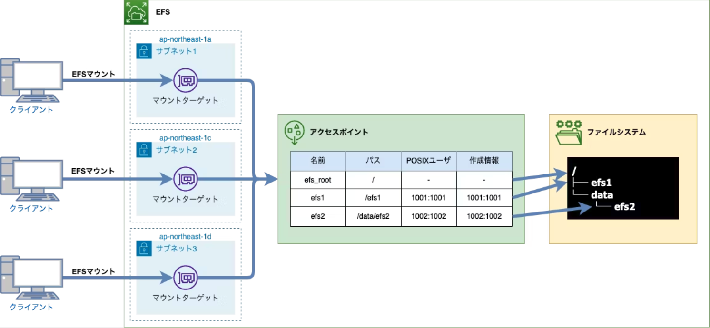
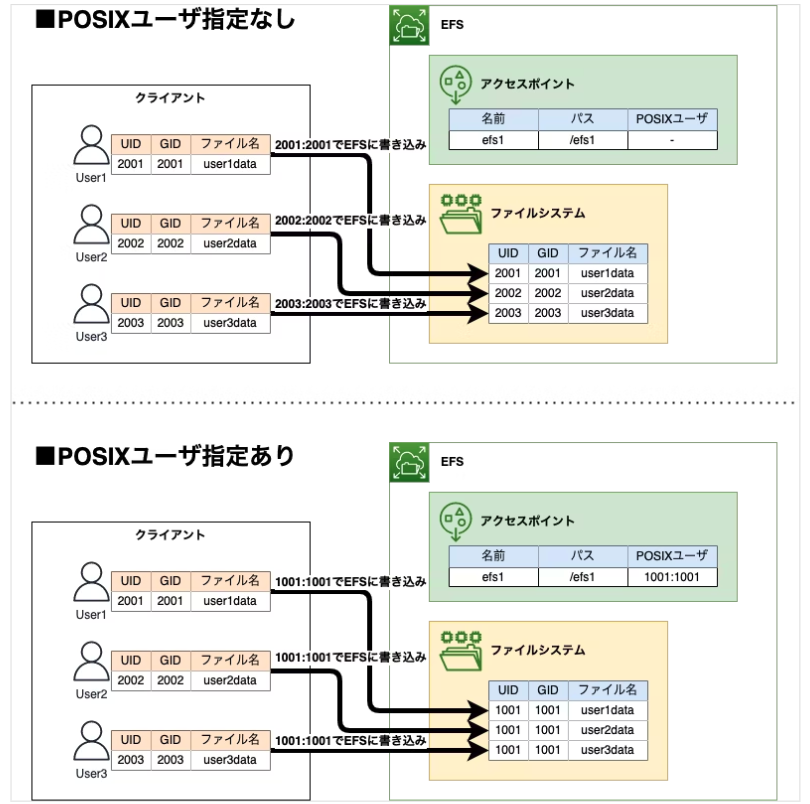
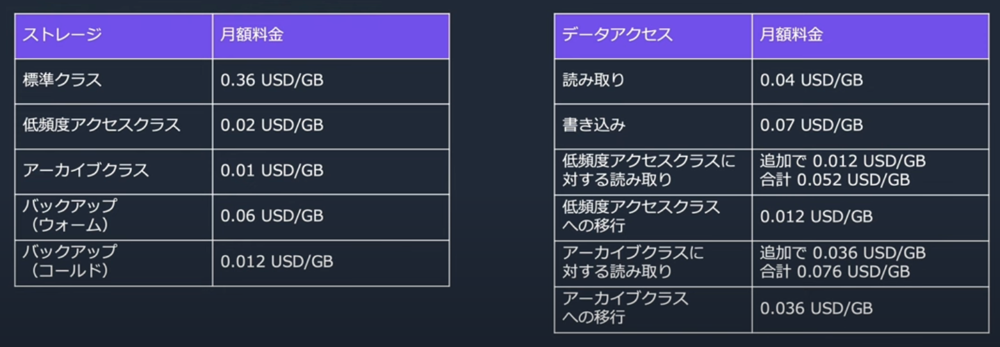

# EFS
## メリット
クラウドネイティブなワークロードに適した分散ファイルシステムのフルマネージドサービス。
特徴としては以下
- フルマネージド
- 保存容量に応じた自動拡張
- 高い耐久性と可能性
- セキュリティ

### フルマネージド
EFSをマウントすると8エクサバイトの容量がマウントされるが、課金は使用容量による重量課金

### 利用しやすさ
さまざまなコンピューティングサービスから利用が可能。


[BlackBelt](https://pages.awscloud.com/rs/112-TZM-766/images/AWS-Black-Belt_2024_Amazon-ElasticFileSystem_0229_v1.pdf)

### 耐久性
リージョンタイプと1ゾーンタイプが利用可能で、耐久性や可用性はどちらでも非常に高い。
リージョンタイプは3つのAZに分散される。1AZはデータの損失の可能性がある点に注意。


[BlackBelt](https://pages.awscloud.com/rs/112-TZM-766/images/AWS-Black-Belt_2024_Amazon-ElasticFileSystem_0229_v1.pdf)

### セキュリティ
EFS自体への操作を制御したり、監視することができる。
また、アプリケーションがEFSに操作する場合も、アイデンティティベース・リソースベース・ネットワークベースでの制御が可能となる。
EFSに保管されるファイルへの暗号化も適用が簡単にできる。


## 接続方法
### マウントとは
マウントとは、サーバーやコンテナ側の特定のディレクトリとファイルシステムを接続し、ディレクトリ経由でファイルシステムにアクセスできるようにする仕組みのこと。
OSは、ディレクトリ（マウントポイント）を経由してファイルサーバーを認識する。

### EFSの接続の概要
EFSをマウントするためには、EFSだけでなく以下のリソースについても設定が必要
- マウントターゲット(必須)  
    EFSに接続するためのAZごとの接続先のようなもの
- アクセスポイント(推奨)  
    EFS側のディレクトリを指定して、マウントさせる。またPOSXIのユーザー管理設定も可能

### マウントターゲット
EFSファイルシステムにアクセスするためのエンドポイントはマウントターゲットと呼ばれる。
マウントターゲットはAZごとに作成され、各種コンピューティングサービスはこのマウントターゲット経由でEFSに接続するため、VPC-Endpointのような動きをする。


[マウントターゲットの管理](https://docs.aws.amazon.com/ja_jp/efs/latest/ug/accessing-fs.html)

CFNでは、リソースとして`AWS::EFS::MountTarget`を個別に定義する必要がある。
```
  MyEFSMountTargetA:
    Type: AWS::EFS::MountTarget
    Properties:
      FileSystemId: !Ref MyEFS
      SubnetId: <Subnet-A-ID>
      SecurityGroups:
        - !Ref EFSSecurityGroup

  MyEFSMountTargetB:
    Type: AWS::EFS::MountTarget
    Properties:
      FileSystemId: !Ref MyEFS
      SubnetId: <Subnet-B-ID>
      SecurityGroups:
        - !Ref EFSSecurityGroup
```
### アクセスポイント
マウントする際にEFSのルートディレクトリではなくて、別のディレクトリをルートディレクトリとして設定することができる機能。また、権限についてもアクセスポイントで制御することができる。
この機能を利用するためにはEFSのマウントヘルパーが必要な点に注意。

[EFSのマウントについて理解する。](https://qiita.com/sakai00kou/items/3ee37db9eb31a726f558)

CFNでは、リソースとして`AWS::EFS::AccessPoint`を個別に定義する必要がある。
```
 MyEFSAccessPoint:
    Type: AWS::EFS::AccessPoint
    Properties:
      FileSystemId: !Ref MyEFS
      PosixUser:
        Uid: "1000"
        Gid: "1000"
      RootDirectory:
        Path: "/ecs-data"
        CreationInfo:
          OwnerUid: "1000"
          OwnerGid: "1000"
          Permissions: "755"
```

[EFSのマウントについて理解する。](https://qiita.com/sakai00kou/items/3ee37db9eb31a726f558)が詳しくてわかりやすいが、本ページでもポイントを解説。

#### EFSの領域分割
EFS側の領域定義を行い、アクセスポイント経由でアクセスすることでどの領域を提供するかを指定することができる。
アクセスポイントにより、efsの領域の提供の制御が容易になる。
上図では、`efs2`のアクセスポイントをマウントすると、実態はefs上の`/data/efs2`をマウントしているが、クライアントからするとefsの`/`をマウントしているように見える。

#### POSXIユーザ・グループ管理
アクセスポイントには、EFS領域に書き込みを行う際の、UIDとGIDの上書き機能が備わっている。
そのため、EFS領域の書き込みを指定したUIDとGIDに固定することができる。
これにより、異なるコンテナの実行者が同じディレクトリのファイルについてやりとりを行うことができる。つまりUID2001とUID20002のUserが同じファイルにアクセスすることができる。


[EFSのマウントについて理解する。](https://qiita.com/sakai00kou/items/3ee37db9eb31a726f558)


### コンテナ側(ECS)からの接続
タスク定義で、EFSとの接続の設定を行う。`Volumes`の設定と`MountPoints`の設定を行う。

Volumesでは、EFSをタスク定義に登録する。設定項目は以下
- EFSの論理名(Name: efs-volume)：タスク定義内でEFSを識別
- EFSの物理名(FileSystemID)：AWS上でEFSを識別
- アクセスポイントID：EFSをマウントする際の定義

MountPointsでは、Volumeで指定したEFSをコンテナ内のディレクトリと紐づける設定を行う。
- SourceVolume: Volumesで定義したEFSの論理名
- ContainerPath: コンテナからEFSにアクセスするためのパス

EFSの「マウントターゲット（Mount Target）」と「マウントポイント（MountPoints）」は異なる概念だが、名前が似ているため混同しないよう注意。


```
  MyECSTaskDefinition:
    Type: AWS::ECS::TaskDefinition
    Properties:
      Family: my-ecs-task
      ~~~
      Volumes:
        - Name: efs-volume
          EFSVolumeConfiguration:
            FileSystemId: !Ref MyEFS
            TransitEncryption: ENABLED
            AuthorizationConfig:
              AccessPointId: !Ref MyEFSAccessPoint
              IAM: ENABLED
      ContainerDefinitions:
        - Name: my-container
          ~~~  
          MountPoints:
            - SourceVolume: efs-volume
              ContainerPath: "/mnt/data"
              ReadOnly: false
```

#### Volumes定義のRootDirectoryについて
ECSのタスク定義におけるVolumesには`RootDirectory`が指定できる。
これは、アクセスポイントでも指定している、EFS側のどのパスを提供するかの指定である。

ただし、アクセスポイントのようにUIDやGIDの上書きをすることができないので、どちらを利用するかは見極めが必要になる。
また、RootDirectoryで指定したディレクトリががEFS上に存在しない場合に自動で作成されないため、事前に作成しておくという手間もかかる点に注意。


### EFSとNFS
EFSはNFSv4およびNFSv4.1プロトコルを使用している。NFSによりEC2やオンプレがEFSにアクセスすることができる。

### NFS(Network File System)
NFSはネットワークを介して、リモートのファイルシステムを共有するためのプロトコルである。
NFSを使用することで、クライアントマシンがリモートサーバーのファイルシステムをローカルのディレクトリとしてマウントする。

### EFSマウントヘルパー
EFSマウントヘルパー(amazon-efs-utils)とは、EFSファイルシステムをEC2インスタンスで簡単にマウントするためのツール。
標準的なNFSクライアントよりもシンプルなCLI操作により、EFSとの接続が可能となる。


## 便利機能
### レプリケーション
EFSを別のリージョンへとレプリケーションが可能。ただし、レプリケーション先のシステムは読み取り専用となる。
15分以内のレプリケーションが行われることが多い。
レプリケーションに土絵は暗号化や自動バックアップやレプリケーション方式にはオプションがある。

### ストレージの階層化
ファイルへのアクセスパターンに応じて、低頻度アクセスクラスやアーカイブクラスなどに移行することができる。
これによって費用を削減へ寄与する。

### バックアップ
AWS Backupと連携して、自動でのバックアップ設定を行うことができる。

## 費用
ストレージとデータアクセスについて費用がかかる


[BlackBelt](https://pages.awscloud.com/rs/112-TZM-766/images/AWS-Black-Belt_2024_Amazon-ElasticFileSystem_0229_v1.pdf)
