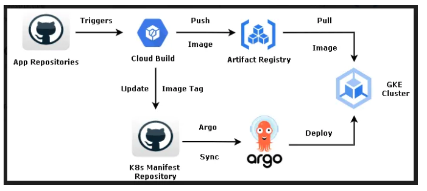

# コンテナサービス
## GCPのコンテナエコシステム
GCPでは、コンテナのBuildを行う`Cloud Build`や成果物（コンテナイメージの管理）を行う`Artifact Resistry`、コンテナのオーケストレーションを行う`GKE`などのサービスが提供されている。


[CI/CD with Cloud Build and ArgoCD on GKE](https://blog.searce.com/ci-cd-with-cloud-build-and-argocd-on-gke-5b2afe316177)


## Kubernetes
Kubernetesとは、コンテナを複数のホストにまたがって管理するオープンソースのコンテナオーケストレーションサービス。 
以下のようなオーケストレーションの機能を有している。
- ヘルスチェック
- オートスケール
- 起動停止(スケジューリング)
- デプロイ
- ネットワーク設定

2014年にGoogleから発表され、オープンソースであるという特徴からさまざまなエコシステムとの連携を行うことができる。

### Kubernetesの構成要素
K8sにおける主要な構成要素は以下の通り。

|構成要素|説明|補足|
|:----|:----|:----|
|クラスタ|Kubernetesの最上位単位。コントロールプレーンと複数のワーカーノードで構成される。|GKEではクラスターを作成すると、コントロールプレーンはマネージドに提供される。|
|ノード|クラスタを管理する`コントロールプレーン`とPod を実行する`ワーカーノード`（VM）の２種類。kubelet やコンテナランタイムが動作。|GKE では GCE VM（Compute Engine）がワーカーノードになる|
|Pod|Kubernetesにおける最小のデプロイ単位。1つ以上のコンテナを含む。|通常は1Pod = 1アプリコンテナ（+ サイドカー）|
|Service|Pod への安定したアクセス手段を提供する仮想IPとロードバランサ|PodのIPは変わるため、Serviceが固定IP的な役割を担う|

イメージとしては以下のような階層構造になっている
```
[ クラスタ ]
  ├─ [ ノード ]（複数）
  │     ├─ [ Pod ]（1つ以上）
  │     │     └─ [ コンテナ ]（1つ以上）
  │
  └─ [ Service ]
         └─ Pod に対する仮想IPと負荷分散を提供
```

### マニフェスト
Kubernetesでは「何を動かすか」「どこに公開するか」「どう設定するか」「どんな権限を持たせるか」などを、リソースごとに分けて`マニフェスト`としてYAMLで書き分ける。各リソースの中には、さらに具体的な設定項目が階層的に記述される。

|マニフェストの種類|主な役割|主な設定項目（中に書く内容）|
|:----|:----|:----|
|🟦 Deployment|アプリを動かす設定|・replicas: 起動するPodの数<br>・selector: 対象Podのラベル<br>・template: Podの定義（下に説明）|
|└─ template:|Podの設計図|・metadata.labels: Podのラベル<br>・spec.containers: コンテナの中身|
|└─ containers:|アプリの実行内容|・image: コンテナイメージ<br>・ports: 公開ポート<br>・env: 環境変数<br>・resources: CPU/メモリ制限<br>・livenessProbe などのヘルスチェック|
|🟦 Service|Podへの入り口|・selector: 対象Podのラベル<br>・ports: 通信ポートの変換<br>・type: ClusterIP / NodePort / LoadBalancer|
|🟦 Ingress|HTTPの入口設定|・rules: ドメイン名とルーティングルール<br>・backend.service.name: 宛先Service名|
|🟦 ConfigMap|設定ファイルや環境変数|・data: キーと値のセット（例: LOG_LEVEL: debug）|
|🟦 Secret|パスワードなどの機密情報|・data: Base64で暗号化された値|
|🟦 PersistentVolumeClaim（PVC）|永続ストレージの要求|・accessModes: アクセス方式<br>・resources.requests.storage: 容量要求|
|🟦 ServiceAccount|Podの身分証明書|・名前のみ（RoleBindingなどと一緒に使う）|
|🟦 Role / ClusterRole|権限定義（RBAC）|・rules: リソースごとに許可する操作（例: get, list）|
|🟦 RoleBinding / ClusterRoleBinding|権限を誰に割り当てるか|・subjects: 対象（ServiceAccountなど）<br>・roleRef: 割り当てるRole名|
|🟦 HorizontalPodAutoscaler（HPA）|Podの数を自動調整|・scaleTargetRef: 対象のDeployment名<br>・minReplicas / maxReplicas<br>・metrics: CPUなどの指標|
|🟦 Namespace|グループ分け|・metadata.name: 名前空間の名前|


### ヘルスチェック
K8Sのヘルスチェックには以下の3種類の機能が提供されている。

|種類|目的とタイミング|
|:----|:----|
|livenessProbe|コンテナが「生きているか」を確認。失敗したら再起動される|
|readinessProbe|コンテナが「リクエストを受け付けられる状態か」を確認。失敗中はServiceから除外される|
|startupProbe|コンテナの起動に時間がかかる場合に使用。起動完了前のlivenessチェックを防げる|


### Kubernetesの課題
Kubernetesは、分散システムであり、コントロールプレーン・データプレーンでさまざまなコンポーネントが動作しており、運用管理が煩雑になりがちである。


## GKE(Google Kubernetes Engine)
KubernetesをGCP上で簡単に利用できるようにしたマネージドサービス。
GKEをりよす売ることでKubernetesのセットアップをすべてマネージドにしてくれる。

GKEを利用することで以下のようなことが可能となる。

|機能|説明|
|:----|:----|
|クラスタ作成・管理の自動化|数クリック or CLI でクラスタが作れる|
|ノードのアップグレード・修復|OSのパッチ適用、ダウン時の自動回復|
|スケーリング|ノード数やPod数の自動増減（オートスケーリング）|
|セキュリティ統合|IAMやVPCと統合。ネットワークやアクセス制御もGoogle Cloud流に設定可能|
|モニタリング・ログ|Cloud Monitoring / Loggingと統合。可視化がラク|

さらに、クラスター構成について言えば、コントロールプレーンについてはすべてGKE側で制御されるため、ユーザーはノード側に集中することができる。

|レイヤ|管理主体|役割・説明|
|:----|:----|:----|
|コントロールプレーン|Google Cloudが管理|Kubernetesの中枢（APIサーバ、スケジューラなど）。利用者は気にしなくてよい|
|ノードプール（Node Pool）|ユーザーが管理（ある程度）|実際にコンテナを動かすVM群。GCE（Compute Engine）インスタンスとして提供される|

### 高可用性
GKEのクラスターについては、ワーカーノードとコントロールプレーンをマルチゾーンに配置することで高可用性を担保することができる。それぞれのマルチゾーン配置による分類は以下の通り。

|クラスタタイプ|ノード配置|コントロールプレーン|可用性|コスト|ユースケース|
|:----|:----|:----|:----|:----|:----|
|シングルゾーン|単一ゾーン|単一ゾーン（冗長性なし）|低|安価|開発・検証向け|
|マルチゾーン|複数ゾーンに分散|単一ゾーン（冗長性なし）|中|中|小規模本番など|
|リージョンクラスタ|複数ゾーンに分散|複数ゾーンに冗長化|高|やや高|可用性・信頼性が求められる本番環境|

### オートスケール
GKEにおけるオートスケールには、ワーカーノードを対象にしたオートスケーリング(Cluster Autoscaler)とPodを対象としたオートスケーリング(HPA)の2つの機能が提供されている。

|比較軸|Cluster Autoscaler（ノード）|Horizontal Pod Autoscaler（Pod）|
|:----|:----|:----|
|スケール対象|ノード（VM）|Pod（レプリカ）|
|粒度|1ノード単位|1Pod単位|
|ユースケース|インフラ自動最適化|アプリの負荷対応|
|設定場所|gcloud や node-pool 設定|HPAリソース（YAML）|
