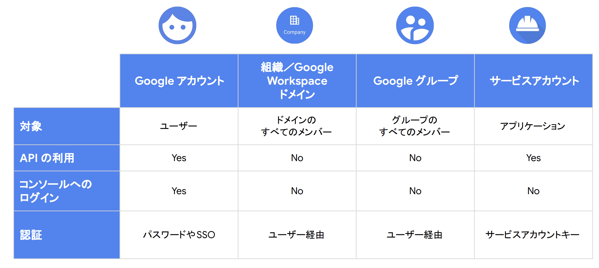
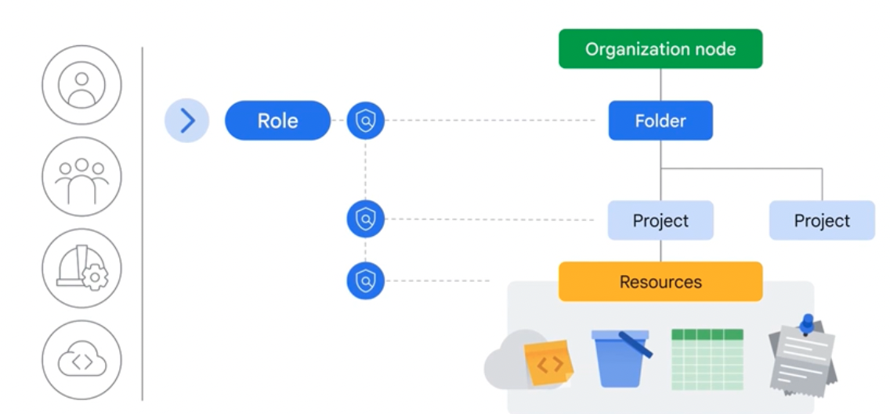

# IAM
リソースやユーザーの管理にはIAM（Identity and Access Management）を利用する。
IAMを利用することで、`誰が`、`どういう操作を`、`何に対して`、`どういう条件で`を制御することができる。
AWSと同じような用語が用いられるがそれぞれで役割が異なるため注意する。

 
[まずは知っておくべき IAM の基礎と最新の便利機能](https://services.google.com/fh/files/events/0224-infra-onair-seesion-1.pdf)

GCPのIAMの本質は`リソースベースでのアクセス制御`である。
以下の流れで、リソース側で誰がどの操作をして良いかについて定義を行う。
1. IAM Roleにより権限を定義する
2. IAM PolicyによりIAM RoleとPrincipalを紐づける（バインディング）
3. IAM Policyをリソースに付与する


## プリンシパル
`誰が`については、principalとも呼ばれ、大きく以下の4つが対象となる。

[まずは知っておくべき IAM の基礎と最新の便利機能](https://services.google.com/fh/files/events/0224-infra-onair-seesion-1.pdf)

プリンシパルにはそれぞれメールアドレス形式の識別子がを持つ。

|プリンシパルの種類|識別子形式|説明・特徴|
|:----|:----|:----|
|Google アカウント|user:alice@gmail.com|個人のGoogleアカウント（Gmail や Workspace）。人間のユーザー。|
|Cloud Identity ドメイン|domain:example.com|ドメイン全体にIAM権限を付与。Google Workspace や Cloud Identity ドメインが対象。|
|Google グループ|group:dev-team@example.com|複数ユーザーを一括管理するメールグループ。IAM権限をまとめて付与可。|
|サービス アカウント|serviceAccount:my-sa@project.iam.gserviceaccount.com|アプリケーションやGCPサービスが操作するためのアイデンティティ。|

## IAM Role
`どういう操作を`については、IAM Roleによって定義される。
GCPのIAM Roleは、どの操作（API 権限）を許可するかのみを定義する。

具体的には、以下のように`includedPermissions`で認可される操作が定義される。
```yaml
title: "My Custom Read-Only Storage Role"
description: "Allows listing and reading GCS objects"
stage: "GA"
includedPermissions:
  - storage.objects.get
  - storage.objects.list
```

例から分かる通り、AWS IAMポリシーとは異なり利用できるprincipalや、対象のResourceの指定は含まない。
後述するがGCPでは、リソースベースポリシーの許可ルールがされており、principalやresouceの紐付けはIAM Policyのバインディングを利用する。

Roleに関しては、おおきく3つが準備されており、事前定義Roleの利用を検討して、より細かい制御が必要な時にカスタムロールを利用する。

|ロール種別|名称（英語）|説明・特徴|カスタマイズ|使用推奨度|例|
|:----|:----|:----|:----|:----|:----|
|基本ロール|Primitive Roles|プロジェクト全体への大雑把な権限（旧式）|❌ できない|🔻 非推奨|roles/editor|
|事前定義ロール|Predefined Roles|Googleが用意した細かく設計されたロール|❌ できない（そのまま使う）|✅ 推奨|roles/compute.viewer|
|カスタムロール|Custom Roles|ユーザーが必要な権限だけを指定して作成|✅ 可能|⭕ 条件付きで推奨|roles/custom.storageReader|


## IAM Policy
IAM Policyは、`バインディング`、`監査構成`、`メタデータ`を定義している。

`バインディング`により、`誰が`が`どの操作を`するかの紐付けを定義し、リソースに対して付与する。
どの操作についてはRoleで定義を行なったことを踏まえると、IAM Policyにより`principal`と`IAM Role`を`紐づける`定義が行われる。

IAM Policyでは、bindingsとして、roleとprincipal(members)を紐づけている。
```yaml
bindings:
  - role: roles/storage.objectViewer
    members:
      - user:alice@example.com
  - role: roles/storage.objectAdmin
    members:
      - serviceAccount:app-sa@my-project.iam.gserviceaccount.com
etag: BwWWja0YfJA=
version: 1
```

IAM Policyはリソースに付与するため、以下のようなコマンドで付与を行う。

loud Storage バケットへの適用
```bash
gcloud storage buckets set-iam-policy gs://my-bucket policy.json
```

プロジェクトへの適用
```bash
gcloud projects set-iam-policy my-project-id policy.json
```

### 上位階層への付与
上記の例のように、特定のバケットにポリシーを付与することができるとともに、組織やフォルダ、プロジェクトも同様にリソースであるため、ポリシーを付与することができる。
付与された権限については、GCPのリソース階層（組織 > フォルダ > プロジェクト > リソース）に基づき、上位階層での設定が下位リソースにも継承される。そのため、プロジェクトに対してIAM Policyを付与して権限を与えると、そのプロジェクト配下のリソース全てに権限を付与していることになる点に注意。


[Google Cloud Fundamentals: Core Infrastructure 日本語版](https://www.coursera.org/learn/gcp-fundamentals-jp/lecture/KUBlM/identity-and-access-management-iam)

上位階層をリソースとして、ポリシーを付与するとアイデンティティベースのように認可を与えることになる点に注意。
例えばPJに対してバインディングを行い、特定のSAをprincipalにした場合、その後はPolicyにRoleを付与していくことでSAは対象リソースへの権限を持つことができ、リソース側にバインディングする手間が省ける。

## SA(Service Account)
### SA簡潔なまとめ
- SA は「実行主体」であり、同時に「IAM リソース」
- 認可は必ず2段階
  1. SA に何ができるか
  2. 誰がその SA を使ってよいか
    - actAs は「SA を使ってよいか」を決める権限
    - 実務では roles/iam.serviceAccountUser = actAs の実体
    - AWS の iam:PassRole と同じ

### SAとは
サービスアカウント（SA）は  
人ではなく、GCP 上のアプリケーションやサービスが使う ID である。

SA を理解する最大のポイントは、SAを利用する際は、以下2つのポイントがあること
- 許可ポリシーの`principal`になること
- 信頼ポリシーの`Resource`になること（※ AWSでいう信頼Policyに相当し、GCPには信頼ポリシーという言葉はない）

### SAは許可ポリシーのprincipalになる
IAM ポリシーで principal（主体） として指定できるため、
> 「この SA に、このリソースへの権限を与える」

というリソースベースの許可ポリシーで利用することができる。

例：SA に「何ができるか」（アクセス先リソース側）を指定。
```
gcloud storage buckets add-iam-policy-binding gs://my-bucket \
  --member="serviceAccount:my-sa@project.iam.gserviceaccount.com" \
  --role="roles/storage.objectViewer"
```
- 対象：Cloud Storage / BigQuery / Pub/Sub など
- Principal：サービスアカウント
- Role：最小権限ロール

→
「この SA は、このバケットを読むことができる」

### SAは信頼ポリシーのResourceになる
SA 自体が IAM リソースであり、
> 「誰が、この SA として実行してよいか」

を SA 側の IAM ポリシーで制御できる。  

誰が「その SA を使ってよいか」（SA 自体に対する権限）を指定。
```
gcloud iam service-accounts add-iam-policy-binding my-sa@project.iam.gserviceaccount.com \
  --member="user:bob@example.com" \
  --role="roles/iam.serviceAccountUser"
```
- 対象：サービスアカウント
- Principal：ユーザー / CI / 別の SA
- Role：roles/iam.serviceAccountUser

→ 「bob は、サービス（Cloud Functions など）にその SA を“使わせてよい”と指示できる」

#### 信頼ポリシー（actAs） が必要になる理由
Cloud Functions / Cloud Run のデプロイ時、デプロイヤーは暗黙的にこう言っている。
`「このアプリ、この SA の権限を借りて実行してください」`
これは 権限の委譲（なりすまし）であり、もし制限がなければ

開発者が
- Owner 権限の SA を指定
- 即、権限昇格事故

これを防ぐために GCP は「その SA を使ってよいかは、SA 自身が許可する」という対応をしている。


### SAのメリット
SAを利用することで以下のようなメリットを享受できる

|理由|解説|
|:----|:----|
|① アクセス権限の一元管理|VMインスタンスごとにアクセス権限をIAMで直に設定していくと管理が煩雑になる。<br>SAにアクセス権限を集中させることで、1箇所で制御可能になる。|
|② 責任の分離|	「誰がこの操作を行ったのか」をSA単位でトレースできる。<br>SAはCloud Audit Logsでの識別にも使われるため、ロールごとの責任区分が明確になる。|
|③ 再利用性・構成の再現性|	複数のVMやCloud Functionsに、同じSAを割り当てることで、共通の権限設定を再利用できる。<br> Infrastructure as Codeとの相性も良い。|
|④ 実行単位に応じた設計が可能|実行環境（VMやCloud Functionなど）に応じて別々のSAを割り当てれば、<br>最小権限の原則（Principle of Least Privilege）を実践できる。|

SAは、サービスアカウントキー（秘密鍵と公開鍵）を発行することができ、その情報を利用することでSAに許可されている権限を行使することができる。注意点として、サービスアカウントキーをgithubなどに後悔しないように注意する。


## Workload Identity
Workload Identityとは、外部のワークロード（k8s/VM/他クラウド）が、GCPのIAMSAとして振る舞うための仕組みである。
代表的な利用例は、K8Sである。

これは、SAの`SAは信頼ポリシーのResourceになる`で解説したSAの信頼ポリシーの先をGSAにすることであると理解できる。

- SAの信頼ポリシー
```
Resource：GSA
Principal：ユーザー / CI / 別の SA
Role：roles/iam.serviceAccountUser
```

- workload Identity
```
Resource：GSA
Principal：KSA（または Workload Identity Pool の主体）
Role：roles/iam.workloadIdentityUser
```

### K8SにおけるWorkload Identity
K8SにおいてWorkload Identityを利用すると、Kubernetes ServiceAccount（KSA）と GCP IAM ServiceAccount（GSA）という異なる認証ドメインに属する ID を安全に関連付けることができる。

- KSA（Kubernetes ServiceAccount）
  - Kubernetes クラスタ内の ID
  - Pod が Kubernetes API にアクセスするための身分証
- GSA（GCP IAM ServiceAccount）
  - Google Cloud IAM 上の ID
  - Cloud Storage や Pub/Sub など GCP API にアクセスするための身分証

これらを関連付けることで、Kubernetes 上のアプリケーションは KSA を使用したまま、サービスアカウントキーを用いることなく、GSA の権限で GCP リソースにアクセスできる。

具体的な手順は以下
- Kubernetes ServiceAccount（KSA）を作成する
- IAM ServiceAccount（GSA）を作成し、KSA を principal として roles/iam.workloadIdentityUser を付与する
- KSA にアノテーションを設定し、対応する GSA を指定する(両方向で指定が必要)
- Pod（または Deployment）で使用する ServiceAccount として KSA を指定する

この構成により、Pod は 短命な認証情報を用いてGSA の権限で GCP API を呼び出すことが可能となる。

具体的には、GSAをリソースとして以下のポリシーを指定することになる
```
IAM Policy（Service Account リソースに対するポリシー）
Resource：GSA
Principal：KSA（または Workload Identity Pool の主体）
Role：roles/iam.workloadIdentityUser
```

## クロスプロジェクト
GCP におけるプロジェクト間をまたいだリソース操作は、
「実行主体（principal）」と「リソース所有側（resource）」を分離して設計する。

1. 実行主体となるプロジェクト（principal 側）でサービスアカウント（SA）を作成する
2. 実行主体の SA を用いて、アプリケーション（Cloud Run / Functions など）を実行する
3. リソース所有側（resource 側）で、IAM ポリシーに以下を指定し、リソースにバインディングする
   - member: principal 側の SA
   - role: 必要最小限の Role

### 補足：API 有効化が必要なマネージドサービス
一部の GCP マネージドサービス（例：Cloud SQL）は、リソースへのアクセス時に内部的に管理 API を呼び出す。

そのため、クロスプロジェクト構成では IAM 設定に加えて、実行主体側・リソース側の両プロジェクトで該当 API（例：Cloud SQL Admin API）を有効化する必要がある。

これは IAM 権限とは別の「サービス利用可否」の設定であり、権限が正しく付与されていても API が無効な場合は接続に失敗する。


## Identity-Aware Proxy (IAP)
IAP は Google Cloud が提供する認証・認可プロキシである。
アプリケーション自身にログイン処理や認証ロジックを実装しなくても、Google アカウント（Google Workspace 含む）を使った安全なアクセス制御を実現できます。
Identity-Aware Proxyにより、アプリケーションに直接認証ロジックを実装しなくても、Google アカウントを用いた認証およびアクセス制御を実現できます。


### IAPの役割
IAP はアプリケーションの 前段（HTTP(S) ロードバランサ等）に配置され、次を担当します。
- ユーザー認証
- Google アカウントでログイン
- アクセス認可
- IAM / Google グループでアクセス可否を判定
- 認証済みリクエストのみをバックエンドへ転送

### IAP と Load Balancer の関係
IAP は 単体で通信を受けるサービスではない。
必ず Cloud Load Balancing（HTTP(S) Load Balancer）と組み合わせて利用される。

立ち位置の整理
- IAP は HTTP(S) Load Balancer の機能の一部として動作
- IAP は Backend Service に対して有効化される
- クライアントは 必ず Load Balancer 経由で IAP を通過する


### IAPの処理詳細
AP による認証が成功すると、IAP が署名した JWT がバックエンドに渡されます。
- 処理イメージ
  - ユーザーがアプリにアクセス
  - IAP が Google アカウントで認証
  - IAP がアクセス許可を判定
- 許可された場合のみ
  - JWT を HTTP ヘッダに付与
  - バックエンド（Compute Engine / GKE / Cloud Run 等）へ転送
- アプリ側の役割
  - JWT の 署名検証
  - ユーザー情報（email / ID）を参照
  - 「認証済みユーザー」として処理する

結果として、アプリは「JWT を検証するだけ」ログイン画面・OAuth 実装は不要。

IAP が付与する JWT には、例えば次の情報が含まれる。
- ユーザーの Google アカウント（email）
- IAP が発行者であること（issuer）
- 対象アプリ（audience）
- 有効期限

これにより、アプリは「誰が」「どのアプリに」「正しく認証されて来たか」を安全に判定できる。