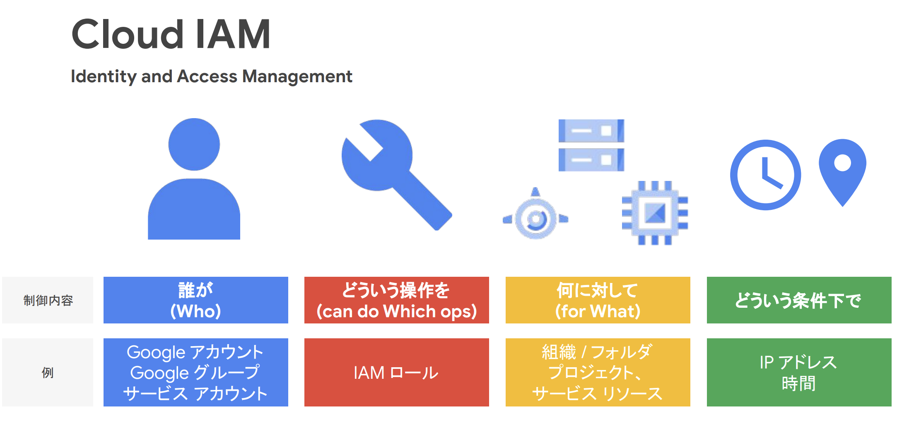

# IAM
リソースやユーザーの管理にはIAM（Identity and Access Management）を利用する。
IAMを利用することで、`誰が`、`どういう操作を`、`何に対して`、`どういう条件で`を制御することができる。
AWSと同じような用語が用いられるがそれぞれで役割が異なるため注意する。

 
[まずは知っておくべき IAM の基礎と最新の便利機能](https://services.google.com/fh/files/events/0224-infra-onair-seesion-1.pdf)

## 認可
### プリンシパル
`誰が`については、principalとも呼ばれ、大きく以下の4つが対象となる。

[まずは知っておくべき IAM の基礎と最新の便利機能](https://services.google.com/fh/files/events/0224-infra-onair-seesion-1.pdf)

プリンシパルにはそれぞれメールアドレス形式の識別子がを持つ。

|プリンシパルの種類|識別子形式|説明・特徴|
|:----|:----|:----|
|Google アカウント|user:alice@gmail.com|個人のGoogleアカウント（Gmail や Workspace）。人間のユーザー。|
|Cloud Identity ドメイン|domain:example.com|ドメイン全体にIAM権限を付与。Google Workspace や Cloud Identity ドメインが対象。|
|Google グループ|group:dev-team@example.com|複数ユーザーを一括管理するメールグループ。IAM権限をまとめて付与可。|
|サービス アカウント|serviceAccount:my-sa@project.iam.gserviceaccount.com|アプリケーションやGCPサービスが操作するためのアイデンティティ。|

### IAM Role
`どういう操作を`については、IAM Roleによって定義される。
GCPのIAM Roleは、どの操作（API 権限）を許可するかのみを定義しており、どのリソースに対して適用されるかは含まない。
AWS IAMポリシーのようにRoleに直接Resource指定は含まず、リソース側にバインディングする形で適用範囲が決まる。

GCPでは拒否ポリシーが先にチェックされるため、拒否のルールを付与するとPrincipalによる操作を拒否することができる。

IAM Roleのバインディングは、GCPのリソース階層（組織 > フォルダ > プロジェクト > リソース）に基づき、上位階層での設定が下位リソースにも継承される。

[Google Cloud Fundamentals: Core Infrastructure 日本語版](https://www.coursera.org/learn/gcp-fundamentals-jp/lecture/KUBlM/identity-and-access-management-iam)

Roleに関しては、おおきく3つが準備されており、事前定義Roleの利用を検討して、より細かい制御が必要な時にカスタムロールを利用する。

|ロール種別|名称（英語）|説明・特徴|カスタマイズ|使用推奨度|例|
|:----|:----|:----|:----|:----|:----|
|基本ロール|Primitive Roles|プロジェクト全体への大雑把な権限（旧式）|❌ できない|🔻 非推奨|roles/editor|
|事前定義ロール|Predefined Roles|Googleが用意した細かく設計されたロール|❌ できない（そのまま使う）|✅ 推奨|roles/compute.viewer|
|カスタムロール|Custom Roles|ユーザーが必要な権限だけを指定して作成|✅ 可能|⭕ 条件付きで推奨|roles/custom.storageReader|

### バインディング
GCPのIAMの本質はリソースベースでのアクセス制御である。
GCPでは、リソースに定義をする形で、PrincipalとRoleをバインディングする。
すなわち、対象となるリソースに対して`誰が`と`どういう操作を`して良いかを定義するのである。
```
gcloud storage buckets add-iam-policy-binding gs://my-bucket \
  --member="user:alice@example.com" \
  --role="roles/storage.objectViewer"
```

### IAM Policy
GCPにおけるIAM Policyとは、リソースに紐づけられたバインディング情報の一覧である。
```
policy:
  bindings:
    - role: roles/storage.objectViewer
      members:
        - user:alice@example.com
    - role: roles/storage.objectAdmin
      members:
        - serviceAccount:app-sa@project.iam.gserviceaccount.com
```

### SA(Service Account)
サービスアカウント（SA）は、GCPのリソース（VM、Cloud Functionsなど）が他のリソースにアクセスするための認可主体（Principal）である。

つまり、VM などが Cloud Storage や BigQuery といった他のリソースにアクセスするためには、以下の2つのステップで認可を定義する必要がある。

- 「誰が SA を使ってよいか？」を定義（SA 自体にバインディング）
  - 対象リソース: サービスアカウントそのもの
  - Principal: VM やユーザー
  - 付与するロール: roles/iam.serviceAccountUser（または roles/iam.serviceAccountTokenCreator など）
```
gcloud iam service-accounts add-iam-policy-binding my-sa@project.iam.gserviceaccount.com \
  --member="user:bob@example.com" \
  --role="roles/iam.serviceAccountUser"
```

- 「SAにどんな権限を与えるか？」を定義（アクセスしたいリソース側にバインディング）
  - 対象リソース: Cloud Storage、BigQuery、Pub/Subなど
  - Principal: サービスアカウント
  - 付与するロール: roles/storage.objectViewer など、操作対象に応じたロール
```
gcloud storage buckets add-iam-policy-binding gs://my-bucket \
  --member="serviceAccount:my-sa@project.iam.gserviceaccount.com" \
  --role="roles/storage.objectViewer"
```

SAを利用することで以下のようなメリットを享受できる

|理由|解説|
|:----|:----|
|① アクセス権限の一元管理|VMインスタンスごとにアクセス権限をIAMで直に設定していくと管理が煩雑になる。<br>SAにアクセス権限を集中させることで、1箇所で制御可能になる。|
|② 責任の分離|	「誰がこの操作を行ったのか」をSA単位でトレースできる。<br>SAはCloud Audit Logsでの識別にも使われるため、ロールごとの責任区分が明確になる。|
|③ 再利用性・構成の再現性|	複数のVMやCloud Functionsに、同じSAを割り当てることで、共通の権限設定を再利用できる。<br> Infrastructure as Codeとの相性も良い。|
|④ 実行単位に応じた設計が可能|実行環境（VMやCloud Functionなど）に応じて別々のSAを割り当てれば、<br>最小権限の原則（Principle of Least Privilege）を実践できる。|
