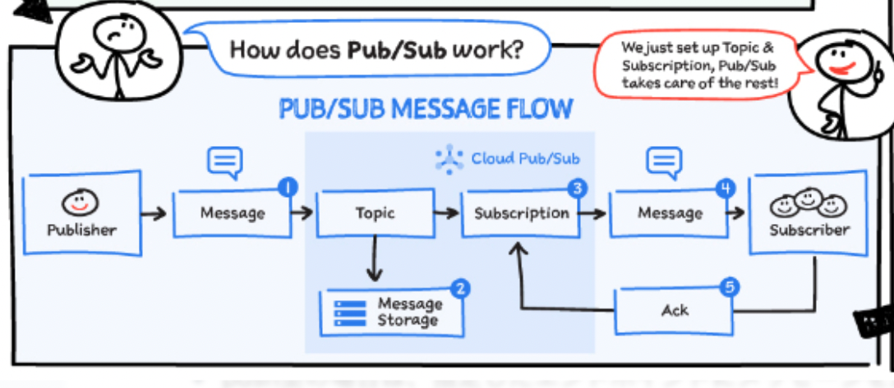
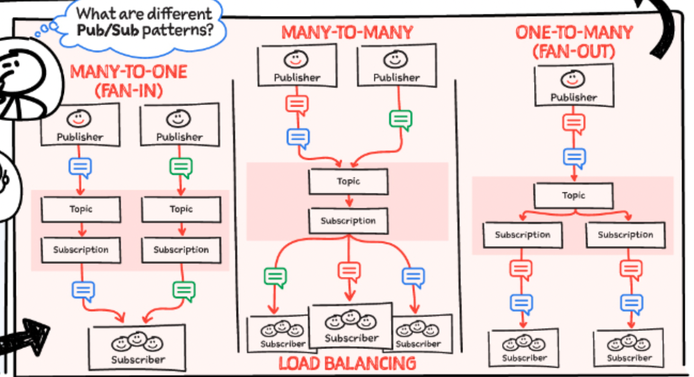

# Pub/Sub
Pub/Subとは、GCPにおけるキューイングメッセージサービス。
Pub/Subを利用することで、アプリ間を非同期に通信させ疎結合とすることができる。

Pub/Subだけで、Push型・Pull型の配信をすることができたり、ファンアウトの構成を取ることができ、AWSのSQSとSNSを組み合わせたようなサービスであるといえる。

## 構成
Pub/Subは、以下で構成される。
構成としてのポイントは、一度メッセージを受け取る`Topic`とメッセージが配置される`Subscription`。
Topicはメッセージの受付口で、Sucscriptionは各配信先のポストのようなもの。

TopicとSubscriptionは1:Nの関係とすることができ、これによりファンアウトすることができる。
また、SubscriptionごとにメッセージとSubscriberは1:1の関係となるため、Subscription内でメッセージが二重配信されることはない。

|用語|説明|
|:----|:----|
|Topic|メッセージの送信先。Publisherはここに送信する|
|Subscription|メッセージの受信口。Subscriberはこれを通じて受け取る|
|Publisher|メッセージの送信者|
|Subscriber|メッセージの受信者（Pull型・Push型のどちらか）|
|ACK|Subscriberが「このメッセージは処理済」とPub/Subに通知する信号|


[GCPSketchnote](https://github.com/priyankavergadia/GCPSketchnote)

### メッセージ処理の設計
Pub/Subでは、TopicとSubscriptionによってさまざまなユースケースが可能になる。

詳しいユースケースを理解する前に、メッセージ処理時の、SubscriptionとSubscriberの関係を整理しておく。
以下を基本的な処理設計として理解しておくとユースケースが理解しやすい。
```
Subscriptionに対して、Sucscriberが複数いる場合であってもメッセージは1回だけ配信され、誰かが処理する。
処理の詳細としては、Pub/Subによってメッセージはラウンドロビン的に配布される。
つまり、ワーカー分散モデルで処理される。
```

以下が具体的なユースパターンのイメージ。
 
[GCPSketchnote](https://github.com/priyankavergadia/GCPSketchnote)

それぞれの特徴をまとめると以下。

|パターン名|構造（Publisher / Topic / Subscription / Subscriber）|処理モデル|メッセージの流れ|主なユースケース|
|:----|:----|:----|:----|:----|
|1. Many-to-One (Fan-In)|複数Publisher → 各自のTopic → 各自のSubscription → 1つのSubscriberで統合|集約処理|TopicごとにSubscriptionを作成し、すべてを1つのSubscriberが受信・処理|IoTセンサー統合、複数マイクロサービスからのログ集約|
|2. Many-to-Many (Load Balancing)|複数Publisher → 1 Topic → 1 Subscription → 複数Subscriberが分散受信|水平スケーリング|メッセージは1つのSubscriberにのみ届き、Pub/Subが自動振り分け|バックエンド処理のスケールアウト、大量イベントの分散処理|
|3. One-to-Many (Fan-Out)|1 Publisher → 1 Topic → 複数Subscription → 各Subscriberが独立して受信|並列処理・分岐|同じメッセージが各Subscriptionに複製され、複数のSubscriberに配信|通知・監査・ログなどの多用途同時処理|


## 送受信の仕組み
### Push/Pull
Pub/Subでは、Subscriberがメッセージをどのように受信するかを設定することができる。

|モード|特徴|
|:----|:----|
|Pull型|Subscriberが明示的にメッセージを取りに行く|
|Push型|Pub/SubがHTTPエンドポイントに自動送信する|


### ACK
Pub/Subでは、管理されているメッセージが処理をされているか否かを管理するためにSubscriberとACKのやり取りを行う。
ACKとは、「そのメッセージを受け取って処理が完了したました」という受信者からの応答のことを指す。

Ackが返信されるまでの時間を指定するAck DeadLineという設定がある。
これは、SQSでいうところの可視性タイムアウトにあたり、この時間内はメッセージが同じSubscriptionに所属する他のSucscriberに配信されることはないので、同じメッセージがSubscription内で二重配信されることはない。

Push型とPull型でACKの扱いが異なる部分があるので注意。

|項目|Push型|Pull型|
|:----|:----|:----|
|ACKの方式|HTTP ステータスコードで自動判定|クライアントが明示的に ack() を呼び出す|
|ACK成功と判定される条件|HTTP 200〜299 を返す（例：200, 202）|acknowledge() メソッド実行時|
|ACK失敗の判定条件|HTTP 5xx（500〜599）、タイムアウト|ACKされない／modifyAckDeadline(0) でNACK|
|再送の条件|ACK失敗時、指数バックオフで再送|ACK期限切れ後に再取得可能になる|
|Ack Deadline（猶予時間）|明示的には設定できない（タイムアウト依存）|初期10秒、最大600秒まで modifyAckDeadline() で延長可能|
|NACK（拒否応答）|明示的には不可（HTTP 5xxが実質的NACK）|明示的に modifyAckDeadline(0) を使って即再送可能|
|再送の対象|同じPush先に繰り返しPOST|同じPullサブスクリプションに再配信（別のSubscriberにも届く可能性あり）|

### メッセージの寿命とDLQ
メッセージはサブスクリプションごとに管理され、ACKを契機に削除される。

また、最大再配信回数（デフォルト5、最大100）をSubscription単位で設定しておくことで、何度も失敗するメッセージに関してはDLQに配信することができる。
