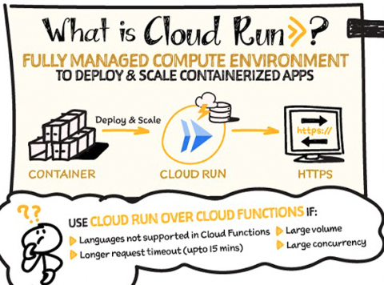

# サーバーレスアーキテクチャ
サーバーレスアーキテクチャを利用することで、インフラの管理を最小限に抑え、開発者がAPP開発に集中することができる。
GCPでは、`Cloud Functions`・`Cloud Run`・`Cloud Run Functions`といったサーバーレスサービスが提供されている。

## Cloud Functions
`CloudFunctions`は、イベント駆動型の`関数実行環境`である。  
開発者は、インフラ管理は一切不要であり、コードをデプロイするだけで、処理を実行することができ、AWSのLambdaのようなサービスである。

   
[Learn Cloud Functions in a snap!](https://cloud.google.com/blog/topics/developers-practitioners/learn-cloud-functions-snap?utm_source=ext&utm_medium=partner&utm_campaign=CDR_pve_gcp_gcpsketchnote_&utm_content=-&hl=en)

## Cloud Run
`Cloud Run`はフルマネージドの`コンテナ実行環境`である。  
リポジトリ（Artifact Registry）に、DockerイメージをPushし、Cloud Runで設定することで実行環境が準備される。
コンテナの実行環境を提供するため、任意の言語やライブラリを利用したアプリのデプロイが可能であることが特徴。
加えて、Cloud Run上で実行することで、自動スケーリング・HTTPリクエスト処理を行なうことが可能。

AWSのLambdaとFargateのいいとこ取りをした実行環境しつつ、実行方法としてはAPIGW+Lambdaのような動きをしてくれる。

  
[Cloud Run: What no one tells you about Serverless (and how it's done)](https://cloud.google.com/blog/topics/developers-practitioners/cloud-run-story-serverless-containers?utm_source=ext&utm_medium=partner&utm_campaign=CDR_pve_gcp_gcpsketchnote_&utm_content=-&hl=en)

## Cloud Run Functions
2024年8月に、CloudRunとCloud Functionsが統合され、Cloud Run Functionsのサービスが開始された。  
[Cloud Functions is now Cloud Run functions — event-driven programming in one unified serverless platform](https://cloud.google.com/blog/products/serverless/google-cloud-functions-is-now-cloud-run-functions?hl=en)

`Cloud Run Functions`は、Cloud Functionsの開発の簡易性とCloud Runの実行環境の柔軟性を兼ね備えたサービス。
ユーザーはソースコードをデプロイするだけで、Google Cloudが自動的にコンテナイメージをビルドし、Cloud Run上で実行されます。

サービスの比較表は以下

|特徴|Cloud Functions（第1世代）|Cloud Run Functions|Cloud Run|
|:----|:----|:----|:----|
|デプロイ方法|ソースコード|ソースコード|コンテナイメージ|
|対応言語|特定の言語に限定|複数の言語に対応|任意の言語に対応|
|実行時間制限|最大9分|最大60分|最大60分|
|スケーリング|自動スケーリング|自動スケーリング|自動スケーリング|
|イベントトリガー|HTTP、Pub/Sub、Cloud Storage|HTTP、Pub/Sub、Eventarcなど|HTTP、Pub/Subなど|
|VPC接続|制限あり|可能|可能|
|トラフィック分割|不可|可能|可能|
|最小インスタンス設定|不可|可能|可能|
