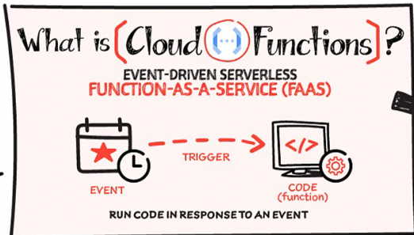

# サーバーレスアーキテクチャ
サーバーレスアーキテクチャを利用することで、インフラの管理を最小限に抑え、開発者がAPP開発に集中することができる。
GCPでは、`AppEngine`・`Cloud Functions`・`Cloud Run`・`Cloud Run Functions`といったサーバーレスサービスが提供されている。

## App Engine
App Engine は、Webアプリケーションのインフラ運用を極限まで簡略化し、スケーラブルかつ安全なサービスを素早く構築・運用できる GCP のサーバーレスプラットフォーム。

スタンダート環境とフレキシブル環境の2種類が提供されている。

|環境|特徴|利用可能な言語|スケーリング|カスタマイズ性|
|:----|:----|:----|:----|:----|
|スタンダード環境|軽量・高速起動、料金が細かく課金される（秒単位）|Python, Java, Node.js, Go などの一部バージョン|リクエスト数に応じて自動スケーリング|制限あり（固定ランタイム）|
|フレキシブル環境|Dockerベースのカスタム環境、メモリやCPUの指定も可能|ほぼすべての言語に対応（カスタムランタイム）|VM単位でスケーリング（起動はやや遅い）|高い（VMレベルで自由に設定可能）|

## Cloud Functions
`CloudFunctions`は、イベント駆動型の`関数実行環境`である。  
開発者は、インフラ管理は一切不要であり、コードをデプロイするだけで、処理を実行することができ、AWSのLambdaのようなサービスである。

   
[Learn Cloud Functions in a snap!](https://cloud.google.com/blog/topics/developers-practitioners/learn-cloud-functions-snap?utm_source=ext&utm_medium=partner&utm_campaign=CDR_pve_gcp_gcpsketchnote_&utm_content=-&hl=en)

第一世代と第二世代があり、第二世代の利用が推奨されており、タイムアウトやトリガー可能なサービスが増えている。

|項目|第1世代（First Gen）|第2世代（Second Gen）|
|:----|:----|:----|
|サポート言語|限定（特定バージョンのPython, Java, Go など）|より多くの言語・バージョンに対応|
|トリガー|HTTPリクエストのみ|HTTP、Task Queues、Pub/Sub、Scheduler など|
|最大タイムアウト|約1分（60秒）|最大60分まで拡張可能（バックグラウンドタスク）|
|ライブラリの制約|固定ランタイム、使えるライブラリに制限あり|柔軟なライブラリ・依存管理が可能（ローカルパッケージ使用OK）|

Lambda同様に、Cloud Functionsには実行時間の制約事項がある。

|関数のトリガー|上限|
|:----|:----|
|HTTP 関数|最大 60 分（3,600 秒）|
|イベントドリブン関数|最大 9 分（540 秒）|
|Pub/Sub push / scheduled / Task queue|30 分 など条件付き制約あり|

- HTTP：
    - クライアントが待つ前提
    - 長時間処理も想定
- イベント：
    - 再試行・冪等性・スケーラビリティ重視
    - 短時間で終わる処理が前提

## Cloud Run
`Cloud Run`とは、フルマネージドなコンテナ実行環境である。
任意の言語やライブラリを含むアプリケーションを、コンテナ化してデプロイすると、自動で実行環境が構築される。`Cloud Run`はAWS Lambdaの気軽さとFargateのカスタマイズ性を併せ持ちつイメージ。また特徴は以下のようなものがある。

- オートスケーリング＆ゼロスケール  
リクエストの有無に応じてインスタンス数が自動調整され、使わないときにはスケールダウンして課金が停止 。
- Dockerイメージ管理：Artifact Registry連携  
リポジトリにDockerイメージを格納し、Cloud Runで実行。CLIやソースデプロイも可能。

CloudRunには、`Cloud Run Services`と`Cloud Run Jobs`の2つの機能が存在。

[Cloud Run ジョブ ことはじめ](https://zenn.dev/google_cloud_jp/articles/cloudrun-jobs-basic)

特徴をまとめると下表になるが詳細は、次節で解説。
|種類|特徴|主な利用ケース|
|:----|:----|:----|
|Cloud Run Services|HTTP/Gatewayを通じたリクエストに応答する 常駐型のコンテナ HTTPS・HTTP/2・gRPC・WebSocket 対応 自動TLS、トラフィック分割可|Web API、マイクロサービス、イベント駆動（Pub/Sub/Eventarc）|
|Cloud Run Jobs|一時的タスクを実行し終えると停止する バッチ処理型 最大10,000タスク並列可 環境変数でタスク制御 最大7日間実行可能|データ処理バッチ、画像リサイズ、DBマイグレーション、定期ジョブ|

### Cloud Run Services
`Cloud Run Services`は、HTTPエンドポイントに対するリクエストなど、外部からのリクエストをトリガーとして実行される特徴がある。

### Cloud Run Jobs
`Cloud Run Jobs`は、HTTPサーバーを立てず、一度実行して終了するバッチ的な処理に設計されたリソース。
手動やスケジュールワークフローの一部など、任意のタイミングで実行される特徴がある。

注意点として、Cloud Run Job：HTTPを待ち受けないため、実行は Admin API の jobs.run で起動する

Cloud Run Jobsは下図のように`Job`、`Execution`、`Task`から構成される。

[Cloud Run jobsを徹底解説！](https://blog.g-gen.co.jp/entry/cloud-run-jobs-explained)

これら3つの特徴をまとめると以下。

|要素|説明|主な構成・制御対象|成功・失敗の定義|
|:----|:----|:----|:----|
|Job|コンテナイメージやTask数、並列度、CPU/メモリ、環境変数などを定義・保持するルートリソース|• 使用するコンテナイメージ • --tasks, --parallelism • CPU/メモリ制限 • 環境変数・秘密情報|—|
|Execution|Job の実行単位。1回の gcloud run jobs execute や Workflows等の起動により生成される|• 登録された Job 設定に基づいて Task を生成・実行 • リトライポリシーやタイムアウトの制御|全 Task が成功 →成功 どれか Task がリトライ上限超 →失敗|
|Task|Execution によって起動された個別のコンテナインスタンス（1 Task = 1 コンテナ）|• 環境変数 CLOUD_RUN_TASK_INDEX, CLOUD_RUN_TASK_COUNT による役割決定 • 一定時間内（最大168時間）で処理|コンテナが正常に終了、もしくはタイムアウトや再試行制限到達でタスク完了。未終了であれば失敗とみなされる|

## Cloud Run Functions
2024年8月に、CloudRunとCloud Functionsが統合され、Cloud Run Functionsのサービスが開始された。  
[Cloud Functions is now Cloud Run functions — event-driven programming in one unified serverless platform](https://cloud.google.com/blog/products/serverless/google-cloud-functions-is-now-cloud-run-functions?hl=en)

`Cloud Run Functions`は、Cloud Functionsの開発の簡易性とCloud Runの実行環境の柔軟性を兼ね備えたサービス。
ユーザーはソースコードをデプロイするだけで、Google Cloudが自動的にコンテナイメージをビルドし、Cloud Run上で実行されます。

サービスの比較表は以下

|特徴|Cloud Functions（第1世代）|Cloud Run Functions|Cloud Run|
|:----|:----|:----|:----|
|デプロイ方法|ソースコード|ソースコード|コンテナイメージ|
|対応言語|特定の言語に限定|複数の言語に対応|任意の言語に対応|
|実行時間制限|最大9分|最大60分|最大60分|
|スケーリング|自動スケーリング|自動スケーリング|自動スケーリング|
|イベントトリガー|HTTP、Pub/Sub、Cloud Storage|HTTP、Pub/Sub、Eventarcなど|HTTP、Pub/Subなど|
|VPC接続|制限あり|可能|可能|
|トラフィック分割|不可|可能|可能|
|最小インスタンス設定|不可|可能|可能|

特徴として、Cloud Run Fuctionsの第二世代は、「同時実行 (Concurrency)」の設定が可能。
デフォルトでは 1 だが、これを増やすことで、1つのインスタンスが複数のリクエストを並列処理できるようになる。