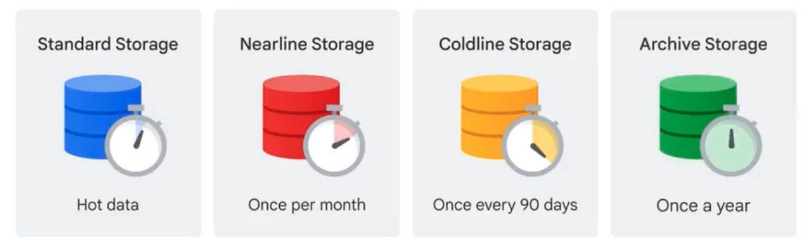

# ストレージ
## Cloud Storage
Cloud Storageは、GCPが提供するスケーラブルで高耐久なオブジェクトストレージサービス。
画像動画音声、ログファイルなど、非構造データを保存するのに適しいる。

以下のような特徴を有する
- Cloud Storage全体としての容量は無制限
- 一つのオブジェクトでは5TiBの制限
- 耐久性はイレブンナイン
- 可用性は99.0-99.5

### バケット
Cloud Storageでは、バケット呼ばれる単位で「オブジェクト」を保存する。
オブジェクト名はグローバルで一意な名前である必要がある点に注意。
```
プロジェクト
└─ バケット（例：my-photo-bucket）
   ├─ photo1.jpg（オブジェクト）
   ├─ report.csv
   └─ ...
```

バケットを作成する際に、データをどのように保存するかのオプションを指定することで冗長性を高めることができる。
Cloud Storageはリージョンベースのリソースであるが簡単にグローバル（マルチリージョン）リソースにすることができる。

|タイプ|説明|特徴|
|:----|:----|:----|
|単一リージョン|東京（asia-northeast1）など|レイテンシ重視・コスト最適|
|デュアルリージョン|明示的に2つのリージョン（例：東京＋大阪）に配置|DR（災害対策）構成が明示的に可能|
|マルチリージョン|asia, us, euなどの地域単位で指定|GCPが自動で複数リージョンにレプリケーション|

また、オブジェクトのURLについては、以下の形式をとるためロケーションに依存しない。
```
https://storage.googleapis.com/[BUCKET]/[OBJECT]
```

### オブジェクト
オブジェクトは`オブジェクトデータ`と`オブジェクトメタデータ`という2つのコンポーネントで構成される。
メタデータには、作成日・サイズ・権限などの情報が含まれる。

Cloud Storageはディレクトリやフォルダという概念自体は存在しないが、ファイル名として"/"を含めることが可能であり、コンソール画面で表示する場合には擬似的にフォルダのように扱って表示してくれる。
ただし、実態としては"/"を含んだ名称でオブジェクトを管理している点に注意。

### アクセス制御
アクセス制御については`IAMを利用した均一なバケット単位でのアクセス制御（推奨）`と`オブジェクトACLを利用したきめ細かい(非推奨)`の2つが可能。
現在は、IAMでの利用が推奨されている。

|方法|特徴|現在の推奨|
|:----|:----|:----|
|IAM|プロジェクト/バケット単位で制御。大規模運用に向く|✅ 推奨|
|オブジェクトACL|個別のオブジェクトごとに細かく制御できるが、管理が煩雑に|❌ 非推奨|

### 署名付きURL
署名付きURLとは、「このオブジェクトに対して、この操作を、この期限まで許可する」という条件付きリクエストをSAの秘密鍵で署名したもの。
署名付きURLで許可されている権限については、HTTPメソッドで操作することができる。


### ストレージクラス
CloudStorageにはストレージクラスの機能があり、アクセス頻度や保存期間に応じて、コストを抑制することができる。
特徴と用件を照らし合わせトレードオフで利用ストレージを選定する。


[Google Cloud Fundamentals: Core Infrastructure 日本語版](https://www.coursera.org/learn/gcp-fundamentals-jp/lecture/40yXj/google-cloud-netutowaku)

|ストレージクラス|想定用途（アクセス頻度）|最低保存期間|主な特徴|
|:----|:----|:----|:----|
|Standard|Hot data（高頻度アクセス）|なし|高可用・高性能、デフォルトクラス|
|Nearline|月1回程度のアクセス|30日|安価なストレージ、取り出しコストあり|
|Coldline|3か月に1回程度のアクセス|90日|さらに低価格、バックアップなどに最適|
|Archive|年1回程度のアクセス|365日|最安値だが高い取り出しコスト、長期保存用|


### バージョニング
`バージョンニング機能`では、上書き・削除されたファイルの旧バージョンを保持できる。
バージョニング機能はオブジェクトではなく、バケット単位で指定することに注意する。

### ライフサイクル管理
`ライフサイクルルール`では、ファイルの自動削除やストレージのアーカイブが可能。

オブジェクトを一括で削除する場合に処理に非常に時間が可k流ため、基本的にはライフサイクルを利用することを検討する旨公式ドキュメントに記載がある。

ライフサイクルについては、オブジェクトに以下2つのアクションを定義可能
- DELETE: 指定した条件を満たしたときにオブジェクトを削除
- SetStorageClass: 指定した条件を満たしたときにオブジェクトをストレージクラスを変更する

### バケットロック
バケットロック（Bucket Lock）を使うと、保持期間（Retention Period）が経過するまで、オブジェクトの削除や上書きができなくなります。

一度ロックされた保持期間は、管理者を含めて変更・解除できないため、意図的・偶発的なデータ削除を防止できます。


### オブジェクトの暗号化
GCSに保存されるオブジェクトは保存時に自動的に暗号化される。　　
暗号化には3つの方式があり、暗号化鍵の管理方法およびアプリ側が何を意識するべきかという点がポイントである。

|方式|略称|正式名|鍵の管理者|
|:----|:----|:----|:----|
|Google 管理鍵|-|Google-managed keys|Google|
|顧客管理鍵|CMEK|Customer-Managed Encryption Keys|顧客（Cloud KMS）|
|顧客提供鍵|CSEK|Customer-Supplied Encryption Keys|顧客（完全自己管理）|

#### Google 管理鍵
デフォルトの暗号化方式であり、全てGoogleが管理するため、ユーザー側は暗号化を一切指揮しなくて良い。

#### 顧客管理鍵
鍵は、Cloud KMSで顧客が管理する。
IAMを利用して、「誰が複合して良いのか」を制御する。

#### 顧客提供鍵
鍵は顧客が生成・保持し、毎回のAPIリクエストで鍵を提示する。かなり厳しい主権要件があるなどの特殊用途向け。  

登場する鍵の種類は以下、

|名前|正体|何に使う？|
|:----|:----|:----|
|暗号化鍵（生鍵）|ランダムなバイト列|実際の暗号化・復号に使用|
|暗号化鍵の base64|生鍵を base64 化|API で送る形式|
|暗号化鍵の SHA256 ハッシュ|生鍵のハッシュ|鍵識別（サーバ側確認）|
|base64 鍵の SHA256|❌存在しない|Cloud Storage では使わない|

上記の`暗号化鍵の base64`と`暗号化鍵の SHA256 ハッシュ`を利用して暗号化と復号化を行う。
なぜ SHA256 ハッシュも送るかというと、Cloud Storage が「途中で鍵が壊れてないか」確認するためで、これは 復号用ではない

具体的な処理の流れは以下
1. オブジェクト作成時（PUT）
   - アプリは Cloud Storage に対して以下を送信
      - base64 でエンコードされた暗号化鍵
      - その暗号化鍵（生鍵）の SHA256 ハッシュ

2. オブジェクトを暗号化
   - 暗号化鍵は保存しない
   - SHA256 ハッシュも保存しない

3. オブジェクト読み取り時（GET）
   - 作成時と完全に同じ情報を再送する必要があります
      - base64 でエンコードされた暗号化鍵 
      - 暗号化鍵の SHA256 ハッシュ 
      - 同じ暗号化アルゴリズム（AES256） 