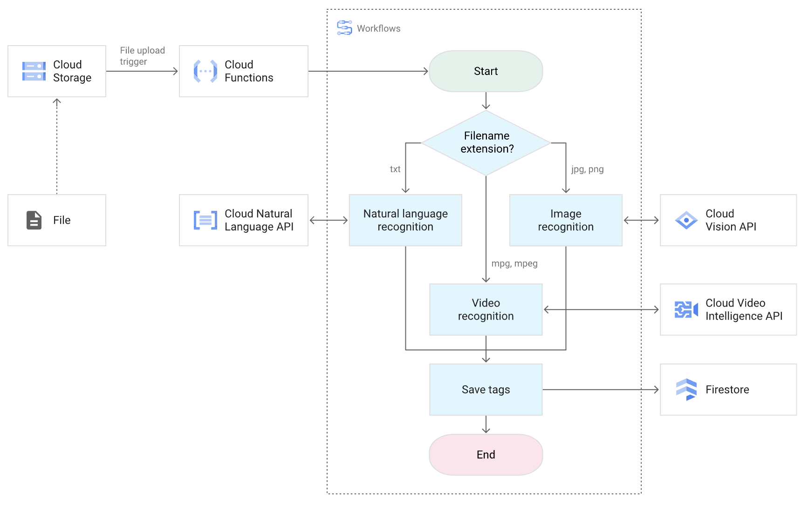

# Workflows
Workflowsは、ワークフローを定義することで、サービスの実行を制御しながら実行するフルマネージドのオーケストレーションサービス。

Workflowsにより、GCPサービスの呼び出し、外部のAPIのHTTPエンドポイントへのリクエスト、BigQueryへSQLを発行などを定義した通りの順番で実行することができる。

実行契機には、Cloud Shedulerでのスケジュール実行、EventarcやPub/Subによるイベント契機実行、直接実行などがサポートされている。

ワークフローの定義は、YAMLやJSONがサポートされており、順次実行だけでなく、条件分岐・並列実行・繰り返すなどが定義可能。


[ワークフローの概要](https://cloud.google.com/workflows/docs/overview?hl=ja)


## ワークフローの定義
以下のような構文を利用してワークフローを定義する。

|種類|名称|説明|使用例/用途|
|:----|:----|:----|:----|
|✅ 基本|steps|処理の実行ステップを定義する基本構文|- stepName: ...|
|✅ 基本|assign|変数の定義・代入を行う|assign: [ x: 10 ]|
|✅ 基本|call|HTTP/Google API呼び出し or サブワークフロー実行|call: http.get or call: mySubflow|
|✅ 基本|return|ワークフローの出力値を返す|return: ${result}|
|✅ 基本|raise|エラーを発生させてワークフローを停止|raise: "Error occurred"|
|✅ フロー制御|switch|条件により処理を分岐する|if/elseに相当|
|✅ フロー制御|for|配列などの繰り返し処理|for: value in array|
|✅ フロー制御|parallel|ステップを並列に実行|マルチAPI呼び出しなど|
|✅ フロー制御|subworkflow|再利用可能な処理を定義（関数のようなもの）|call: myFunc|
|✅ フロー制御|try / except|エラーハンドリング（例外処理）|try: ... except: ...|

詳細は、[Syntax overview](https://cloud.google.com/workflows/docs/reference/syntax)参照。

ワークフローの一例。
```yaml
main:
  steps:
    - init:
        assign:
          - bucket: "my-bucket-name"
          - notifyUrl: "https://YOUR_REGION-YOUR_PROJECT.cloudfunctions.net/notifyFunction"

    - listFiles:
        call: googleapis.storage.v1.objects.list
        args:
          bucket: ${bucket}
        result: objectList

    - checkFiles:
        switch:
          - condition: ${len(objectList.items) == 0}
            next: noFiles
          - condition: ${len(objectList.items) > 0}
            next: sendNotification

    - noFiles:
        call: sys.log
        args:
          text: "No files found in bucket."
        next: end

    - sendNotification:
        call: http.post
        args:
          url: ${notifyUrl}
          headers:
            Content-Type: "application/json"
          body:
            message: ${"Found " + string(len(objectList.items)) + " file(s) in " + bucket}
        result: notifyResult

    - end:
        return: ${"Workflow completed"}
```

上記では、6つのステップが定義されており、それぞれの以下のような処理が実行される。
なお、workflowsではnextを設定すると次の実行ステップを指定することができ、指定しない場合は次に記載されているステップが実行される。

|ステップ名|説明|
|:----|:----|
|init|使う変数（バケット名、通知先URL）を定義|
|listFiles|Cloud Storage の指定バケットにあるファイル一覧を取得|
|checkFiles|ファイルがあるかないかでフローを分岐（switch を使った if 分岐）|
|noFiles|ファイルがない場合、ログを出して終了へ|
|sendNotification|ファイルがある場合、Cloud Functionに通知をPOST送信|
|end|ワークフローを終了し、結果文字列を返す|

### サービス呼び出し
Workflowsでは以下の呼び出しを行い、処理を定義することができる。

|呼び出し元|概要|代表的な用途|記述方法|備考|
|:----|:----|:----|:----|:----|
|① HTTP API|任意の HTTP エンドポイントへ GET / POST 等のリクエストを送る|Cloud Run / Cloud Functions 呼び出し、外部API|call: http.get / http.post|認証が必要なら Bearer トークン付きで送信可|
|② コネクタ|Google Cloud サービス用のネイティブラッパー。REST API を抽象化した簡易インターフェース|Cloud Storage, BigQuery, Pub/Sub など|call: googleapis.bigquery.v2.jobs.insert|サービスアカウントに対応権限が必要|
|③ 標準ライブラリ|Workflows に組み込まれた関数群。文字列処理、リスト操作、Base64 変換など|sleep, string(), len(), base64.encode() など|call: sys.sleep, ${string(123)}|明示的な import 不要。Pythonの標準関数に近い感覚|
|④ 環境変数|Workflows 実行環境が持つ組み込み情報（プロジェクトID、実行IDなど）|ロギング、トレース、デバッグ|${sys.environment.workflow_project} など|sys.environment 名前空間に多数存在|

### コールバック
ワークフロー内で動機的な処理（処理の完了を待ってから次のステップへ進む処理）を実装したい場合、コールバックエンドポイントを利用することができる。
実行したサービスによる処理が完了したら、ワークフローのコールバックエンドポイントへリクエストを投げるように処理を記述することで、一時停止していたワークフローを再開でき、タイムアウトの設定も可能。


## ワークフローの呼び出し
workflowsは、GUIやCLIを利用した手動での実行もサポートされているが、他のサービスからの呼び出しもサポートされている。

呼び出し時の注意点として、Cloud Scheduler はユーザー指定のサービスアカウントによる明示的な認可が可能である一方、Eventarc は内部生成された SA によって自動的に Workflows を起動し、対応する IAM 設定が求められる。

|実行方法|トリガー元|主な用途|引数の渡し方|実行者|認証方法|
|:----|:----|:----|:----|:----|:----|
|Cloud Scheduler|定期スケジュール|毎時/毎日などの定期バッチ処理|JSON形式でHTTP Bodyに渡す|Cloud Scheduler（Cloud Schedulerが引き受けるSA）|Cloud Schedulerに指定するユーザーが作成するSAを対象に認可|
|Eventarc|GCS, Pub/Sub, Audit Logs などのイベント|イベントドリブンで反応するワークフロー|CloudEvents形式（JSON）で渡される|自動的に生成されたサービスアカウント|Event arcが利用する自動的に生成されたSAを対象に認可|

