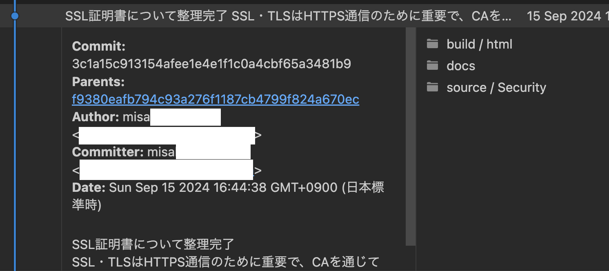
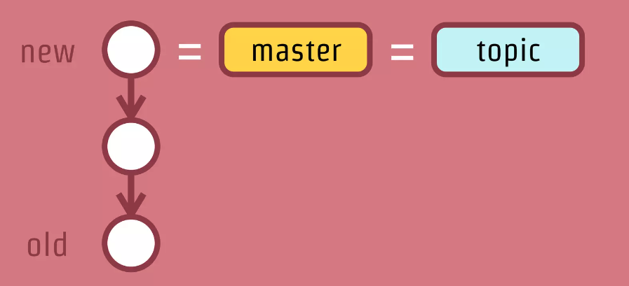
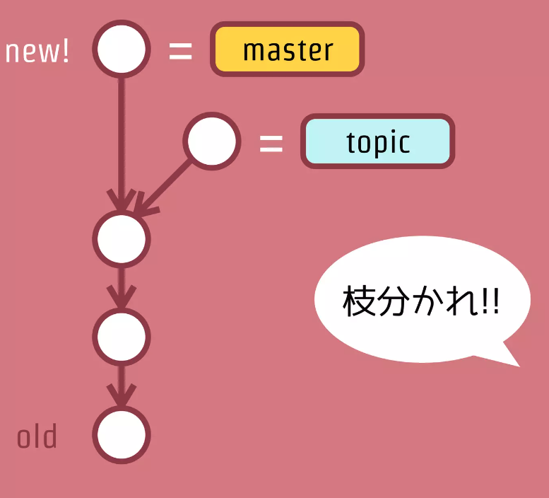

# gitの基本知識

## コミット
gitにおけるコミットでは、実行のたびにファイルの内容をスナップショットとして全て記録する。
また、コミットでは以下のような情報が含まれている
- Commitリビジョン（SHA-１のハッシュ）
- Parents（1つ前のコミットのリビジョン）
- Author（コミットを作成した人）
- Committer（コミットを適用した人）
- Date（日付）
- コメント（コミット時のコメント）
- ファイルのスナップショット（ディレクトリツリー構造）

## ブランチ
ブランチとは、最新のコミットに対する「ラベル」付与である。  
ブランチを切るという操作は、現在の最新コミットに対してさらに別名を付与することを意味する。

[こわくない Git](https://kotas.hatenablog.jp/entry/2012/11/22/000046)

ここから、それぞれのブランチに対して新しいコミットを行うと、コミットはブランチごとに完全に独立して行われるため枝分かれする。

[こわくない Git](https://kotas.hatenablog.jp/entry/2012/11/22/000046)

## push

## マージ

## 参考
- [ATLASSIAN きっとできるGit](https://www.atlassian.com/ja/git)
- [サル先生のgit入門](https://backlog.com/ja/git-tutorial/)
- [こわくない Git](https://kotas.hatenablog.jp/entry/2012/11/22/000046)