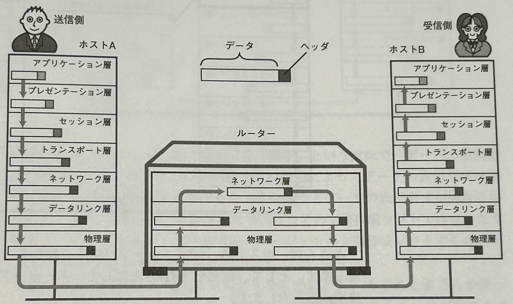
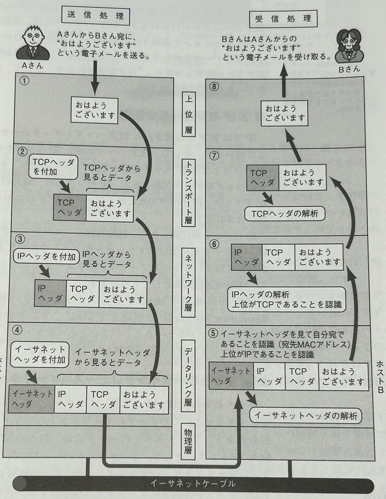

# Network
## ネットワーク基礎知識
### ネットワークの登場
ネットワークの登場はコンピューターがどのように利用されてきたかと深い関係がある。
コンピューターは単独で利用されるスタンドアローンから、複数のコンピューター同士が通信し合うネットワーク、世界中のコンピューターがつながるインターネットへと進化していった。

### プロトコル
世界中のコンピューターが、自身のOSやCPUを気にすることなく通信を行うためには、通信をするためのルールを決める必要がある。それが`プロトコル`である。
プロトコルは人間のコミュニケーションにおける言語（英語や日本語）であり、異なるとコミュニケーションを取ることができない。

例えば、現在の通信における主流のパケットにおける通信では、通信の内容は「パケット」に分割され、以下のような構成で送信される：
- ヘッダ部：宛先IPアドレス、送信元ポート番号など
- データ部：実際に伝えたい中身（HTMLデータなど）

プロトコルは、ヘッダ情報の構成や、通信手順、エラー処理の方法などを厳密に定義している。

プロトコルは、標準化の流れがありISO(国際標準化機構)やIETFが標準化を定めている。
現在最も利用されているTCP/IPはデファクトスタンダードとなっており、IETFが標準化している。

### OSI参照モデル
ISOが標準化を検討した際に、ネットワークにおけるプロトコルにおいて、OSI参照モデルを提唱した。
OSI参照モデルは、ネットワークプロトコルを7つの階層にモデリングしており、各層の役割を定義しているため、TCP/IPや他のプロトコルについて理解する際もガイドラインとして非常に参考になる。
ただし、OSIモデルは理論的には7層だが、実務で使われるのはTCP/IPモデル（4階層）。セッション層・プレゼンテーション層はアプリケーション層に吸収されている。

OSI参照モデルは、ネットワークプロトコルを7つの階層に分けて定義している。
同じ階層同士では同じプロトコルで、上下の階層はインターフェースで、ルールを定めている。
アプリケーション層で生成されたデータは、下位の層に渡されるたびに各層のヘッダが付加されていく。受信側では逆順にヘッダを剥がしながら、最終的にアプリケーション層でユーザーが意味のある形で受け取る。



|層|名称|主な役割|
|:----|:----|:----|
|第7層|アプリケーション層|ユーザーが直接触れるアプリケーションの通信インターフェースを提供。<br>例：HTTP、SMTP、FTP、DNS|
|第6層|プレゼンテーション層|データの表現形式（文字コードや圧縮、暗号化）を統一する役割。<br>例：JPEG、MIME|
|第5層|セッション層|通信の開始〜終了までの論理的な会話（セッション）を管理。中断や再開処理を制御。<br>例：RPC、NetBIOSセッション|
|第4層|トランスポート層|アプリケーション間の通信を確実に届けるため、ポート番号の割当や通信の信頼性確保（TCP）を行う。<br>例：TCP（信頼性あり）、UDP（軽量）|
|第3層|ネットワーク層|ネットワークを越えたルーティングを行い、IPアドレスを用いて適切な宛先までパケットを転送。<br>例：ルーター、IPv4/IPv6|
|第2層|データリンク層|隣接ノード間での誤り検出やフレーム化、MACアドレスによる識別を行う。<br>例：スイッチ、Ethernetフレーム|
|第1層|物理層|電気信号・光信号・電波など、物理的な通信手段を定義。コネクタの形状や電圧レベルも含まれる。<br>例：Ethernetケーブル、Wi-Fiの電波|

例えば、HTTP通信を行う際の各層の役割は以下
```
アプリケーション層
　ユーザーがWebブラウザを使い、HTTPでリクエストを生成する。

プレゼンテーション層
　TLSによってデータが暗号化される。文字コードなども変換される。

セッション層
　クライアントとサーバーのセッション（対話）を開始する（TLSハンドシェイクなど）。

トランスポート層
　TCPでデータが分割・番号付けされ、送信順序や再送制御も行う。ポート番号を指定してアプリケーションを識別。

ネットワーク層
　送信元→宛先IPまでの経路を決定。ルーターを介して中継される。

データリンク層
　MACアドレスを使い、LAN内での最終配信先を決定。エラーチェックも行う。

物理層
　LANケーブルやWi-Fiなどで、実際に電気信号としてデータを送信する。
```


### ネットワーク機器の分類と役割
OSI参照モデルやTCP/IPモデルを理解したうえで、実際のネットワーク通信を支える装置（ネットワーク機器）についても整理しておく。

#### リピーター（Repeater）【第1層：物理層】
リピーターは電気信号の中継器。信号が弱まってしまう距離でも通信できるように、信号を再生成して延長する。
- 層：OSI第1層（物理層）
- 主な役割：信号の増幅・再送
- 装置例：ハブ（旧式のネットワーク装置）

#### L2スイッチ（レイヤ2スイッチ）【第2層：データリンク層】
MACアドレスをもとに、LAN内での宛先を判断し、フレームを転送するスイッチ。
- 層：OSI第2層
- 主な役割：MACアドレスベースの転送・スイッチング
- 特徴：ブロードキャストドメインは分けられない（VLANなしの場合）

#### L3スイッチ（レイヤ3スイッチ）【第3層：ネットワーク層】
IPアドレスを見て、異なるネットワーク間の通信（ルーティング）も処理できるスイッチ。
- 層：OSI第3層
- 主な役割：ルーティング機能付きスイッチング
- 特徴：VLAN間ルーティングや高速な転送が可能

#### L4〜7スイッチ（マルチレイヤスイッチ）【第4層以上】
トランスポート層（ポート番号）やアプリケーション層（HTTPヘッダ）まで見て、より高度な制御や振り分けが可能。
- 層：OSI第4層〜第7層
- 主な役割：
    - L4：AWSのNLBはL4スイッチ。ポート番号に基づくロードバランシング（例：TCP80/443）
    - L7：AWSのALBはL7スイッチ。URLやクッキー、HTTPヘッダによる振り分け（例：/apiと/imageで別のサーバーへ）
- 特徴：WAFやプロキシ、ロードバランサーなどに利用される

#### ゲートウェイ（Gateway）【各層にまたがる】
異なるプロトコルやネットワークの間をつなぐ翻訳装置的な役割。
- 主な役割：異種ネットワーク間の接続・中継（例：IPv4とIPv6間の変換、メールプロトコル間の中継）
- 特徴：OSIモデルでは明確に層を限定しない。アプリケーション層の処理を伴う場合もある

## TCP/IP
TCP/IPとは、全世界のネットワークをつなげるインターネットで使われているプロトコル群（プロトコルスイート）の総称である。
「スイート」とは“ひとまとまりのもの”という意味で、TCP/IPは複数の通信プロトコル（HTTPやDNSなど）をまとめた集合体ということ。
名前には「TCP」と「IP」が含まれているが、実際には多くのプロトコル（HTTP, FTP, SMTP, DNSなど）を含んでおり、単なる2つのプロトコルだけを指しているわけではない。

TCP/IPがインターネットの標準プロトコルスイートとして採用された背景には、次の3つの要因がある。

1. パケット交換ネットワークとの相性  
かつての通信は電話網と同じ回線交換方式（中央集権的）だったが、通信路の効率性や障害耐性の観点からパケット交換方式が注目された。
TCP/IPはこの分散型のパケット通信に最適化された設計を持っており、ネットワーク破壊への耐性も含めて軍事・学術的に注目された。
2. UNIX OSへの標準搭載  
1980年代、TCP/IPは当時広く使われ始めていたUNIX OSに標準で搭載された。
UNIXの普及とともにTCP/IPも自然と広まることになり、結果としてネットワークの共通言語となっていった。
3. オープンな標準化と実装主義  
TCP/IPは**IETF（Internet Engineering Task Force）**で議論され、RFC（Request For Comments）として誰でも参照・参加できる形で仕様が公開されている。
しかも仕様の多くは実装に基づいて定義されるため、理論倒れにならず、実際に動くことが前提となっていた。これは後発のOSI参照モデルとの大きな違いだった。

### TCP/IPとOSI参照モデル
OSI参照モデルは、ネットワークを7つの階層に分けて整理することで、ネットワーク設計やトラブルシュートを論理的に理解するためのモデル。
一方でTCP/IPは実装主義で、現実のネットワークを構築・運用する上で使われている実用的な`4階層`モデルである。

|OSI参照モデル|TCP/IPモデル|主なプロトコル例|担当|
|:----|:----|:----|:----|
|7. アプリケーション層|アプリケーション層|HTTP, FTP, DNS, SMTP|アプリケーションプログラム|
|6. プレゼンテーション層|（アプリケーション層に含まれる）|-|アプリケーションプログラム|
|5. セッション層|（アプリケーション層に含まれる）|-|アプリケーションプログラム|
|4. トランスポート層|トランスポート層|TCP, UDP|OS|
|3. ネットワーク層|インターネット層|IP, ICMP, ARP|OS|
|2. データリンク層|ネットワークインターフェース層|Ethernet, PPP, Wi-Fi|デバイスドライバ・ネットワークインターフェース|
|1. 物理層|ハードウェア|UTPケーブル, 光ファイバーなど|デバイスドライバ・ネットワークインターフェース|

#### インターネット層
この層は「データを目的地まで届ける」ことにフォーカスした層。IPアドレスを利用してルーティングやアドレス指定といった処理を担当する。
「インターネット層」は“IPを中心としたルーティング機能”に特化しており、OSIモデルのように細かい制御機能（例えばQoSなど）まではカバーしていない。

|プロトコル|役割|主な特徴|
|:----|:----|:----|
|IP|パケットに送り先・送り元のIPアドレスを付けて配送|コネクションレス・ルーティング機能で、再送などはしない。<br>IPにより、通信したいホストの間経路に関係なく通信が可能となる。|
|ICMP|通信エラーや到達確認を行う|ping・tracerouteに利用される制御用プロトコル|
|ARP|IPアドレスをMACアドレスに変換する|LAN内での実通信のために必要なアドレス解決プロトコル<br>ARPは「インターネット層に属するが、実際にはデータリンク層と密接に関わる」位置付けにある。|

#### トランスポート層
ここではアプリケーション間のデータ伝送の信頼性を保証する。コンピューターの内部では複数プログラムが動作しており、アプリケーションの識別にはポート番号を利用。

|プロトコル|役割|主な特徴|
|:----|:----|:----|
|TCP|信頼性のある通信を実現（コネクション型）|3-wayハンドシェイク、順序保証、再送制御あり|
|UDP|最小限の処理で素早く送信（コネクションレス型）|軽量・再送なし・順序保証なし|

TCPは、ホスト間のデータの到達性を保証し、パケットの消失や順番の入れ替わりがあっても、TCPが解決してくれる。
一方でUDPは、コネクションレスのため、相手へ正しく届いているかは実施せず、アプリケーション層に任せている。
「信頼性が重要ならTCP」「リアルタイム性が重要ならUDP」と覚えると良い。

|TCP vs UDP（比較表）|
|:----|
|特徴項目|TCP|UDP|
|接続|コネクション型|コネクションレス型|
|信頼性|高い（再送・順序制御あり）|低い（制御なし）|
|速度|遅め（オーバーヘッドあり）|速い（軽量）|
|用途例|Web通信, メール, SSH|DNS, ストリーミング, ゲームなど|


#### アプリケーション層
利用者が直接使う「目的に応じた通信プロトコル」が該当する層。

|プロトコル|用途|通信方式|説明|
|:----|:----|:----|:----|
|HTTP|Web閲覧|TCP|WebブラウザとWebサーバ間の通信|
|HTTPS|暗号化されたWeb通信|TCP|HTTP+TLSで安全な通信|
|FTP|ファイル送受信|TCP|認証あり、制御/データの2つのチャネルを使用|
|SSH|リモート接続|TCP|セキュアなターミナル通信|
|SMTP|メール送信|TCP|メール送信用プロトコル|
|POP3|メール受信|TCP|クライアントにダウンロードして読む|
|IMAP|メール受信|TCP|サーバ上に保存しながら操作可能|
|DNS|名前解決|UDP/TCP|ドメイン名 ⇔ IPアドレスの変換|
|DHCP|IPアドレス配布|UDP|自動でIPやゲートウェイを配布する|


#### 通信イメージ
TCP/IP通信では、アプリケーションが作ったデータが「上から下へ」と層を通過するたびにヘッダ情報が追加され、送信される。
受信側では「下から上へ」と各層のヘッダを1つずつ剥がして中身を読み取り、最終的にアプリケーションへ届けられる。


ここで注意したいのが、「IPとMACの違い」。
- IPアドレス：通信の最終目的地（たとえばWebサーバなど）を示す。
- MACアドレス：通信の次の1ホップ先の相手（物理的に直接つながっている機器）を示す。

たとえば、Aという端末がCにデータを送りたい時に、AとCは直接つながっておらず、間にBというルータがいる場合：
1. Aは最終的にCに届けたい（IPアドレス：C）
1. しかし直接は届かないため、まず中継先のBに渡す
1. Aは「C宛のIPパケット」を作るが、データリンク層ではBのMACアドレスを使って送信する
1. Bが受け取った後、今度はCのMACアドレスを使ってデータを再送する
各層では以下で定義されており、各ホップごとにMACアドレス（データリンク層の相手）は変化していく

 各層での「通信相手」の違いは以下に整理できる。
 
|層|通信の相手|備考|
|:----|:----|:----|
|アプリケーション層|最終的な通信アプリケーション|HTTPやFTPのクライアント・サーバ|
|トランスポート層|最終的な通信アプリケーション（ポート）|TCP/UDPのポートで指定|
|インターネット層|最終的な宛先のIPアドレス|例：203.0.113.5|
|データリンク層|次の中継先（1ホップ先）のMACアドレス|ARPで解決し、その都度変わる|
