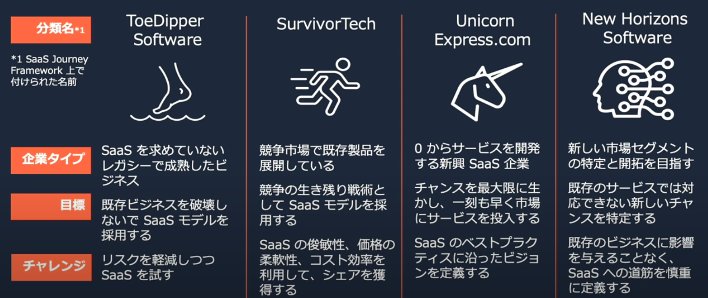

# SaaS
SaaSはビジネスモデルであり、具体的な技術はSaaSのメリットを享受するための手段にすぎない。
SaaSに取り組む上では、ステークホルダー全員にSaaSに関するマインドセットが重要であり、サービスの持続的な成長や価値ベースのアプローチの理解などが重要である。

## SaaSへの移行
AWSでは[SaaS Journey Framework](https://d1.awsstatic.com/whitepapers/ja_JP/saas-journey-framework.pdf)を推奨している。

移行に先立ってSaaS化したいとしても、SaaSで得たい目標は異なる。そのため、自社がどうしてSaaS化したいのから見極める。

### 4つのステップ
4つのステップに分類している。
- 事業計画立案
- 製品戦略およびロードマップ開発
- 実用最小限のサービス
- ローンチ・市場開拓(Go-to-Market)

### 事業計画立案
ヒトモノカネの準備をする
### 製品戦略およびロードマップ開発
どのような価値を誰に提供するのかを明確にする
### 実用最小限のサービス
コアとなる価値を見出し、MVSを特定して、アーリーアダプターを定義する
### ローンチ・市場開拓
顧客の意地と利用拡大検討。プライシングパッケージを行う