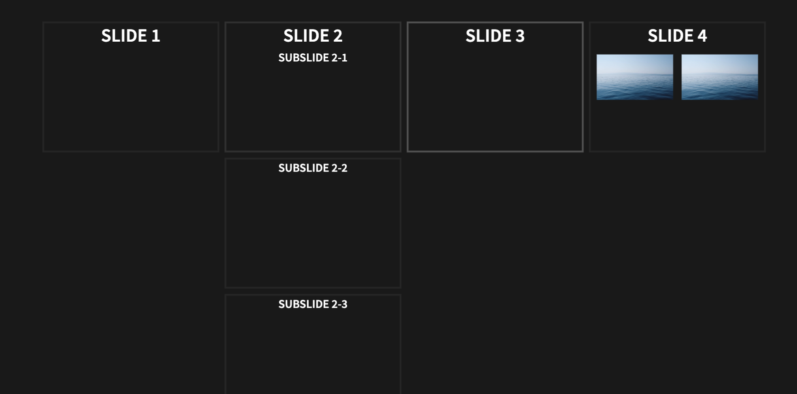

# Reveal.jsとは
Reveal.jsとは、ウェブベースのプレゼンテーションフレームワークであり、ウェブ上にスライドを構築することができる。

# note
```sh
# ローカル出力
reveal-md md_docs -w --port [PORT_NUM]

# htmlファイルの作成
reveal-md md_docs --static docs
```

# Reveal.jsの初期設定
## ディレクトリの作成と移動
最初に、プレゼンテーションのプロジェクト用に新しいディレクトリを作成し、そのディレクトリに移動。

```bash
mkdir ~/[YOUR_WORK_DIR]
```

## reveal.jsのクローン
GitHubからreveal.jsのリポジトリをクローン。
これにより、revealに必要なファイルとフォルダ構造がローカル環境にコピーされる。

```bash
git clone https://github.com/hakimel/reveal.js.git
```

## npmのインストール
reveal.jsはnpmを使用して依存関係を管理しているため、npmがシステムにインストールされていることを確認する。
npmはNode.jsのパッケージマネージャーで、Node.jsをインストールすることで利用できるようになるので、次のコマンドを使用してNode.js（およびnpm）をインストール。

```bash
brew install node
```

## 依存関係のインストール
reveal.jsの`npm i`コマンドでカレントディレクトリのpackage.jsonを利用して、依存関係をインストールする
```
cd reveal.js && npm i
```

## Markdownのための設定
reveal-mdを使用すると、Markdownファイルから直接reveal.jsを使用したプレゼンテーションを作成できる。

### reveal-mdのインストール
グローバルにreveal-mdをインストールします。これにより、コマンドラインからreveal-mdを実行できるようになる。

```bash
npm install -g reveal-md
```

### ディレクトリ作成とmdファイル作成
プレゼンテーションのための新しいディレクトリを作成し、そのディレクトリに移動します。
```bash
mkdir ~/[YOUR_WORK_DIR]/md_docs
cd ~/[YOUR_WORK_DIR]/md_docs
```

次に、md_docsの中でmarkdownファイルを作成する。テストのため、簡単なファイルで良い

### スライドの出力とhtmlファイルの出力
最後に、`md_docs`を指定して以下のコマンドを実行すると、自動でスライドが作成され、ブラウザに移動する
```
reveal-md md_docs -w --port [PORT_NUM]
```

このコマンドで実行されるファイルは、ホットリロードなので、mdファイルを編集して保存するとブラウザ側にも反映される

github pagesに出力する場合は、`[YOUR_WORK_DIR]/docs`にindex.htmlファイルを出力する必要がある。
```
reveal-md md_docs --static docs
```


## github pagesの設定
[sphinx](https://misakifujishiro.github.io/TECH/Sphinx/quickstart.html#github-pages)で行ったgithub pagesの設定と同様


## トラブルシューティング

以下のエラーが出た場合は
```
Fetching submodules
  /usr/bin/git submodule sync --recursive
  /usr/bin/git -c protocol.version=2 submodule update --init --force --depth=1 --recursive
  Error: fatal: No url found for submodule path 'reveal.js' in .gitmodules
  Error: The process '/usr/bin/git' failed with exit code 128
```

以下の内容を`.gitmodules`という名前にして、ルートディレクトリに保存してpushする
```
[submodule "reveal.js"]
    path = reveal.js
    url = https://github.com/hakimel/reveal.js.git
```


# Reveal.jsの基本的な利用方法
## reveal-mdの基本記述方法
### ページ構成

- 水平方向にスライドを作成するには、---（ダッシュを3つ）を使用します。
- 垂直方向にスライドを作成するには、----（ダッシュを4つ）を使用します。

```
# Slide 1
---

# Slide 2
## Subslide 2-1
----
## Subslide 2-2
----
## Subslide 2-3
---

# Slide 3
---

# Slide 4
```



### 図の挿入
図を挿入する場合は、md_docsの中にファイルを置いて、参照する。

フォルダ構成は以下
```
md_docs
├── img
│   └── sea.png
└── md_docs.md
```


図を並べた時のmdファイルは以下
```
<div style="display: flex; justify-content: space-around;">
  
  
</div>
```


### リンク
markdown形式で記述すればリンクになる
```
[Linkreference](https://www.yahoo.co.jp/)
```

ただし、HTMLのタグの内部の場合はHTMLタグを利用する。以下は、左寄せで小さい文字でリンクを記述する場合

```
<div style="text-align: left;">
  <small>
    References: References: <a href="https://www.yahoo.co.jp/">Link to reference</a>
  </small>
</div>

```