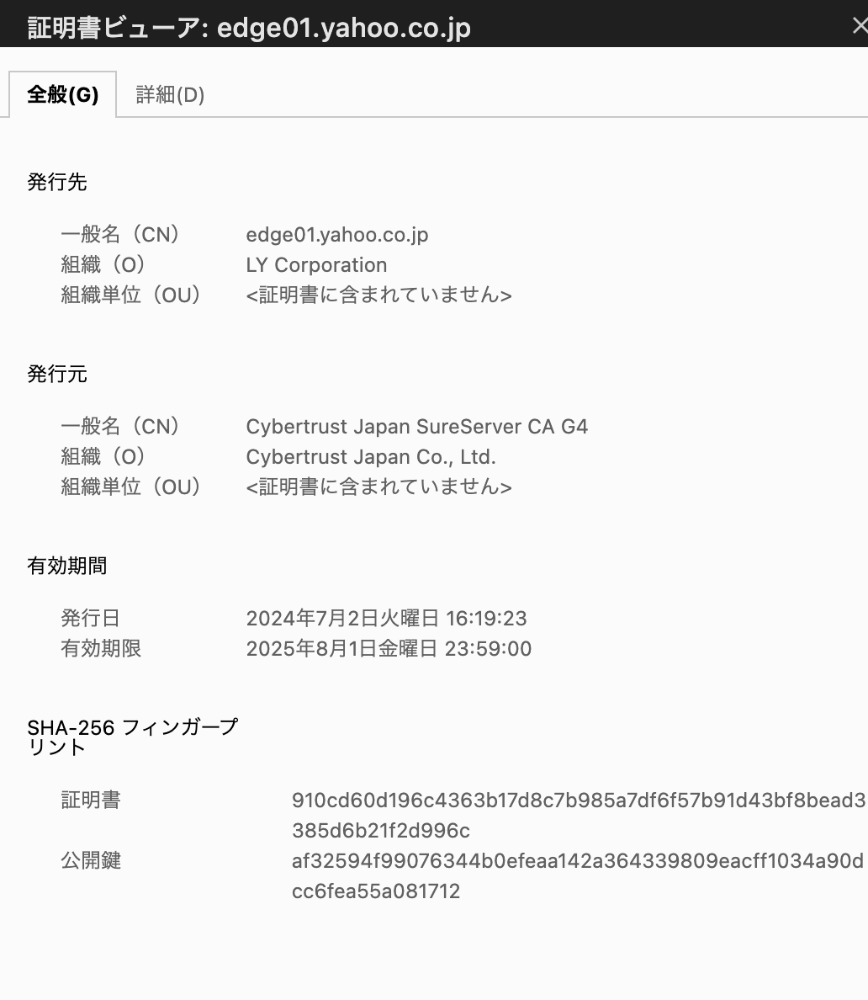

# セキュアな通信
## SSL/TLS
SSL(Secure Socket Layer)/TLS(Transport Layer Security)とは、インターネット上でやり取りされるデータの「盗聴」と「なりすまし」を防ぐための暗号化のプロトコルである。

### 暗号化詳細
1. クライアントはサーバーへ通信要求  
クライアント（例えばブラウザ）がサーバーにHTTPS通信をリクエストします。この段階ではまだ暗号化されていない通信です。

1. サーバーはSSL証明書（公開鍵を含む）をクライアントに送信  
サーバーは自分のSSL証明書をクライアントに送信します。この証明書にはサーバーの公開鍵と、証明書発行機関（CA）によるサーバーの信頼性を証明する署名が含まれています。

1. クライアントはSSL証明書を検証  
クライアントは、サーバーから受け取ったSSL証明書の信頼性を確認します。具体的には、証明書が信頼できるCAから発行されているか、証明書が有効期限内かどうか、証明書に含まれるドメイン名が接続先と一致しているかなどをチェックします。この検証が成功すると、クライアントはそのサーバーが正当なものであると判断します。

1. クライアントは共通鍵を生成し、公開鍵で暗号化  
クライアントは、この後の通信で使う「共通鍵（セッションキー）」を生成します。この共通鍵は、サーバーとクライアントの間で通信データを暗号化するために使用されます。そして、共通鍵をサーバーから受け取った公開鍵で暗号化します。

1. 暗号化された共通鍵をサーバーに送信  
クライアントは、サーバーから受け取った公開鍵で暗号化した共通鍵をサーバーに送信します。公開鍵で暗号化されたデータは、サーバーの秘密鍵でしか復号化できません。

1. サーバーは秘密鍵を使って共通鍵を復号化  
サーバーは自分の秘密鍵を使って、クライアントから送信された暗号化された共通鍵を復号化します。これにより、サーバーとクライアントが同じ共通鍵を共有することになります。

1. 共通鍵を使って暗号化された通信を開始  
以降、サーバーとクライアントはこの共通鍵を使用して通信データを暗号化し、やり取りします。共通鍵暗号は処理が速いため、効率的に通信を行うことができます。これにより、通信の盗聴やデータ改ざんが防止されます。

## SSL/TLSによるウェブサイトのセキュリティ確保
インターネットを通じて、Webサイトを閲覧している際にSSL/TLSを利用している場合はHTTPSでの通信になる。
WebブラウザとWebサーバーの通信に用いるHTTPが暗号化されているのでHTTPSと呼ばれる。

ウェブサイトのURLのアドレスバーから、発行されているSSL証明書などを確認することができる。
SSL証明書により、サイトを運営している会社などを確認することや、サイトがセキュアな通信であることを確認することができる。

例えば、yahooのwebサイトから証明書を確認すると、運営会社と証明書を発行した会社が確認できる。

## CAとSSL証明書
SSL証明書は、ウェブサイトとユーザー間の通信を暗号化し、安全に行うために使用されるデジタル証明書

### 発行時
- ドメインに対して、発行者の身元確認などをする
- DV/OV/EVのレベルがある
- おれおれ証明書とは？
### 発行後
- 証明書について、身元が正しいことを証明する

## AWSのサービスによるウェブサイトのセキュリティ確保の流れ

暗号化の終端についても
クラウドフロントについても
ACMについても