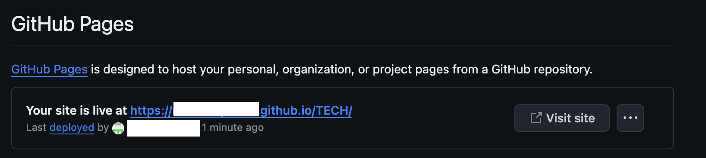

# Sphinxとは
python製のドキュメント生成ツールでreSTやmarkdownで書かれたファイルをHTMLなどに変換することが可能。

github Pagesと連携することで、github上でドキュメントを公開できる。


# Sphinxの初期設定
## Sphinxのインストール
python環境がインストールされていることが前提となる。
以下のコマンドでインストールされているか確認して、されていなければインストールする。
```sh
$ python -V
```

pipでsphinxをinstall
```sh
$ pip install sphinx
```


## Sphinxのクイックスタート
クイックスタートコマンドを実行し、SphinxのProjectを作成する。対話形式での設定例は以下。
```sh
$ sphinx-quickstart

> ソースディレクトリとビルドディレクトリを分ける（y / n） [n]: y
> プロジェクト名: project
> 著者名（複数可）: author
> プロジェクトのリリース []: 
> プロジェクトの言語 [en]: ja
```

動作確認コマンド実行後に`build/html/index.html`のindex.htmlを開いてページの確認をする
```sh 
$ make html
```


## バックグラウンドでビルドし続ける
毎回、make htmlを実行するのは手間なので、autobuildをさせる。

ライブラリのインストール
```sh
$ pip install sphinx-autobuild
```

以下のコマンドを実行すると、localホストでビルドしてくれる。PORT_NUMを指定しない場合は8080で起動する。
```sh
$ sphinx-autobuild -b html source build/html --port [PORT_NUM]
```


## Markdownのための設定
Sphinxをドキュメント化するにあたって、Markdownを利用するためには以下の設定が必要。

myst-parserをインストール
```sh
$ pip install --upgrade myst-parser
```

インストール後に、`source/conf.py`について、以下のように修正を追加する

変更前
```sh
# -- General configuration ---------------------------------------------------
# https://www.sphinx-doc.org/en/master/usage/configuration.html#general-configuration

extensions = []

templates_path = ['_templates']
```

変更後
```sh
# -- General configuration ---------------------------------------------------
# https://www.sphinx-doc.org/en/master/usage/configuration.html#general-configuration

extensions = [
    'myst_parser'
]

source_suffix = {
    '.rst': 'restructuredtext',
    '.md': 'markdown',
}

templates_path = ['_templates']
```

## テーマの変更
Sphinxで作成するドキュメントにはいくつかのテーマが準備されている。
conf.pyを修正することによって、簡単にテーマを変更することが可能。

`readthedocs`というテーマが見やすくておすすめ。

sphinx_rtd_themeのインストール
```sh
$ pip install sphinx_rtd_theme
```

インストール後に、`source/conf.py`について、以下のように修正を追加する


修正前
```sh
# -- Options for HTML output -------------------------------------------------
# https://www.sphinx-doc.org/en/master/usage/configuration.html#options-for-html-output

html_theme = 'alabaster'
html_static_path = ['_static']
```

修正後
```sh
# -- Options for HTML output -------------------------------------------------
# https://www.sphinx-doc.org/en/master/usage/configuration.html#options-for-html-output

import sphinx_rtd_theme
html_theme = 'sphinx_rtd_theme'
html_theme_path = [sphinx_rtd_theme.get_html_theme_path()]
```


## github pagesの設定
作成したhtmlをgithub pagesで公開することができる。
また、githubで公開することで、どの環境からも修正を加えることができる。

### リポジトリ設定
github pagesで公開を行う場合は、publicとして作成を行う。

`git clone`により、ローカルにリポジトリをクローンして、そのリポジトリ上でSphinxの設定を行う。


### 出力先の変更
github pagesでは、`docs/index.html`というパスを固定で参照しにいくので、docsというフォルダにも出力する必要がある。

`Makefile`を修正して、docsにも出力する設定を行う。

修正前
```sh
# Catch-all target: route all unknown targets to Sphinx using the new
# "make mode" option.  $(O) is meant as a shortcut for $(SPHINXOPTS).
%: Makefile
	@$(SPHINXBUILD) -M $@ "$(SOURCEDIR)" "$(BUILDDIR)" $(SPHINXOPTS) $(O)
```

修正後
```sh
# Catch-all target: route all unknown targets to Sphinx using the new
# "make mode" option.  $(O) is meant as a shortcut for $(SPHINXOPTS).
%: Makefile
	@$(SPHINXBUILD) -M $@ "$(SOURCEDIR)" "$(BUILDDIR)" $(SPHINXOPTS) $(O)

html: Makefile
	@$(SPHINXBUILD) -b html "$(SOURCEDIR)" "docs" $(SPHINXOPTS) $(O)
```


### github pagesの設定
リポジトリの`/Setting/Pages`から、以下のように設定。



設定後、SphinxをPushするとGitHub Pageが作成され、URLからアクセス可能になる。


# Sphinxの基本的な利用方法
## 階層構造


## ファイル出力


